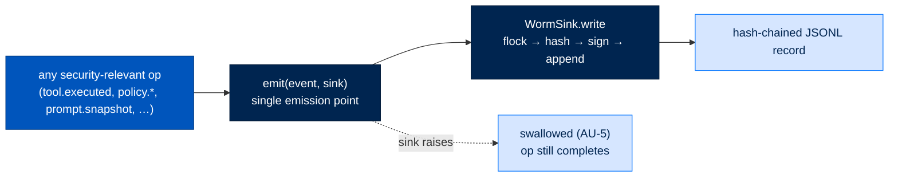

# Audit Emission and the WORM Chain

> **Walkthrough**  ·  Understand  ·  how every action becomes a tamper-evident record
> [Docs home](../README.md)  ·  [3. Anatomy of a Turn](03-anatomy-of-a-turn.md)  ·  [10. The Security Model](10-security-model.md)

---

## In one breath

Every security-relevant thing Arc does — a tool call, a policy decision, a
prompt snapshot, a key operation — emits one **audit event** through a single
function, `emit()`. There is exactly one place the event is written and exactly
one durable place it lands: an append-only, hash-chained, signed file called a
**WORM chain** (write-once, read-many). Each record carries the hash of the one
before it, so removing or editing any record breaks the chain and a later verify
catches it. The write path is deliberately **fail-open** — if the audit sink
itself errors, the action being audited still completes; auditing must never
become a way to break the system it watches. This is the "Audit" pillar of the
Four Pillars, in code.



---

## How it actually works

### One emission point

`arctrust.audit.emit(event: AuditEvent, sink: AuditSink) -> None`
(`packages/arctrust/src/arctrust/audit.py:518`) is the whole public surface.
Callers never write a file directly; they build a typed `AuditEvent` (actor,
action, target, outcome, timestamp — NIST AU-2) and hand it to `emit()`. `emit()`
routes it to the configured sink and **swallows any sink exception**, logging
locally but never propagating it (AU-5, "audit failure response"). That single
choice is what lets the rest of the stack treat auditing as unconditional: a
tool dispatch can always call `emit()` as its last step without a `try/except`
of its own, because `emit()` already guarantees it can't raise.

`AuditSink` is a structural `Protocol` — any object with
`write(event: AuditEvent) -> None` qualifies — so the emission point is decoupled
from any concrete destination. Two real sinks ship:

| Sink | Role | Anchor |
|---|---|---|
| `NullSink` | Discards everything — tests and air-gapped evaluation | `audit.py:139` |
| `WormSink` | The durable, append-only, signed, hash-chained log | `audit.py:174` |

> **Naming correction — three sinks that are not classes.** The project
> `CLAUDE.md` and some older prose name `JsonlSink`, `SignedChainSink`, and
> `arcui.bridge.UIBridgeSink` as if they were importable sinks. They are not.
> The module docstring (`audit.py:9-14`) states it directly: `WormSink`
> *"replaces the old unchained `JsonlSink` and the in-memory-only
> `SignedChainSink`"* — those two name behaviors the one real durable sink
> superseded. `UIBridgeSink` was a live-push sink that was **deliberately torn
> out** (SPEC-026); `packages/arcui/tests/test_no_push_pipeline.py` asserts
> `arcui.bridge` can no longer even be imported. Cite `NullSink` and `WormSink`
> only.

### The WORM record — what a chained entry actually holds

`WormSink._append` (`audit.py:291`) writes one line of JSON per event. Each
record is:

```json
{ "seq": 41,
  "event": { "...": "the AuditEvent, or its sealed ciphertext" },
  "prev_hash": "<event_hash of record 40>",
  "event_hash": "<SHA-256 over (seq, prev_hash, event)>",
  "algorithm": "ed25519",
  "signature": "<signature over event_hash>" }
```

The chain is the `prev_hash` → `event_hash` link: `event_hash` is a canonical
hash of the sequence number, the previous record's hash, and the event body, and
the record's `signature` signs that hash. Change one byte of any past record and
its `event_hash` no longer matches, its signature no longer verifies, and every
record after it is orphaned — which is exactly what `verify_chain`
(`audit.py:388`, and the standalone `verify_chain` at `:426`) detects: a byte
mutation, a forged signature, or a sequence gap. Signing is Ed25519 at
personal/enterprise and ECDSA-P256 at federal (FIPS), by the deployment operator
key — so the audit authority is the operator, never the agent being audited.

When record encryption is enabled, the event body is **sealed by a
`RecordCipher` before it is hashed** (`audit.py:295-299`, D-577), so the chain
commits to the ciphertext and a verifier who holds no sealing key can still prove
integrity.

### Single-writer, rotation, and crash recovery

- **Single writer.** On open, the sink takes an exclusive `flock` on the chain
  file; a second writer for the same chain fails loudly with a
  single-writer-invariant error rather than interleaving records (`audit.py:249`).
  The file is `0o600`.
- **Rotation.** `_maybe_rotate` (`audit.py:316`) rolls the active file to a
  sequence-stamped segment once it passes **100,000 records or 50 MB**, then
  keeps appending to a fresh active file — the chain continues unbroken across
  segments.
- **Crash recovery.** On startup, `_restore_tip` (`audit.py:333`) walks the
  existing segments plus the active file to recover the tip and next sequence
  number. A **torn final line** (a process killed mid-write) is truncated, and a
  signed `audit.worm.recovery` event is appended through the normal path so the
  recovery itself is on the record.

```mermaid
sequenceDiagram
    autonumber
    participant C as "caller (e.g. tool dispatch)"
    participant E as "emit()"
    participant W as "WormSink"
    participant F as "chain file (flock, 0600)"

    C->>E: emit(AuditEvent, sink)
    E->>W: write(event)
    W->>W: seq = next; prev_hash = chain_tip
    W->>W: event_hash = H(seq, prev_hash, event)
    W->>W: signature = sign(event_hash)
    W->>F: os.write(one JSON line) — append only
    W->>W: chain_tip = event_hash; maybe_rotate()
    Note over E,W: any exception here is swallowed (AU-5)
```

### The read side — arcui is a consumer, not a second writer

ArcUI does not receive a live push of audit events and does not open a second
fan-out. Its operator-mutation capture is `MutationWormWriter`
(`packages/arcui/src/arcui/audit.py:231`), which wraps a `WormSink` — the same
durable machinery, not a parallel one — and its ephemeral log + OpenTelemetry
span is `UIAuditLogger` (`arcui/audit.py:183`). Everything the dashboard shows is
**read** from the durable arcstore record after the fact (see
[9.8 Observe — the read path](09-workflows.md)); the
"no push pipeline" teardown removed every live audit-fan-out wire.

---

## Where a WORM write can go wrong

| Situation | Behavior | Why |
|---|---|---|
| Sink raises mid-write | Swallowed; the audited op completes | AU-5 — auditing never breaks the call |
| Second writer opens the same chain | Hard error on the `flock` acquire | Single-writer invariant; no interleaved records |
| Process killed mid-write | Torn tail truncated on next open, signed `audit.worm.recovery` appended | The chain stays verifiable; the gap is itself recorded |
| Someone edits a past record on disk | `verify_chain` fails at that record and every one after | `event_hash` + `prev_hash` + signature all break |

---

## Where to look in the code

| Path | What lives there |
|---|---|
| `packages/arctrust/src/arctrust/audit.py` | `AuditEvent`, `emit`, `NullSink`, `WormSink`, `verify_chain` |
| `packages/arctrust/src/arctrust/audit_cipher.py` | `RecordCipher` — seals record content before hashing (D-577) |
| `packages/arctrust/src/arctrust/signer.py` | The `Signer` seam (Ed25519 / ECDSA-P256) the chain signs with |
| `packages/arcui/src/arcui/audit.py` | `MutationWormWriter` (durable, wraps `WormSink`), `UIAuditLogger` (ephemeral + OTel) |

---

## Flow footer — decision & anchors

The six-field record for the **audit emission (WORM)** flow, shared verbatim
with the shared *Decision Index* catalog (`docs/concepts/decision-index.md`).
Line numbers drift; the **symbol name** is the durable anchor. Full text for
each `D-NNN` lives in
[`.claude/decisions-log.md`](https://github.com/joshuamschultz/Arc/blob/main/.claude/decisions-log.md).

| Field | This flow |
|---|---|
| **Where it lives** | arctrust `audit` (+ arcui) |
| **What calls what** | `emit(event, sink)` → `WormSink._append` (flock → hash → sign → write) → `_maybe_rotate`; arcui via `MutationWormWriter` |
| **What passes — where / when / to** | an `AuditEvent` → the sink at **every** op; each record chains `event_hash = H(seq + prev_hash + event)` + a signature; segments rotate on size / count |
| **Security / modularity reason** | tamper-evident, single-writer, and **fail-open** — the write never interrupts the operation being audited (AU-5) |
| **`D-NNN` / ADR** | D-203, D-047, D-437, D-026 · ADR-022 |
| **Code anchor** | `arctrust/audit.py:518,174,291,316` (`emit`, `WormSink`, `_append`, `_maybe_rotate`) · `arcui/audit.py:231` (`MutationWormWriter`) |

**Set it up:** the Track 1 counterpart is the
[Security reference](../reference/security.md) — the Four Pillars and where the
operator key that signs the chain lives. The tool call whose `tool.executed`
event this flow records is
[A tool call through policy](data-flows.md#tool-execution-pipeline).
