# Data Flow Pathways

> **Walkthrough**  ·  Understand  ·  page 13 of 14  
> **For** Anyone who needs to understand how Arc works  
> [← 12. Configuration](12-configuration.md)  ·  [Docs home](../README.md)  ·  [Diagrams →](diagrams.md)

---

## Architecture Layers

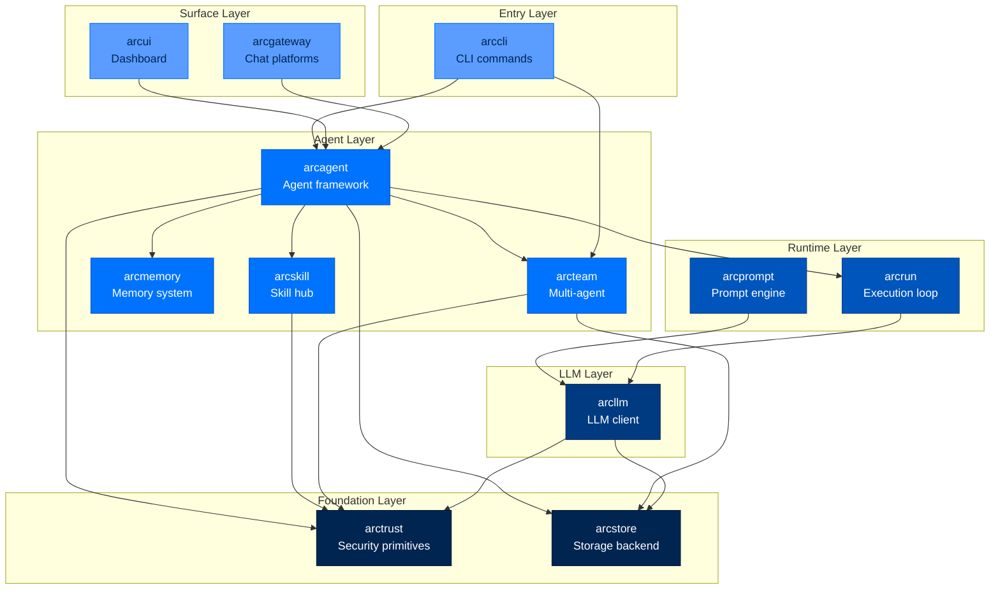

---

## Single-Agent Turn Flow

When an agent processes a message, data flows through this pathway:

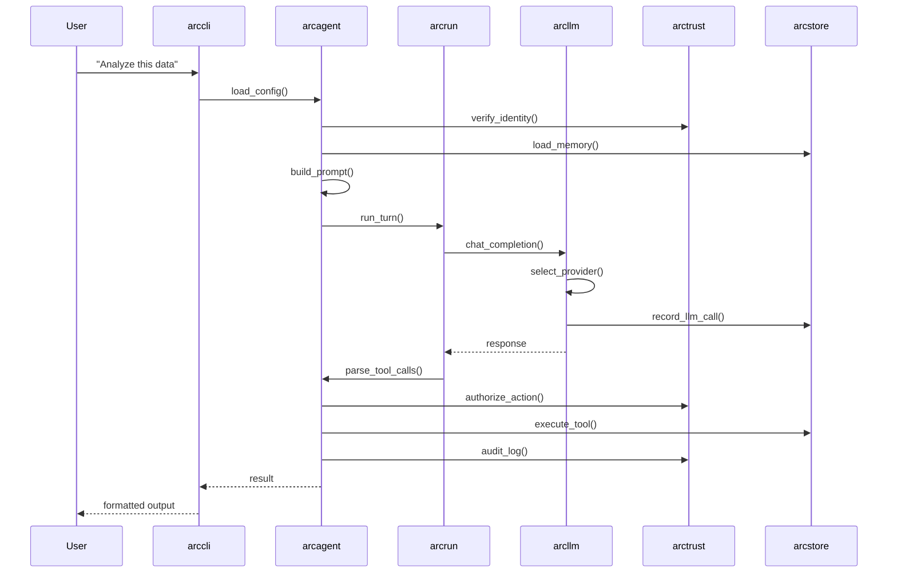

### Detailed Turn Steps

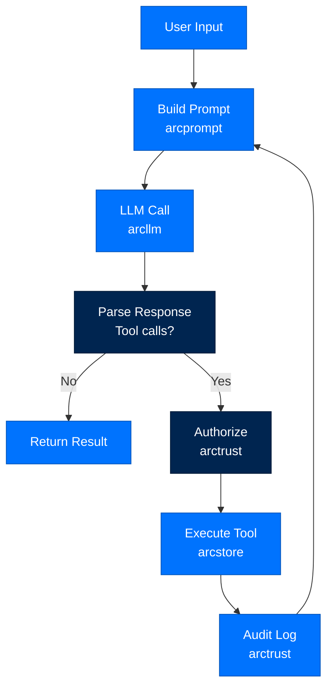

---

## Capability Loading Flow

Capabilities are loaded from multiple sources with security checks:

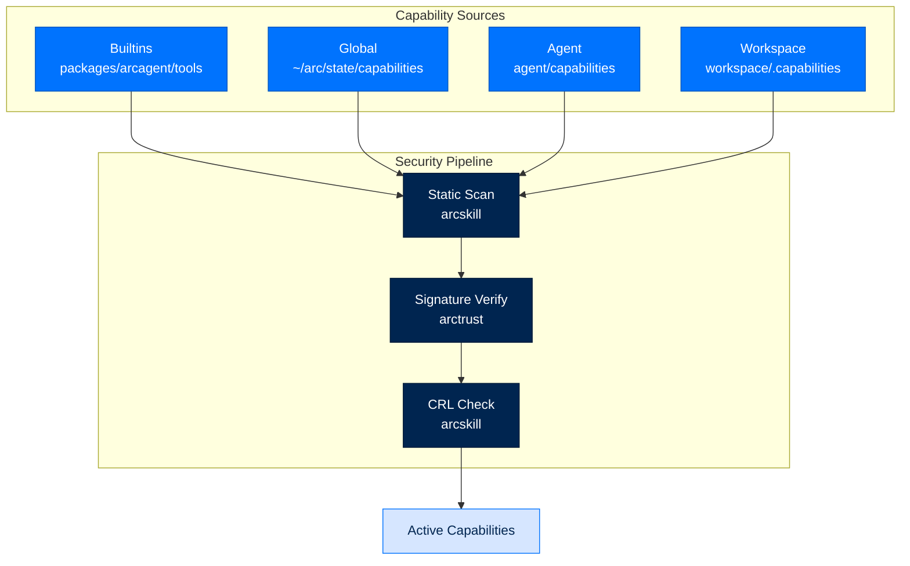

---

## Skill Installation Pipeline

The 8-gate skill install pipeline:

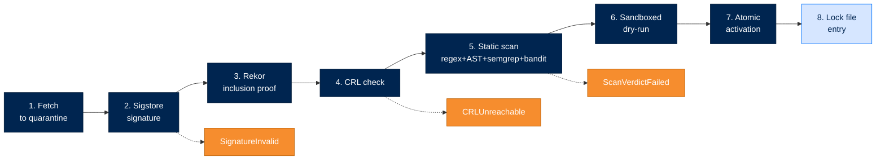

---

## Multi-Agent Communication Flow

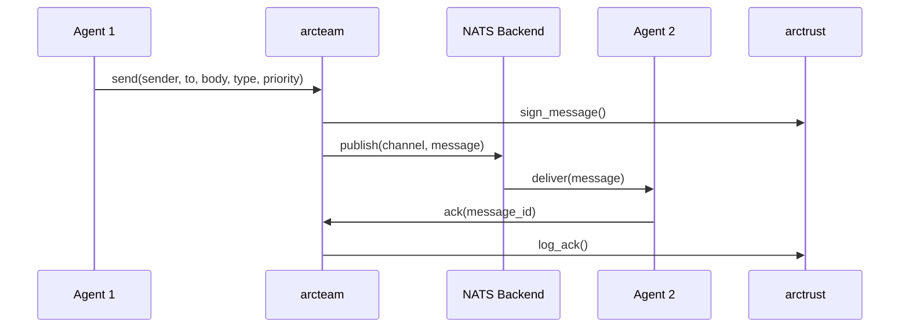

### Team Message Flow

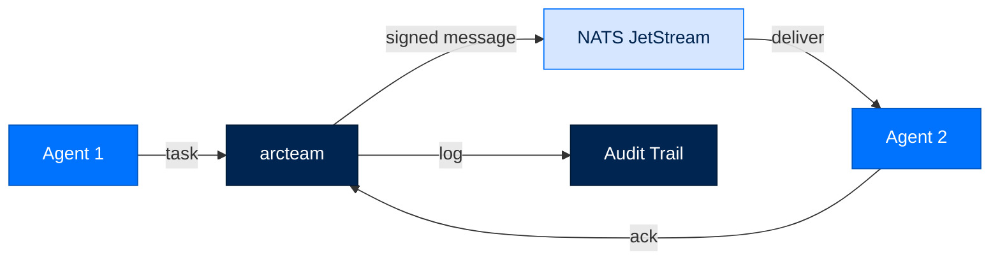

---

## Memory System Flow

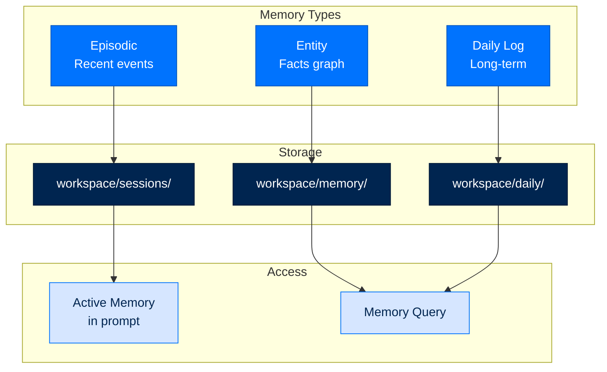

---

## LLM Provider Selection Flow

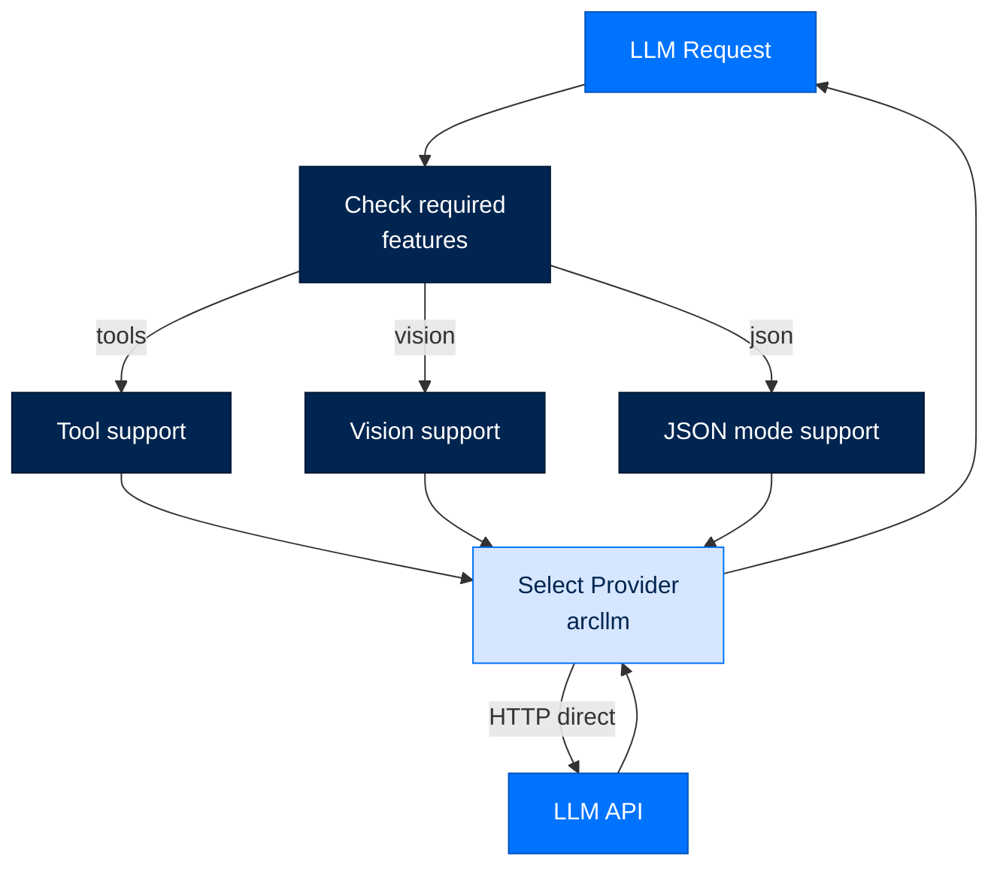

---

## Turn Flow — From Message to Response

When an agent processes a message, data flows through this pathway:

```mermaid
sequenceDiagram
    participant U as User
    participant Entry as Entry Surface
    participant Agent as ArcAgent.run
    participant Dispatch as dispatch_stream
    participant RunStream as arcrun.run_stream
    participant Loop as react_loop
    participant LLM as arcllm
    participant Tool as Tool (policy-wrapped)
    participant Spool as arcstore spool
    participant UI as arcui

    U->>Entry: message (CLI, TUI, or Gateway)
    Entry->>Agent: agent.run(input_text, session)
    Agent->>Dispatch: build_run_context (prompt, tools, provider)
    Dispatch->>RunStream: model, capabilities, actor_did, run_id
    RunStream->>Loop: same run_id (mint if None)
    Loop->>Loop: registry.freeze() - tool-set lock
    Loop-->>RunStream: RunState (run_id fixed for the whole run)
    RunStream-->>Dispatch: AsyncIterator[StreamEvent]
    
    loop each turn
        Dispatch->>LLM: model.invoke(messages, tools)
        LLM-->>Dispatch: LLMResponse
        LLM->>Spool: llm_call record (request_id=run_id)
        Dispatch->>Tool: dispatch tool_call
        Tool->>Tool: policy.evaluate (DENY short-circuits)
        Tool-->>Dispatch: tool_result
        Dispatch->>Spool: run_event / tool_event (request_id=run_id)
        Tool->>Spool: audit tool.executed (WormSink)
    end
    
    Dispatch-->>Agent: TokenEvent... TurnEndEvent
    Agent-->>Entry: StreamEvent stream
    Entry-->>U: reply
    UI->>Spool: query (list_traces / get_trace)
```

### Three Entry Surfaces, One Path

The three entry surfaces converge on the same function almost immediately:

**`arc` CLI.** `arc agent chat` loads the agent's config, opens a session, and drives the streaming entry directly:
```python
session = await arc_agent.session(current_session_id)
result = await collect(arc_agent.run(user_input, session=session))
```

**The `arctui` TUI.** Holds its own `ArcAgent` instance in-process and calls the identical entry point when the user submits text:
```python
session = await self._agent.session("tui:main")
async for event in self._agent.run(text, session=session):
    if isinstance(event, TokenEvent):
        self._transcript.append_delta(event.text)
```

**A gateway channel.** Telegram/Slack/Mattermost adapters receive platform updates, normalize them into `InboundEvent`, and route through `SessionRouter`:
```
TelegramAdapter → SessionRouter.handle → Executor.run → ArcAgent.run
```

### Tool Execution Pipeline

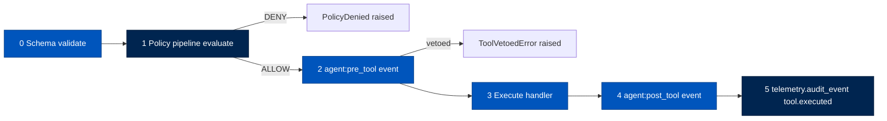

**Authorize.** The policy pipeline builds a signed `ToolCall` (tool_name, arguments, agent_did, session_id, classification) and signs it with the agent's identity key. The pipeline's `evaluate()` loop calls each configured layer in order and returns on the first `DENY` (first-DENY-wins, fail-closed). A denied call raises `PolicyDenied` before the handler runs.

**Audit.** Every successful execute emits `tool.executed` with `actor_did`, `tier`, `transport`, and duration to `WormSink` — a hash-chained, append-only JSONL file. The audit system is fail-open by design: it must never interrupt the operation being audited.

#### The policy layer chain — first-DENY-wins, tier-sized

`PolicyPipeline.evaluate` walks the configured layers **in order** and returns
on the **first `DENY`**; any exception a layer raises is itself converted to
`DENY` (fail-closed). Which layers run is a function of tier — the layer set is
a stringency dial, not a different code path — but **`IdentityLayer` always runs
first, at every tier** (authentication is universal, ADR-019). Assembled by
`build_pipeline()` in `arctrust/policy.py`:

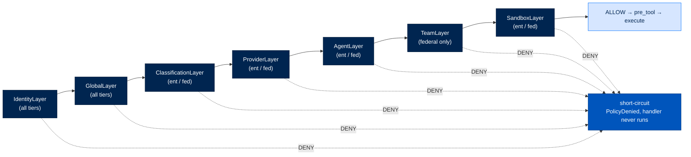

Per tier: **personal** runs `[Identity, Global]`; **enterprise** runs
`[Identity, Global, Classification, Provider, Agent, Sandbox]`; **federal** adds
`TeamLayer` for the full seven. Layers past the first are no-ops when their
policy is unconfigured, and fail **closed** only once a configured policy meets
missing state — so tightening a tier never silently weakens a lower one.

---

## Flow footer — decision & anchors

The six-field record for the **tool call → policy** flow, shared verbatim with
the shared *Decision Index* catalog (`docs/concepts/decision-index.md`). Line
numbers drift; the **symbol name** is the durable anchor. Full text for each
`D-NNN` lives in
[`.claude/decisions-log.md`](https://github.com/joshuamschultz/Arc/blob/main/.claude/decisions-log.md).

| Field | This flow |
|---|---|
| **Where it lives** | arcagent `tool_registry` → arctrust `policy` |
| **What calls what** | `wrapped_execute` → validate args → `sign_call` → `PolicyPipeline.evaluate` (tier layers) → `agent:pre_tool` → `tool.execute` → `agent:post_tool` → audit |
| **What passes — where / when / to** | a signed `ToolCall`(name, args, `agent_did`, session, classification, `origin`) → each layer **in order**; the first `DENY` short-circuits before the handler; the result → the caller; a `tool.executed` event → the WORM chain |
| **Security / modularity reason** | first-DENY-wins plus fail-closed-on-exception is least privilege with no confused-deputy path; the engine lives in arctrust, so arcagent never re-implements authorization |
| **`D-NNN` / ADR** | D-294, D-662, D-608, D-607, D-563 · ADR-017A |
| **Code anchor** | `core/tool_registry.py:646,520,537` (`wrapped_execute`, `sign_call`, evaluate call) · `arctrust/policy.py:1186,1221` (`PolicyPipeline.evaluate`, first-DENY short-circuit) · layers `arctrust/policy.py:695,749,823,890,981,1010,1085` |

**D-563 (tool-contract hashing / rug-pull defense)** is a named invariant — a
signed tool that changes shape after approval should be re-gated — but its
hashing site is **not yet anchored in code**: treat that clause as
**needs confirmation** pending an arctrust/tool-registry trace.

**Set it up:** the Track 1 counterpart is
[Policy & tiers](../reference/tiers-and-presets.md) — dialing the tier and its
active policy set. The run this call sits inside is
[Anatomy of a turn](03-anatomy-of-a-turn.md).

---

## Memory Lifecycle

Dual-speed, four-store, analogical memory: markdown source + SQLite index.

```mermaid
flowchart LR
    classDef entry   fill:#D6E6FF,stroke:#0073FE,color:#002550
    classDef agent   fill:#0073FE,stroke:#0055BC,color:#FFFFFF
    classDef llm     fill:#003B82,stroke:#002550,color:#FFFFFF
    classDef runtime fill:#0055BC,stroke:#003B82,color:#FFFFFF

    See["1 See — FastCapture.capture"]:::entry --> Curate["2 Curate — curate_for_distillation"]:::agent
    Curate --> Distill["3 Distill — extract_facts / mint_insights / extract_procedures"]:::llm
    Distill --> Consolidate["Consolidator.run — orchestrates 4-7"]:::agent
    Consolidate --> Dedup["4 Dedup / hygiene — merge_entities, merge_cues, dedup_workspace"]:::agent
    Dedup --> Index["5 Index — SurfaceIndex + StructuralIndex"]:::runtime
    Index --> Retrieve["6 Retrieve / fuse — Retriever.retrieve"]:::runtime
    Retrieve --> Enrich["7 Enrich — spot then enrich"]:::runtime
    Enrich --> Prompt["boundary-marked memory-result block"]:::entry

    classDef entry   fill:#D6E6FF,stroke:#0073FE,color:#002550
    classDef surface fill:#5A9CFF,stroke:#003B82,color:#002550
    classDef agent   fill:#0073FE,stroke:#0055BC,color:#FFFFFF
    classDef runtime fill:#0055BC,stroke:#003B82,color:#002550
    classDef llm     fill:#003B82,stroke:#002550,color:#FFFFFF
    classDef found   fill:#002550,stroke:#001A38,color:#FFFFFF
```

### Dual-Speed Memory Cadence

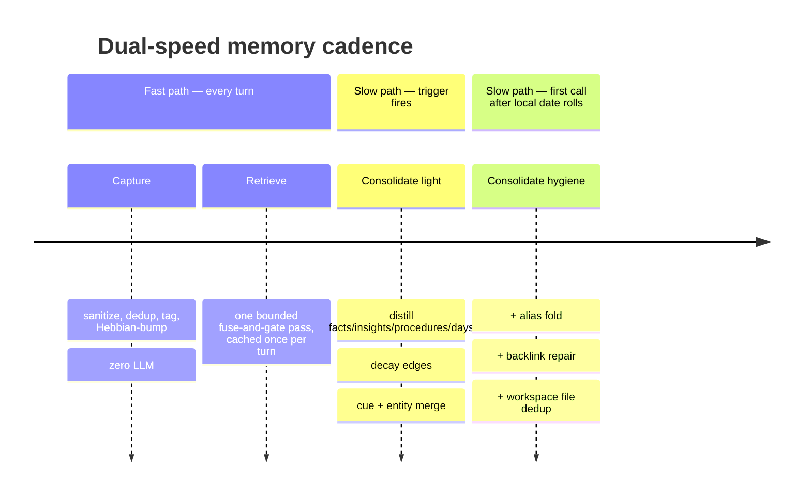

### Four Stores

| Store | File | Holds | Written by | Read for |
|---|---|---|---|---|
| Episodic | `stores/episodic.py` | Raw event stream (SQLite `episodic` table) | `FastCapture.capture` | Consolidation input, enrichment context |
| Semantic | `stores/semantic.py` | Entity cards (`memory/entities/<slug>.md`) | Distillation, agentic tools | Facts, structural enrichment |
| Insight | `stores/insight.py` | Minted abstractions (`memory/insights/<id>.md`) | `mint_insights` / agentic tools | Structural recall |
| Procedural | `stores/procedural.py` | How-to cards (`memory/procedures/<slug>.md`) | `extract_procedures` / `record_procedure` | Recall, skill improvement |
| Daily notes | `stores/daily.py` | Curated per-day rollup | `_summarize_days` | Human/operator review, surface index source |

### Insight Confidence Lifecycle

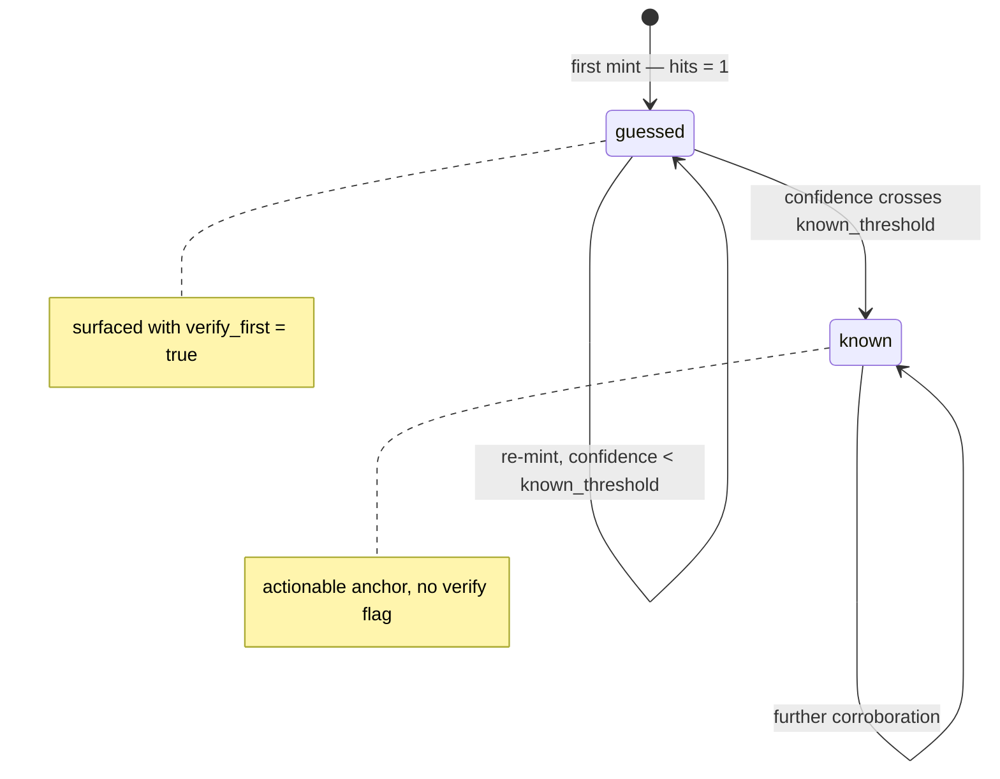

---

## Session Lifecycle

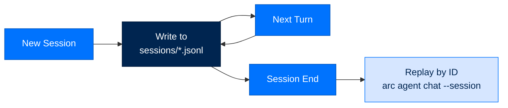

---

## Tool Execution Flow

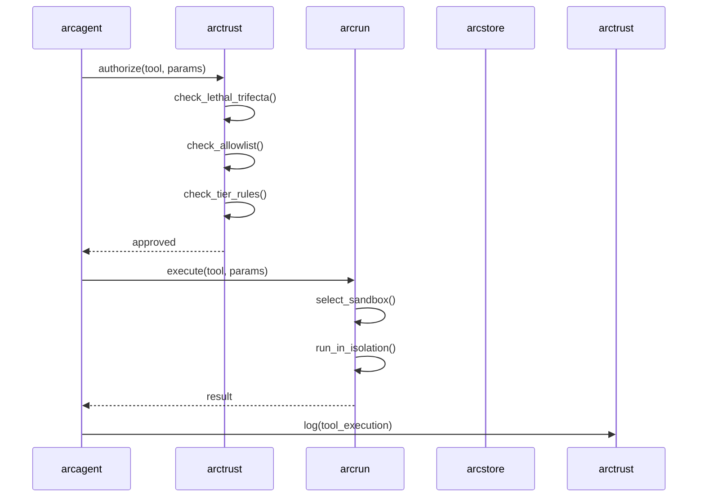

### Dynamic Tool Creation Pipeline


Execution itself crosses an **isolated JSON exec seam**: the checked code never
runs in-process via `eval`, it is handed to an `ExecutorBackend` acquired
**only** for an executable artifact (D-667), and only its JSON result returns to
the model — as inert DATA, never as an instruction.

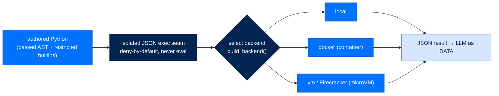

Built-in backends (`local` / `docker` / `vm`) are trusted with no manifest;
**every non-builtin backend requires a signed `allowed_backends` manifest at
every tier** (the tier picks which issuers are trusted, not whether to verify),
and setuptools entry-point discovery is permanently disabled — there is no safe
way to verify an arbitrary installed package.

---

## Flow footer — decision & anchors

The six-field record for the **dynamic tool / sandbox exec** flow, shared
verbatim with the shared *Decision Index* catalog
(`docs/concepts/decision-index.md`). Line numbers drift; the **symbol name** is
the durable anchor. Full text for each `D-NNN` lives in
[`.claude/decisions-log.md`](https://github.com/joshuamschultz/Arc/blob/main/.claude/decisions-log.md).

| Field | This flow |
|---|---|
| **Where it lives** | arcagent tools → arcrun / isolation |
| **What calls what** | agent-authored Python → encoding / AST check → restricted builtins → isolated JSON exec seam → result to LLM; browser via the CDP backend |
| **What passes — where / when / to** | the authored code → a sandbox (deny-by-default), never `eval`; only its JSON result → the model, as DATA |
| **Security / modularity reason** | RCE containment (ASI05); an isolation backend is acquired **only** for executable artifacts; an explicit allowlist, not implicit trust |
| **`D-NNN` / ADR** | D-659, D-667, D-608, D-601, D-145, D-175, D-176 · ADR-017C |
| **Code anchor** | `arcagent/tools/_dynamic_loader.py` (authored-tool load) · `arcrun/dynamic/` (grammar, interpreter) · `arcrun/backends/` (`local.py`, `docker.py`, `vm.py`, `loader.py`, `_verifier.py`) |

**Set it up:** the Track 1 counterpart is
[Firecracker isolation](../runbooks/deploy/firecracker.md) — provisioning the
microVM exec backend. The authorization that gates every such call is
[A tool call through policy](#tool-execution-pipeline).

---

## Dashboard Data Flow

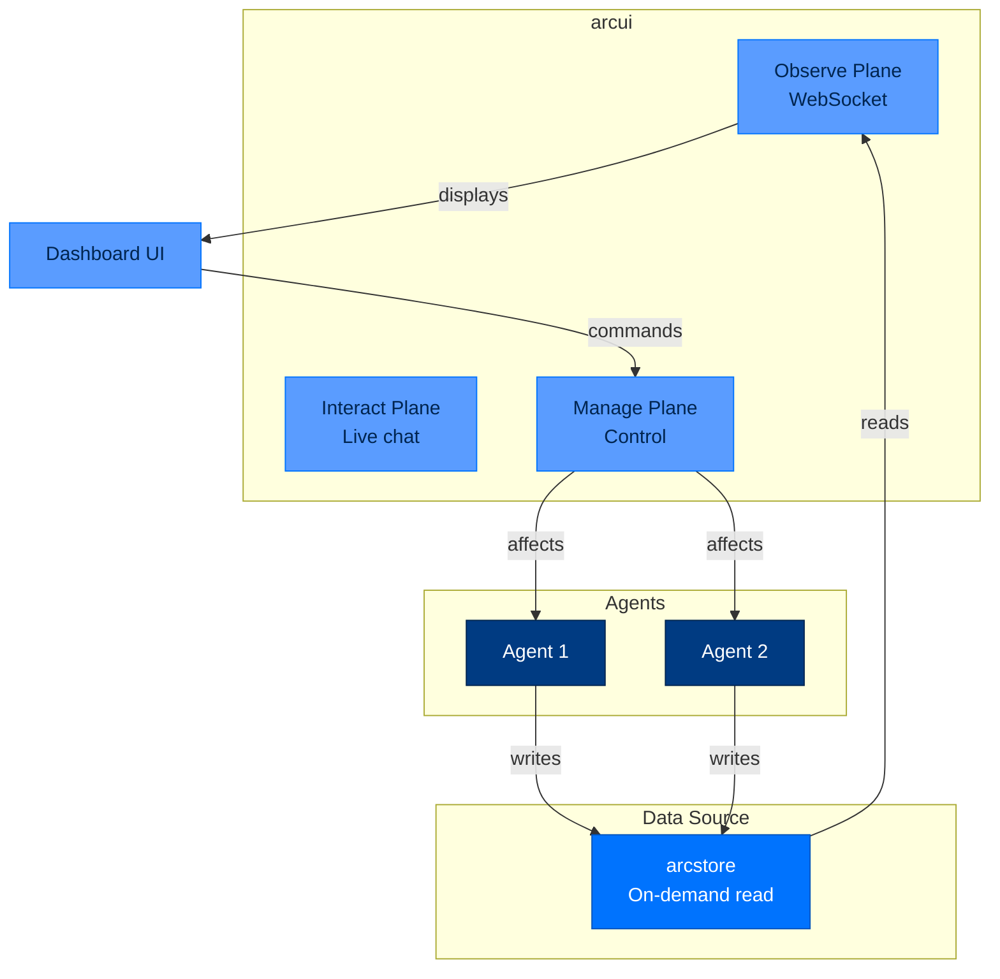

---

## Gateway Message Flow

```mermaid
sequenceDiagram
    participant User as Chat User
    participant Gateway as arcgateway
    participant Agent as arcagent
    participant Platform as Chat Platform

    User->>Platform: Message
    Platform->>Gateway: Webhook
    Gateway->>Gateway: verify_signature()
    Gateway->>Agent: enqueue(message)
    Agent->>Agent: process_turn()
    Agent-->>Gateway: response
    Gateway->>Platform: reply
    Platform-->>User: Response
```

### Platform Adapter Flow

```mermaid
flowchart LR
    classDef plat fill:#0073FE,stroke:#0055BC,color:#FFFFFF
    classDef gw fill:#002550,stroke:#001A38,color:#FFFFFF
    classDef agent fill:#D6E6FF,stroke:#0073FE,color:#002550

    Telegram[Telegram]:::plat -->|adapter| Gateway[arcgateway]:::gw
    Slack[Slack]:::plat -->|adapter| Gateway
    Mattermost[Mattermost]:::plat -->|adapter| Gateway
    Gateway -->|unified| Agent[arcagent]:::agent
```

---

## Data Storage Layout

```mermaid
erDiagram
    LLM_CALLS ||--o{ RUN_EVENTS : "request_id"
    LLM_CALLS {
        text record_id PK
        text kind
        text actor_did
        text ts
        text request_id
        text model
        text provider
        integer prompt_tokens
        integer completion_tokens
        real cost_usd
        real latency_ms
        text outcome
    }
    RUN_EVENTS {
        text record_id PK
        text actor_did
        text ts
        text request_id
        text name
    }
    AGENT_EVENTS {
        text record_id PK
        text actor_did
        text ts
        text name
    }
    TOOL_EVENTS {
        text record_id PK
        text tool_name
        text phase
        text args_digest
        text result_digest
    }
    SPAWN_EVENTS {
        text record_id PK
        text parent_did
        text child_did
        text role
        integer depth
    }
    AUDIT_CHAIN {
        text record_id PK
        integer seq
        text actor_did
        text action
        text target
        text outcome
        text event_hash
        text prev_hash
        text signature
        integer verified
    }
    MUTABLE_RECORDS {
        text collection PK
        text key PK
        text value
        text updated_at
    }
    SKILL_CANDIDATES {
        text record_id PK
        text skill_name
        text candidate_id
        integer generation
        text body_hash
    }
    SKILL_CANDIDATE_BODIES {
        text record_id PK
        text body
    }
```

### Disk Layout

`~/.arc` is split by **lifecycle**, so replacing the framework cannot destroy
anything irreplaceable. Every path below is resolved by exactly one named
accessor in `arctrust.paths` — no surface composes its own (enforced by
`tests/architecture/test_arc_home_single_resolver.py`).

Two directories, and which is which is the design: `~/.arc` is the **install**
and is disposable by construction; `~/arc` is the **operator's**, holding the
fleet and the source tarball beside it. Nothing is ever executed from `~/arc`.

| Root | Accessor | On update |
|---|---|---|
| `~/.arc/runtime/<version>/` (+ `current` symlink) | `arc_runtime()` | **replaced wholesale** |
| `~/arc/config/` | `arc_config()` | preserved |
| `~/arc/state/` | `arc_state()` | **never touched** |
| `~/arc/team/` — outside the home entirely | `arc_team()` | **out of reach** |

The fleet's placement is what makes "drop a fresh tree into `~/.arc`" — or
`rm -rf ~/.arc`, the blunt version — cost nothing but a reinstall. No agent's
memory, identity, tools, skills, or workspace is anywhere underneath it.

`resolve_data_dir()` — `${ARCSTORE_DATA_DIR}` or `store_dir()` — is arcstore's
file root (spool and WORM source files) and lives under `state/`. The
PostgreSQL operational store is configured separately through
`ARCSTORE_DATABASE_URL` or a vault credential reference; Supabase is a
supported PostgreSQL deployment.

```text
~/.arc/                                  # arc_home()
├── runtime/                             # arc_runtime_root() — disposable
│   ├── current -> 0.9.0/                # atomic symlink; `arc runtime activate` flips it
│   └── 0.9.0/                           # the whole framework, installed side by side
│       ├── .venv/                       # runtime_venv() — runtime_bin("arc") runs from here
│       ├── packages/ scripts/ deploy/   # the code this version ships
│       └── modules/                     # module_root() — re-materialized by `arc install`
├── config/                              # arc_config() — preserved across an update
│   ├── arcllm.toml                      # provider/model defaults (shared layer)
│   ├── arcagent.toml                    # agent-runtime defaults (shared layer)
│   ├── arcrun.toml                      # loop defaults (shared layer)
│   ├── gateway.toml                     # embedded gateway: platforms, agent_did
│   ├── connections.toml                 # connected accounts + per-agent grants
│   └── arc.env                          # 0600 — viewer/operator tokens, secrets
├── state/                               # arc_state() — NEVER touched by an update
│   ├── operator/                        # operator_dir()
│   │   ├── operator.key                 # 0600 — Ed25519 seed, the audit authority
│   │   └── operator.key.pub             # 0644 — anti-erasure/anti-swap sentinel
│   ├── identity/                        # identity_dir() — signing-authority keys
│   ├── trust/                           # trust_dir()
│   │   ├── operators.toml               # 0600 — pairing-approver pubkeys
│   │   └── issuers.toml                 # 0600 — manifest-signer pubkeys
│   ├── bundles/                         # bundles_dir() — staged signed bundles
│   ├── nats/jetstream/                  # nats_dir() — team broker state
│   ├── workflows/                       # workflows_dir() — signed ArcFlow bundles
│   ├── users.json                       # users_file()
│   └── store/                           # store_dir() = resolve_data_dir() default
│       ├── spool/
│       │   └── operational-YYYY-MM-DD.jsonl # 0600 — always-on telemetry, daily rotation
│       ├── worm/
│       │   ├── audit-chain-<agent>.jsonl    # per-agent WORM chain (single-writer flock)
│       │   └── audit-chain-<agent>.<seq>.jsonl  # rotated segments (100k records / 50MB)
│       └── (PostgreSQL operational store is external to this file tree)
└── team/                                # arc_team() — NEVER touched by an update
    └── <agent>/                         # one dir per agent — see agent-root tree below

<agent-root>/                            # e.g. ~/arc/team/<agent>/
├── arcagent.toml                        # per-agent config
├── .audit/
│   └── skills.worm                      # skill-improver's own WORM chain
└── workspace/
    ├── identity.md                      # read-only goal charter
    ├── context.md                       # sole writer: workpad module
    ├── policy.md                        # protected — not agent-writable
    ├── capabilities/                    # workspace-scoped tools/skills
    ├── skill_traces/<skill>/candidates/ # mutation candidates
    └── memory/
        ├── index.db                     # SQLite: episodic + indices
        ├── entities/*.md                # semantic store
        ├── procedures/*.md              # procedural store
        ├── insights/*.md                # insight store
        └── daily-log/*.md               # curated daily summaries
```

Two rules follow from the table, and both have already cost a live box: never
put the fleet inside the code checkout (every `git pull` then collides with a
running agent), and never overwrite `~/.arc` wholesale (that destroys the
operator key, and every WORM chain it signed becomes unverifiable). Replace
`runtime/` — nothing else. `arc install` migrates a pre-split flat home into
this layout once, by moving rather than copying, and rolls back on failure.

### The Spool — Always-On Operational Telemetry

**Design points:**
- Filename: `spool/operational-YYYY-MM-DD.jsonl`, daily rotation by UTC date
- Append-only, single `os.write()` syscall per record (atomic on local filesystem)
- Mode `0600` — set on open and re-asserted
- No per-record `fsync` — durability = survives process crash, not OS crash
- Fail-open — write errors logged and swallowed; telemetry must never break the call
- `request_id` — correlation id bound via `contextvars.ContextVar` for concurrent runs

**SpoolRecord kinds:** `llm_call`, `run_event`, `agent_event`, `tool_event`, `spawn_event`

### The WORM Audit Chain — Compliance System of Record

**Design points:**
- Two sinks: `NullSink` (discard) and `WormSink` (durable, signed, chained)
- Each record: `seq`, `prev_hash`, `event_hash` (SHA-256 of seq+prev+event), `signature`
- Single-writer `flock` per agent chain file
- Crash recovery: torn final line truncated, signed `audit.worm.recovery` appended
- Rotation: at 100,000 records or 50MB
- Signature: Ed25519 (personal/enterprise) or ECDSA-P256 (FIPS/federal), by operator key

### The PostgreSQL Operational Store — Queryable Read Plane

- Bounded async connection pool with idempotent, content-keyed upserts
- Shared by agents, arcui, and the CLI; local PostgreSQL and Supabase are supported
- Mirrors both spool and WORM files, while those append-only files remain durable sources

**Mutable Records:** Tasks, Approvals, Cancellations — overwritten in place, not append logs

### Memory on Disk — Glass-Box Markdown + Disposable Index

- Markdown files are the durable truth; SQLite index is disposable/re-derivable
- `sqlite-vec` optional extension; absence degrades to BM25 + graph (silent unless watched)
- Atomic writes via temp file + `os.replace`
- Insight card format: YAML frontmatter (id, trigger, cues, instances, confidence, status) + markdown body

### Keys and Secrets

| Credential | Location | Mode | Custody |
|---|---|---|---|
| Agent DID keypair | `~/.arcagent/keys/<did>.key` / `.pub` | `0700` dir | Vault resolver seam supports Azure KV, file, env backends |
| Operator key | `~/arc/state/operator/operator.key` | `0600`, `O_NOFOLLOW` | In-process by default; VaultSigner/VaultTransit for external custody |
| Trust store | `~/arc/state/trust/operators.toml`, `issuers.toml` | `0600` | Public keys only |
| UI tokens | `~/arc/config/arc.env` | `0600` | Minted once, pinned |

### Retention and Deletion

- **Spool/WORM purge:** Whole rotated files only; oldest files deleted until under `max_bytes`
- **No per-record erasure:** Deleting one record breaks hash chain links
- **GDPR tombstone:** Separate workflow for user profile data only (`user_profile/tombstone.py`)

---

## Next Steps

- [API Reference](../reference/api.md) - Detailed class and method documentation
- [Package Index](../building/package-index.md) - Package-specific details
- [Implementation Guides](../building/implementation-guides.md) - Custom integrations
