# Mermaid Diagram Index

> **Walkthrough**  ·  Understand  ·  page 14 of 14  
> **For** Anyone who needs to understand how Arc works  
> [← Data flows](data-flows.md)  ·  [Docs home](../README.md)

---

## Architecture Diagrams

### Package Architecture

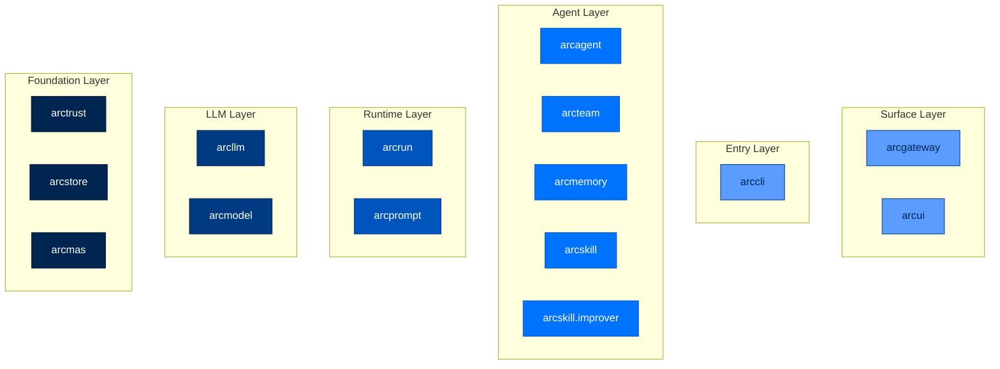

**Found in:** [PACKAGE_INDEX.md](../building/package-index.md)

---

### Layering Law

```mermaid
flowchart TB
    classDef entry   fill:#D6E6FF,stroke:#0073FE,color:#002550
    classDef surface fill:#5A9CFF,stroke:#003B82,color:#002550
    classDef agent   fill:#0073FE,stroke:#0055BC,color:#FFFFFF
    classDef runtime fill:#0055BC,stroke:#003B82,color:#FFFFFF
    classDef llm     fill:#003B82,stroke:#002550,color:#FFFFFF
    classDef found   fill:#002550,stroke:#001A38,color:#FFFFFF

    CLI["arccli / arctui — entry points"]
    GW["arcgateway — channel sessions"]
    UI["arcui — observe plus chat"]
    AGENT["arcagent — tools, skills, memory-as-tools"]
    RUN["arcrun — the execution loop"]
    LLM["arcllm — provider calls"]
    PROMPT["arcprompt — signed prompts"]
    SKILL["arcskill — signed skill hub"]
    MEMORY["arcmemory — analogical memory"]
    TEAM["arcteam — multi-agent bus"]
    STORE["arcstore — spool plus PostgreSQL operational store"]
    TRUST["arctrust — identity, sign, policy, WORM"]
```

**Found in:** [PACKAGE_INDEX.md](../building/package-index.md)

---

### Two Planes Architecture

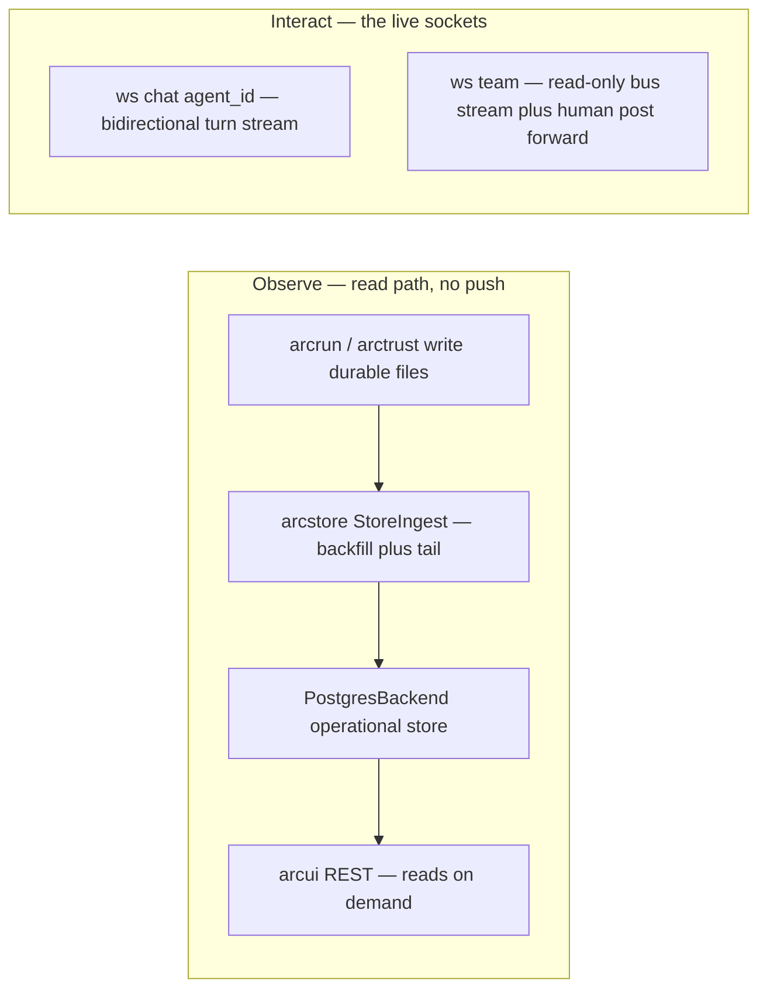

**Found in:** [PACKAGE_INDEX.md](../building/package-index.md)

---

## Security Diagrams

### Four Pillars

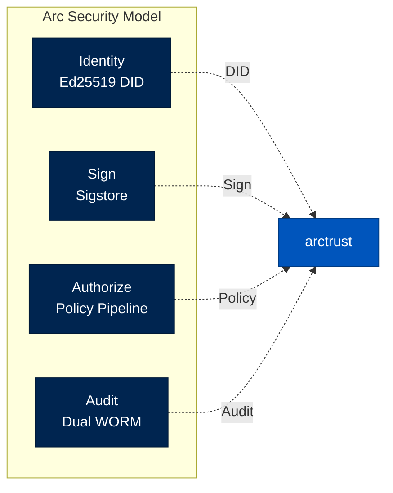

**Found in:** [SECURITY.md](../reference/security.md)

---

### Tier Comparison

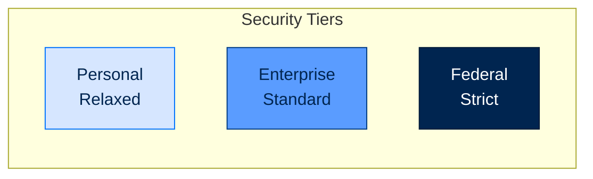

**Found in:** [SECURITY.md](../reference/security.md), [TIERS_AND_PRESETS.md](../reference/tiers-and-presets.md)

---

### Lethal Trifecta

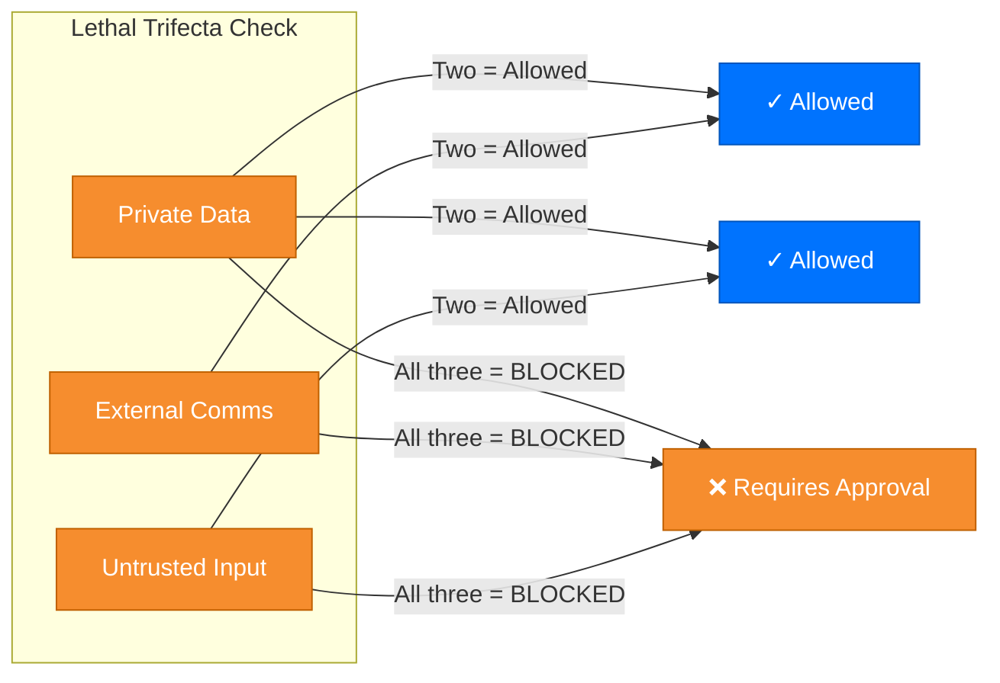

**Found in:** [SECURITY.md](../reference/security.md)

---

## Data Flow Diagrams

### Turn Flow

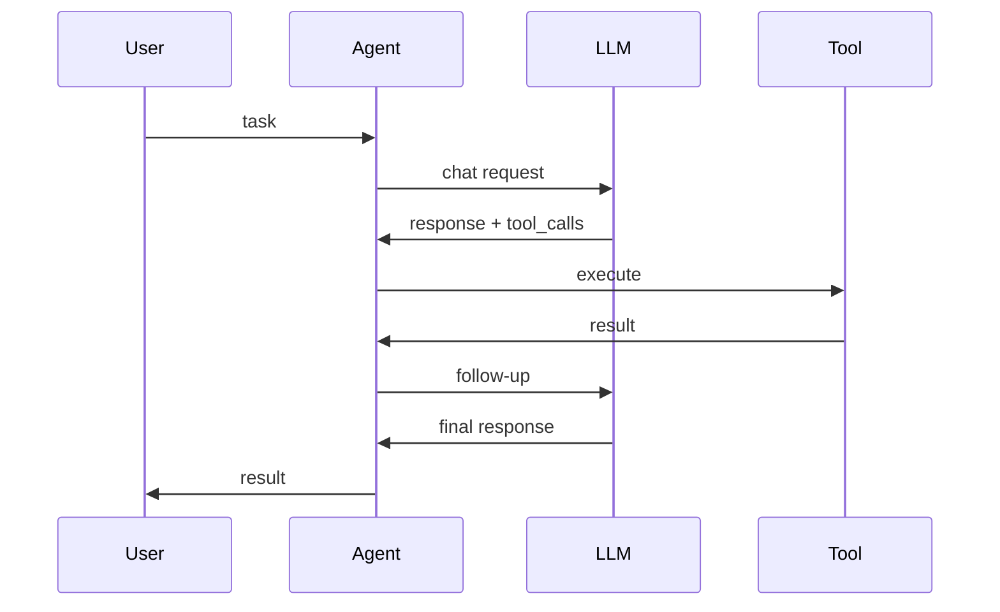

**Found in:** [DATA_FLOW.md](data-flows.md)

---

### Memory Flow

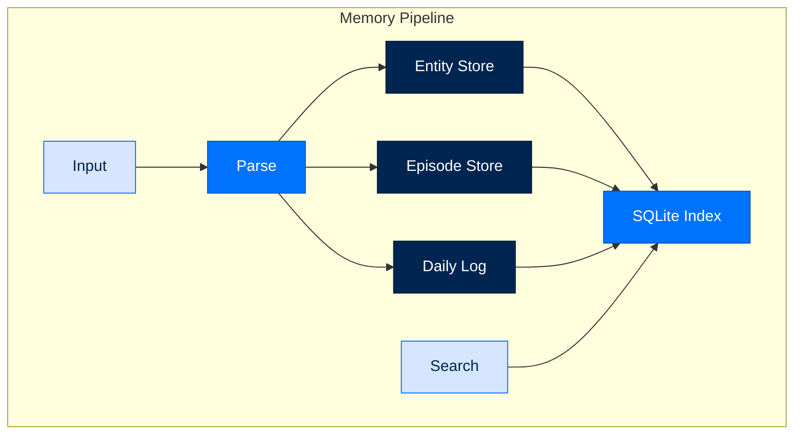

**Found in:** [DATA_FLOW.md](data-flows.md)

---

### Skill Install Pipeline

**Found in:** [PACKAGE_INDEX.md](../building/package-index.md), [BLUEPRINTS.md](../blueprints/blueprints.md)

---

## Scaling Diagrams

### Horizontal Scaling

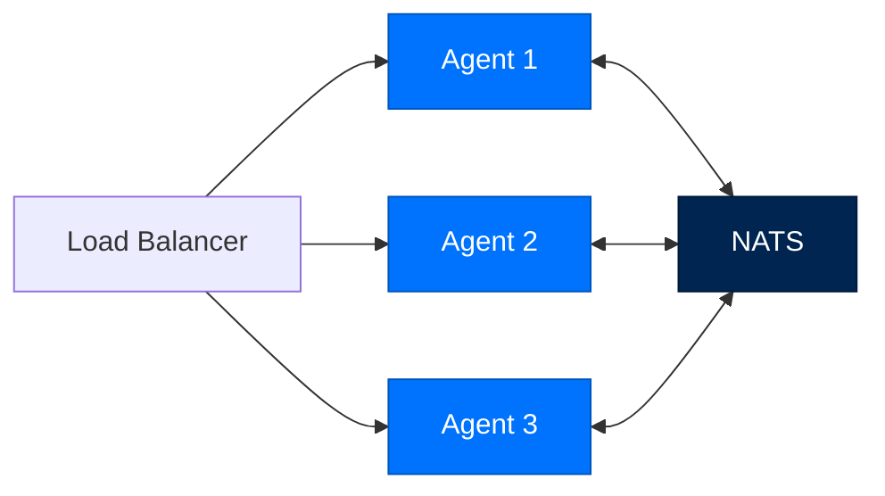

**Found in:** [PERFORMANCE.md](../building/performance.md)

---

## Deployment Diagrams

### Docker Deployment

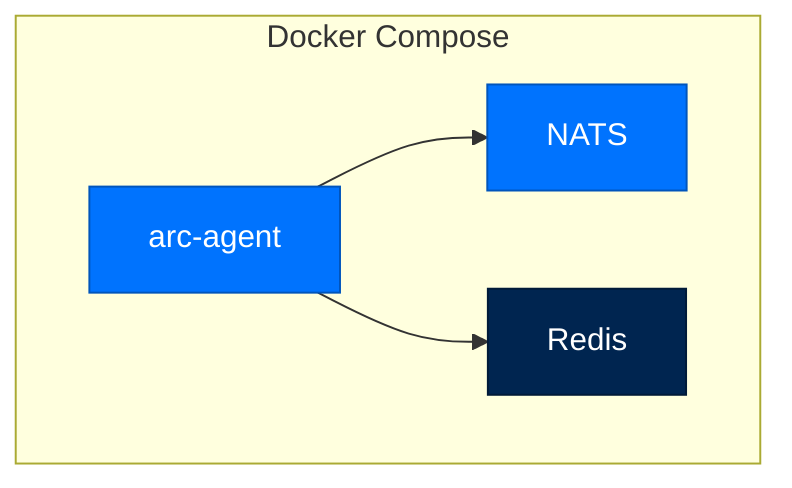

**Found in:** [DEPLOYMENT.md](../runbooks/deploy/overview.md)

---

## Reading Paths

### Documentation Paths

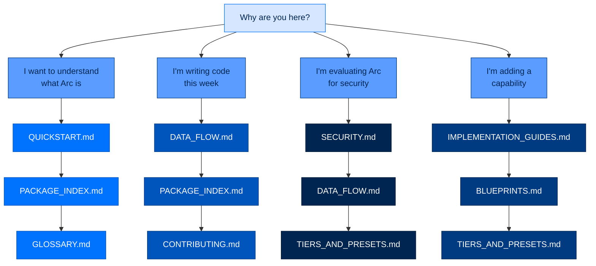

**Found in:** [README.md](../README.md)

---

## Next Steps

- [README.md](../README.md) - Main documentation index
- [PACKAGE_INDEX.md](../building/package-index.md) - Detailed architecture
