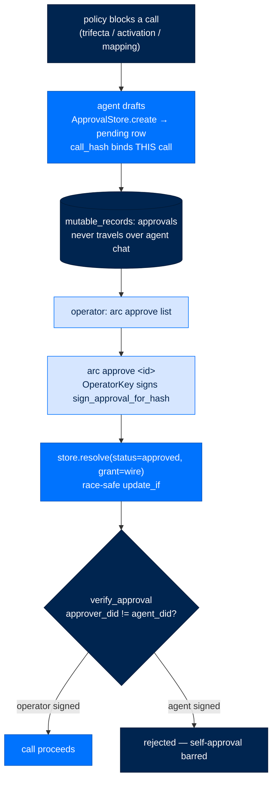

# An Approval — The Agent Drafts, the Operator Key Signs

> **How Arc works**  ·  Understand  ·  a data-flow page (T2.11)
> **For** anyone who needs to know how a blocked action becomes an authorized one — without the agent ever holding the key
> [← A tool call through policy](03-anatomy-of-a-turn.md)  ·  [Docs home](../README.md)  ·  [Policy & tiers →](10-security-model.md)

---

## In one breath

When policy blocks an action that needs a human — a trifecta-completing tool
call, an activation, a data-source mapping — the agent does **not** get to
approve itself. It can only *draft*: it parks a `PendingApproval` row that binds
to exactly this call by `call_hash`. Approval happens out-of-band, through the
`arc approve` CLI, where the **deployment operator key** (a notary seed that is
deliberately not an agent identity) signs a grant. The grant is written back into
the row, and the gate accepts it only because the signer is the operator, not the
agent. For recurring automation there's a second shape — a **scenario grant** —
keyed on an `origin` (`workflow:<id>` / `schedule:<id>`), so a standing grant can
never be replayed by an ordinary interactive turn, whose origin is `None` and
matches nothing.

## Draft, sign, grant

### The pending row (the draft)

`PendingApproval` (`packages/arcstore/src/arcstore/approvals.py:33`) is a frozen
row. Its load-bearing field is `call_hash` (`:49`) — *"binds an eventual grant to
exactly this call"* — alongside `agent_did`, `tool`, `legs` (which trifecta legs
are lit), redacted `arguments` and `provenance` for operator triage, `status`,
and `grant` (`:60`), which holds the operator-signed grant in wire form once
resolved. `ApprovalStore.create` (`:134`) writes it via
`mutable_write_with_outbox`. It lives in the `mutable_records` directory plane
(see [Where data lives](08-data-and-storage.md)) — **it never travels over agent
chat**, so a prompt-injected message can't forge one.

### The signature (the operator, never the agent)

`arc approve` (`packages/arccli/src/arccli/commands/approve.py:162`) lists
pending rows (`:81`) and, on `approve <id>`, mints the grant (`:102`): it builds
an `OperatorApprovalAuthority(resolve_operator_signer())`, calls
`sign_approval_for_hash(row.call_hash, operator)`, then
`store.resolve(status="approved", grant=grant_to_wire(grant))` (`:129`). The key
is the deployment operator key at `~/.arc/operator` — the module docstring is
explicit: *"A different key produces a different approver DID and the gate
rejects it."*

The operator key (`packages/arctrust/src/arctrust/operator.py:90`) is an
Ed25519 audit-signing credential that is **deliberately not** an `AgentIdentity`
— no `sign()` as an agent, no `did`. `resolve()` (`approvals.py:166`) is race-safe
(`update_if_with_outbox(where={"status": "pending"})`, `:194`), so two operators
can't double-resolve, and the `grant` is written **only** on `approved` (`:192`).

The draft/sign split is enforced structurally, not by a comment:
`verify_approval` (`policy.py:666`) rejects any grant whose `approver_did`
equals `call.agent_did` (`:676`). An agent that somehow signed its own grant is
rejected at the gate (ASI09 — human-agent trust exploitation).

## Scenario grants — approve automation once

Interactive approvals are per-call. A recurring, non-interactive driver (a
workflow, a schedule) would otherwise re-prompt forever. A **scenario grant**
(`packages/arctrust/src/arctrust/policy.py:123`) binds five facts: `agent_did`,
`tool_name`, `composition` (the frozenset of trifecta legs), `origin`, and
`connection`. The `scenario_key` (`policy.py:569`) is a canonical, sorted-key
serialization of all five — *"what a grant signs over, what durable storage
dedups on."* `sign_scenario_grant` (`:594`) signs `key.encode()` under the
operator identity; `verify_scenario_grant` (`:624`) checks it.

The safety mechanism is `origin`. Its docstring (`policy.py:138`) says it plainly:
*"`origin` is what keeps this enterprise-safe: it names a non-interactive driver
(`workflow:<id>`, `schedule:<id>`). Interactive work carries no origin and
therefore matches no grant."* The rule is explicit at `policy.py:640` — if
`origin is None or connection is None: return False`. So a standing grant approved
for `schedule:nightly-ingest` cannot be replayed by a user's live chat turn.
Self-approval is barred here too (`:642`).

## Why it is built this way

- **Draft/sign split (D-523).** The agent never holds the operator key. It can
  request; only the operator authority signs. This is the confused-deputy
  defense at the approval seam.
- **`call_hash` binding (D-111).** A grant authorizes *this* call, not a class of
  calls — a later, different call gets a different hash and no grant.
- **`origin` keying (D-651, scenario grants).** Standing automation grants are
  scoped to their driver; an interactive turn can't inherit them. That is what
  makes "approve once, run nightly" safe (ADR-034).

---

### Flow footer

| Field | Value |
|---|---|
| **Where it lives** | arcstore `approvals` → arccli `approve` → arctrust `policy`/`operator` |
| **What calls what** | `ApprovalStore.create` (pending row) → `arc approve` → `OperatorKey` signs `sign_approval_for_hash` → `resolve` sets grant; scenario: `sign`/`verify_scenario_grant` |
| **What passes — where / when / to** | `PendingApproval(call_hash)` → durable row (never over chat); operator signature → grant; scenario grant keyed by `scenario_key` incl. `origin` (`workflow:`/`schedule:`; `None` = interactive matches nothing) |
| **Security / modularity reason** | Draft/sign split = agent never holds the operator key; `origin` key = a standing grant can't be replayed by an interactive turn |
| **D-NNN / ADR** | D-523, D-525, D-557, D-111, D-651; ADR-034 |
| **Code anchor** | `arcstore/approvals.py:33,134,166` · `arccli/commands/approve.py:162` · `arctrust/operator.py:90` · `arctrust/policy.py:123,569,624,640,676` |

The full text of every `D-NNN` above lives in the decision log
([`.claude/decisions-log.md`](https://github.com/joshuamschultz/Arc/blob/main/.claude/decisions-log.md)).
