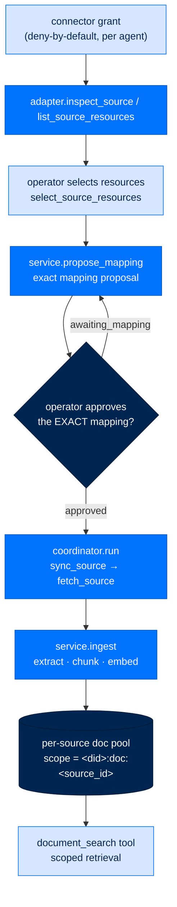

# Connected Source → Knowledge — Grant, Map, Approve, Sync, Retrieve

> **How Arc works**  ·  Understand  ·  a data-flow page (T2.8)
> **For** anyone who needs to know how an external account becomes searchable, per-source-isolated agent knowledge
> [← Anatomy of a turn](03-anatomy-of-a-turn.md)  ·  [Docs home](../README.md)  ·  [Connect a source (how-to) →](../get-started/connect-a-source.md)

---

## In one breath

Granting an account does **not** silently turn it into knowledge. A connected
source travels a governed lifecycle: an adapter *inspects* and *lists* what the
account holds, an operator *selects* the least-privilege resource set, Arc stages
an **exact mapping proposal** that a human must *approve*, and only then does
*sync* run — pulling objects, extracting and chunking them, and indexing each
source into its **own** document pool keyed `<did>:doc:<source_id>`. Retrieval is
the `document_search` tool, and it can only ever see the pools scoped to the
calling agent. Disconnecting a source is literally "delete that pool." The
source-side contract is one small Protocol (`SourceAdapter`); everything a
provider must implement lives behind it, so a new connector is a leaf you add,
not a core branch you edit.

## The lifecycle

Two seams cooperate. The **agent-side** coordinator drives sync and holds the
port contracts; the **arcmemory** service owns mapping approval, ingest, and the
index.

### 1. The source contract

Every provider implements `SourceAdapter`, a `@runtime_checkable` Protocol
(`packages/arcagent/src/arcagent/extension/source.py:159`) with six methods:

| Method | Line | Role |
|---|---|---|
| `inspect_source` | `:163` | describe the account (what kind of source it is) |
| `list_source_resources` | `:165` | enumerate folders / buckets / labels / schemas |
| `select_source_resources` | `:169` | record the operator's least-privilege selection |
| `sync_source` | `:171` | return a page of changed objects (cursor-driven) |
| `fetch_source` | `:173` | fetch one object's bytes/content |
| `close_source` | `:175` | release the connection |

*(The plan's catalog says "five methods"; the Protocol declares six — the sixth
is `close_source`.)* A connector that satisfies this Protocol is discovered as a
leaf; the coordinator never names a provider.

### 2. The coordinator drives sync

`ConnectedDataCoordinator.run`
(`packages/arcagent/src/arcagent/modules/connected_data/coordinator.py:54`)
acquires a lease (`:65`), then **gates on the mapping** —
`self._ingest.require_approved_mapping(source)` (`:82`) — before any fetch. It
registers a live datastore for datastore-shaped sources (`:88`), then loops
`_fetch_with_retry` → `_ingest_page` → `commit_page`, and on a full
(non-incremental) crawl calls `complete_snapshot` (`:144`). The port contracts it
talks to — `IngestPort`, `SyncStatePort` — are typed Protocols in
`packages/arcagent/src/arcagent/connected_data.py:161,185`, so the agent side
depends on a seam, not on arcmemory internals.

### 3. Mapping approval is the gate

`ConnectedDataService.require_approved_mapping`
(`packages/arcmemory/src/arcmemory/connected_data.py:297`) loads the SPEC-035
approval rows, matches by `mapping_call_hash`, and **only** on `status ==
"approved"` commits the mapping and returns an `ApprovedMapping` (`:338`).
Otherwise it stages a proposal and raises `SourceMappingPendingError` (`:350`).
The proposal itself is written as a `PendingApproval` row into the
`arcstore.approvals.ApprovalStore` via `stage_mapping_proposal`
(`packages/arcmemory/src/arcmemory/mapping.py:41`); the operator resolves it with
the same mechanical `arc approve` subsystem every other approval uses (see
[An approval](flow-approval.md)). A *changed* proposal produces a new
`call_hash`, so it needs a fresh approval — you can never silently re-map fields
under an old approval. An approved mapping does **not** lapse on a timer; it only
lapses when the structure changes (`connected_data.py:331`).

### 4. Ingest and the per-source pool

`ConnectedDataService.ingest` (`connected_data.py:358`) extracts, chunks, and
indexes each object. The isolation invariant is the **doc scope**:
`doc_scope(agent_did, source_id)`
(`packages/arcmemory/src/arcmemory/doc_index.py:36`) returns a `Scope` whose key
is `<did>:doc:<source_id>`. Each source gets its **own** `SurfaceIndex` — N
indices, one per source, not one shared index with a filter (D-686;
`doc_index.py:173`). Writes go
straight through the `IndexBackend` so the agent's *own* memory files can never
bleed into a document pool (`doc_index.py:9`,`:85`). Reindex and purge are
first-class: `reindex_source` (`connected_data.py:850`), `purge_source`
(`connected_data.py:570`, which clears the pool and removes the mapping).

### 5. Retrieval is a scoped tool

The agent sees one tool, `document_search`, registered as a ToolSpec at
`packages/arcagent/src/arcagent/modules/memory/capabilities.py:617`
(an `@tool(name="document_search", classification="read_only", ...)` decorator).
Its body resolves `st.brain.document_search`
(`capabilities.py:636`) → `ArcMemoryBrain.document_search`
(`packages/arcmemory/src/arcmemory/brain.py:812`) →
`DocIndex.document_search` (`doc_index.py:153`), passing `caller_did=st.agent_did`
so the search can only touch that agent's pools. Results are DATA-framed before
they reach the model (LLM01) and an audit event `memory.document_search` is
emitted (`capabilities.py:642`). A sibling tool, `knowledge_search`
(`capabilities.py:605`), covers the agent's *personal curated* store — a distinct
surface, not connected-source retrieval.

## Why it is built this way

- **Per-source scope = cross-tenant isolation (LLM08).** Because `vec0` carries
  no scope column, the index joins against `chunks WHERE scope = ?`
  (`index/backend.py:258`) — a search scoped to one source can never score
  another source's, or another agent's, vectors.
- **Mapping approval = no silent field mapping.** Sync is fail-closed in
  `awaiting_mapping` until an operator approves the *exact* mapping; a changed
  proposal re-gates (D-691).
- **One Protocol = a deletable connector.** Removing an extension's files leaves
  every other source working; only that capability goes away — the seam rule
  made literal ("disconnect = delete the pool").

---

### Flow footer

| Field | Value |
|---|---|
| **Where it lives** | arcagent `connected_data` module → arcmemory `ConnectedDataService` → extension `SourceAdapter` |
| **What calls what** | coordinator → adapter `inspect/list/select/sync/fetch` → `require_approved_mapping` → `ingest` → per-source index → `document_search` tool |
| **What passes — where / when / to** | source objects → per-source doc scope `<did>:doc:<source_id>`; sync only after the exact mapping is approved; provenance stamped; retrieval scoped to the calling agent |
| **Security / modularity reason** | Per-source scope = LLM08 cross-tenant isolation; mapping approval = no silent field mapping; one Protocol = deletable connector |
| **D-NNN / ADR** | D-683, D-684, D-686, D-688, D-691; SPEC-073 |
| **Code anchor** | `connected_data/coordinator.py:54,82` · `extension/source.py:159` · `arcmemory/connected_data.py:297,358,570,850` · `doc_index.py:36,153` · `memory/capabilities.py:617` |

The full text of every `D-NNN` above lives in the project's decision log.
