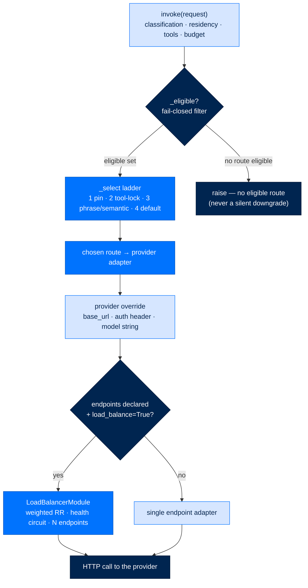

# LLM Routing and Load-Balancing — One Provider Answers, Spread Across Many Keys

> **How Arc works**  ·  Understand  ·  a data-flow page (T2.12)
> **For** anyone who needs to know how a model call picks a provider — and how one provider fans out across endpoints
> [← Anatomy of a turn](03-anatomy-of-a-turn.md)  ·  [Docs home](../README.md)  ·  [Source cookbook →](../get-started/source-cookbook.md)

---

## In one breath

Every model call in Arc goes through a **router** before it reaches a provider,
and the router is the *innermost* element of the stack — always. It picks a
provider by four ordered rules (an explicit pin, a tool-continuity lock, a
phrase/semantic match, then a default), but only after a **fail-closed
eligibility filter** rejects any route that violates classification, residency,
required capabilities, or budget. Underneath a chosen route, an optional
**load-balancer** can spread a single caller's calls across N *equivalent
endpoints of the same provider* — different keys, different base URLs, same
model — with weighted round-robin and a per-endpoint health circuit. Routing and
balancing both live entirely inside `arcllm`: `arcrun` and `arcagent` never see a
provider name. This is concern purity (`arcagent` must not own LLM-call logic)
made concrete.

Two things this page makes precise, because they had **almost no documentation**
before it: how a provider *overrides* its base URL / auth header (the
Azure/OpenAI-compat seam), and how an **endpoint pool** is declared and driven.

## The router is always there

`arcllm.load_model(...)` never returns a bare adapter. It builds a
`RoutingModule` as the innermost element of every stack and returns that
(`packages/arcllm/src/arcllm/registry.py:629`; the package rule is stated by
design — *"`load_model` always returns a `RoutingModule`"*).
A single-provider deployment still gets a router; it simply has one route.

Selection is a **four-tier ladder** in `RoutingModule._select`
(`packages/arcllm/src/arcllm/modules/routing.py:588`), tried in order:

1. **Pin** — the caller passed `route="<name>"`. Honoured first.
2. **Tool-continuity lock** — a run already mid-tool-use stays on the provider
   that started it, so a multi-step tool sequence doesn't jump models.
3. **Phrase / semantic match** — the request matches a route's routing rule.
4. **Default** — the configured fallback route.

But a route is only *reachable* if it first passes `_eligible`
(`modules/routing.py:610`), a **fail-closed** filter. A route is skipped when:

- its `classification_max` ranks **below** the call's classification
  (`_CLASSIFICATION_RANK.get(route.classification_max) < level` → skip);
- its `residency` doesn't satisfy the call;
- it lacks a `required_capability` (Arc adds `"tools"` automatically when the
  call carries tools, so a non-tool model can never silently receive a tool
  call); or
- the remaining budget is exhausted.

If nothing is eligible, selection raises rather than quietly downgrading. That
is the LLM06 / least-privilege posture: a classified prompt never falls through
to a model that isn't cleared for it.



## Provider override and inheritance

A provider ships with a packaged descriptor TOML (its default `base_url`,
`default_model`, auth style). A deployment overrides any of that with a
`[providers.<name>]` block in the user-wide `arcllm.toml`
(`${ARC_CONFIG_DIR:-~/.arc}/arcllm.toml`). The override **deep-merges** over the
packaged descriptor (`packages/arcllm/src/arcllm/config.py:445` —
`overrides = user_data.get("providers", {})` … `data = _deep_merge(data,
overrides[provider_name])`).

```toml
# ~/.arc/arcllm.toml — point the OpenAI-compatible provider at an internal gateway
[providers.openai]
base_url = "https://my-gateway.internal"
api_key_env = "OPENAI_API_KEY"
```

- **Base URL** is applied by the adapter, not the core. The base `BaseAdapter`
  stores the merged config (`adapters/base.py:29`); the OpenAI adapter reads it
  when it builds the request URL (`adapters/openai.py:403` —
  `f"{self._config.provider.base_url}/v1/chat/completions"`).
- **Auth header** is overridden by *subclassing*, which is how the
  Azure/OpenAI-compat seam works. OpenAI sends `Authorization: Bearer <key>`
  (`adapters/openai.py:191`); the Azure adapter overrides `_build_headers` to
  send an `api-key` header instead, and overrides `_completions_url` to
  `{base}/openai/v1/chat/completions` (`adapters/azure_openai.py:29`,`:39`).
- **Model string.** For Azure the model string *is* the deployment name
  (`adapters/azure_openai.py:10`). There is **no per-endpoint model-remapping
  table** — the model is `route.model or config.provider.default_model`
  (`registry.py:242`,`:207`). If you were expecting a `model_map` field, none
  exists in the code today (**needs confirmation** whether one is planned).

## Load-balancing: intra-provider only

When a provider declares multiple endpoints **and** the call opts in, the chosen
route's adapter is replaced — at the innermost stack position, exactly where the
router sits — by a `LoadBalancerModule`
(`packages/arcllm/src/arcllm/modules/load_balancer.py:308`; built under the route
at `registry.py:244`). It holds a pool of endpoint adapters, all cloned from the
**same** provider config (`registry.py:322`), so balancing is strictly
**intra-provider** — it never changes which provider or model answers, only which
key/URL carries the request (`load_balancer.py:1` docstring; D-449). No prompt is
ever split across two different vendors.

- **Default strategy** is `weighted_round_robin`
  (`load_balancer.py:342`). The three valid strategies are
  `weighted_round_robin`, `health_aware`, and `sticky` (`load_balancer.py:71`).
- **Health circuit.** Each endpoint carries a passive `_EndpointHealth`
  breaker with CLOSED / OPEN / HALF_OPEN states, escalating jittered cooldowns,
  and honouring a `429 Retry-After` (`load_balancer.py:98`,`:171`). The
  `health_aware` and `sticky` strategies skip OPEN endpoints and raise
  `PoolExhaustedError` when every endpoint is dead (`load_balancer.py:397`,`:507`)
  — a fail-closed pool, not a silent single-endpoint fallback.
- **The pool** is `list[PoolEndpoint]` (`load_balancer.py:359`), each
  `PoolEndpoint(adapter, weight, endpoint_id)` expanded into a weighted sequence
  (`load_balancer.py:366`).

### Declaring an endpoint pool

Endpoints are parsed into `EndpointConfig` at `config.py:457`. Each has
`base_url`, one of `api_key_env` **or** `vault_path` (cross-validated so a key
source is required when the provider needs auth — `config.py:214`), and a
`weight` (`config.py:178`):

```toml
# in the provider TOML, or merged via [providers.<name>] in ~/.arc/arcllm.toml
[[endpoints]]
base_url = "https://api.openai.com"
api_key_env = "OPENAI_API_KEY_A"
weight = 2

[[endpoints]]
base_url = "https://api.openai.com"
vault_path = "secret/openai/key-c"   # vault instead of env — same audited resolver
weight = 1
```

Each endpoint gets its **own** key: `_build_adapter_for_endpoint` clones the
provider config with that endpoint's `base_url` / `api_key_env` / `vault_path`
(`registry.py:325`). Balancing is **opt-in per call**, not per-endpoint: it
activates only when `load_model(..., load_balance=True)` is passed *and* the
provider TOML actually declares endpoints (`registry.py:500`,`:622`,`:244`).
Today only the shipped `openai.toml` and `vllm.toml` descriptors carry example
`[[endpoints]]` blocks, and both are commented out — an empty list is exactly
today's single-endpoint behaviour (`config.py:210`).

## Why it is built this way

- **Concern purity.** Routing and balancing never leak upward. `arcrun` asks
  `arcllm` for "a model" and gets a stack; it cannot name a provider, so no loop
  or agent code can encode a vendor branch. That is what lets `arcllm` be
  rewritten or `pip install`ed alone (composability rule; ADR-035).
- **Fail-closed on classification.** Eligibility runs *before* selection, so a
  classified call can never reach an uncleared model even by pin (LLM06 /
  excessive agency).
- **Intra-provider containment.** A pool spreads load, not data: one prompt
  stays with one provider and one model. Cross-provider spreading of a single
  caller's data is structurally impossible (D-449).
- **Per-endpoint key custody.** Each endpoint resolves its own vault path or env
  key through the one audited resolver — no shared credential across the pool.

---

### Flow footer

| Field | Value |
|---|---|
| **Where it lives** | `arcllm` (router + load-balancer modules; provider adapters) |
| **What calls what** | `load_model` → `RoutingModule._eligible` → `_select` (pin · tool-lock · phrase · default) → provider adapter (override URL/auth/model) → optional `LoadBalancerModule` (weighted RR + health circuit) over N `[[endpoints]]` |
| **What passes — where / when / to** | request (classification · residency · required capabilities · budget) → eligibility filter; within the chosen provider, calls spread across N endpoints, each with its own key; a call never crosses providers |
| **Security / modularity reason** | Routing policy stays inside `arcllm` (concern purity); eligibility is fail-closed (LLM06); balancing is intra-provider only (D-449) |
| **D-NNN / ADR** | D-190, D-197, D-232, D-233, D-449, D-453, D-458; ADR-035, ADR-025 |
| **Code anchor** | `arcllm/registry.py:629,244,500` · `modules/routing.py:588,610` · `modules/load_balancer.py:308,342,98` · `config.py:445,457,178` · `adapters/azure_openai.py:29,39` |

The full text of every `D-NNN` above lives in the project's decision log;
the seam catalog that indexes these footers is the Decision Index concept page.
