# The MCP Door — Letting External Clients Reach an Agent's Tools

> **Walkthrough**  ·  Set up  ·  how an outside MCP client calls an Arc agent's tools, safely
> [Docs home](../README.md)  ·  [6. Prompts, Tools, Skills](06-prompts-tools-skills.md)  ·  [10. The Security Model](10-security-model.md)  ·  [Audit and the WORM Chain](audit-and-the-worm-chain.md)

---

## In one breath

Arc has always been an MCP *client* — an agent reaches out to external MCP
servers through an extension attachment (see
[6. Prompts, Tools, Skills](06-prompts-tools-skills.md#part-b--tools)). The
**door** is the mirror image: an optional module that lets an outside MCP client —
Claude Desktop, another Arc agent, a bring-your-own harness — call *this* agent's
tools over MCP. It is off until you enable `[modules.mcp_server]`, it serves only
the tool verbs you name, and — the load-bearing part — every inbound `tools/call`
runs the **same** identity → policy → audit envelope a native tool call runs. The
door adds an inbound front end (who are you, is this signed, is it a replay, are you
enrolled, is this verb exposed); it adds **no** second dispatch path, no new crypto,
and no persistent state. Recorded as **ADR-035**.

```mermaid
flowchart LR
    C["external MCP client<br/>(Claude Desktop / Arc agent / BYO)"] --> T["transport<br/>stdio · streamable-HTTP (+mTLS)"]
    T --> V["verify inbound<br/>DID · signature · replay · tier"]
    V --> E["enrollment gate<br/>(enterprise/federal)"]
    E --> A["exposure allowlist<br/>only named verbs"]
    A --> ENV["AgentCapabilityProvider.invoke<br/>= the one native envelope"]
    ENV --> P["PolicyPipeline<br/>first-DENY, fail-closed"]
    P --> X["tool execute"]
    X --> AU["one audit event<br/>(WORM at enterprise/federal)"]
```



---

## Enabling the door

The door is an ordinary Arc module: discovered by folder presence, served only when
an operator turns it on. It is **default off** — a security-sensitive surface never
activates by discovery alone
(`packages/arcagent/src/arcagent/modules/mcp_server/config.py`).

```toml
[modules.mcp_server]
enabled = true
server_name = "arc"          # identity reported to clients, for their logs and yours
page_size = 100              # tools/list page size (1–1000)
expose = ["read", "grep", "find"]   # the exposure allowlist — see below
```

`expose` is the **allowlist of tool verbs the door may open**. It is not optional
scenery: `tools/list` returns only `expose ∩ your real catalog`, and a `tools/call`
on any verb not on the list is refused *before* a dispatch object exists
(`allowlist.py::ExposureAllowlist.check_call`).

- At **personal** tier, `expose = ["*"]` is permitted — the wildcard opens the full
  catalog.
- At **enterprise/federal**, an unbounded (`*`) or empty `expose` is **refused
  outright** (REQ-415, D-548): the door must name every verb it opens, mirroring the
  connector allowlist rule. This is a tier stringency dial, not a different trust
  model.

The whole module is removable: delete the directory and the nucleus, startup, and
every other feature keep working — the core has zero knowledge of it.

## The transports

The door speaks `server/discover`, a paginated `tools/list`, and `tools/call` on the
stateless 2026-07-28 MCP revision, with wire constants that mirror Arc's own MCP
client exactly, so the two sides are symmetric (`server.py`, `http_transport.py`).

| Transport | Shape | State in the tree |
|---|---|---|
| **streamable-HTTP** | one POST per message, JSON reply, 8 MiB body cap; **mTLS at enterprise and federal** | **Shipped** — `http_transport.py::HttpDoor`, an ASGI responder with the full `tools/call` pipeline |
| **stdio** | one JSON message per line over stdin/stdout, for a client that launches the agent as a subprocess (Claude Desktop style) | **Shipped** — `stdio_transport.py::serve_stdio`, driving the same `DoorRouter` |

> **How it runs.** arcagent is headless and never binds a port. `serving.build_door_from_agent`
> assembles the full door (listing + the verify → enroll → allowlist → dispatch → audit
> call path) from a started agent, and `arc mcp serve --stdio` (default, for a local
> client) or `arc mcp serve --http --host H --port P [--tls-cert … --tls-key …]` binds
> it to a socket. The module's own `capabilities.py::setup()` builds only the in-process
> read-only listing surface; the CLI is the surface that serves. A persistent
> gateway/arcui-hosted door (mounting the `HttpDoor` ASGI app so no CLI process is
> needed) is the one remaining option, not a blocker.

The HTTP door (`http_transport.py::HttpDoor`) is a plain ASGI callable — no server
framework, no vendor SDK — so it runs under any ASGI server. Two hard guards sit in
front of every request:

- **mTLS at enterprise and federal.** A request that arrives without a client
  certificate in the ASGI `tls` extension (populated by a TLS-terminating proxy in
  front of the app) is refused with `403` before anything is served (REQ-418).
- **Body cap.** A body over 8 MiB is refused with `413` before it is parsed — an
  unbounded read is a memory-exhaustion primitive (LLM10).

`tools/call` is served on the HTTP door **only** when the door was given its full
trust collaborators (a capability provider, the allowlist, a replay cache, and an
audit sink); otherwise the HTTP surface is a read-only `server/discover` +
`tools/list` listing.

## Enrolling an external caller

A caller presenting a valid, signed identity has proven **possession of a key**, not
**admission to your fleet** (ASI04). A foreign harness is untrusted code; "it signed
correctly" grants it nothing on its own.

Admission is an **operator-signed `EnrollmentGrant`**, verified against the trust
store's operator key before the caller reaches the door; the verified members' DIDs
arrive at the door as the enrolled roster
(`enrollment.py::require_enrolled`). The gate is a **stringency dial**, not a second
trust model:

- **Personal** — enrollment is optional. A self-signed personal caller that passes
  inbound verification is admitted without a roster.
- **Enterprise / federal** — enrollment is **mandatory**. A verified-but-unenrolled
  caller is refused, and the check is **fail-closed**: a `None` or empty roster
  enrolls nobody, so a tier that requires enrollment refuses every caller until an
  operator enrolls one (NIST 800-53 AC-3, deny-by-default). The refusal emits one
  `deny` audit event.

## Every inbound call rides the native envelope

This is the whole security argument for the door. An inbound `tools/call` runs one
ordered, fail-closed pipeline (`door.py::authorize_and_dispatch`):

1. **Verify the signed envelope** (`identity.py::verify_inbound`) — `validate_did`,
   `did_matches_pubkey`, an Ed25519 signature check over the `canonical_json` of the
   request, and a `ReplayCache` check (nonce + timestamp). No new crypto lives in
   the door; it composes `arctrust`/`arcteam` seams. Any anomaly — malformed DID,
   missing signature, DID↔key mismatch, bad signature, replay, stale timestamp —
   fails closed with a `deny` audit event.
2. **Enrollment gate** (`enrollment.py`) — as above.
3. **Exposure allowlist** (`allowlist.py`) — the verb is refused here if it is not
   exposed, before any dispatch object exists.
4. **The one existing envelope** (`dispatch.py` → `AgentCapabilityProvider.invoke`)
   — the verified external caller's DID becomes `caller_did` inside the *native*
   invoke path, so `PolicyPipeline` (first-DENY-wins, fail-closed) and audit run
   **identically** to a native call. There is deliberately **no** second dispatch
   path: REQ-411 forbids it, because a bespoke external path is exactly how policy
   and audit drift apart.
5. **One audit event** (`audit.py::emit_door_event`) — every door operation, allow
   *and* deny, emits exactly one event carrying the caller DID, the verb, the
   outcome, the tier, and a **SHA-256 hash** of the arguments — never the raw
   argument values (LLM02/LLM07).

See [10. The Security Model](10-security-model.md) for the policy layers and
lethal-trifecta gate the envelope applies, and
[Audit and the WORM Chain](audit-and-the-worm-chain.md) for where the event lands.

## Security posture per tier

Tier is stringency metadata, not a gate (ADR-019): every tier still identifies,
verifies, authorizes, and audits every inbound call. What changes is how strict each
knob is.

| Knob | Personal | Enterprise | Federal |
|---|---|---|---|
| Exposure allowlist | `*` permitted | explicit list, no `*`/empty | explicit list, no `*`/empty |
| Enrollment | optional | required (operator-signed) | required (operator-signed) |
| HTTP transport | plaintext localhost OK | mTLS | **mTLS required** (cert or `403`) |
| Audit sink | `NullSink` | `WormSink` (tamper-evident) | `WormSink` (tamper-evident) |
| Missing WORM path/signer | n/a | fails closed | fails closed |

At enterprise/federal the audit sink selection itself fails closed: a missing WORM
path or signer raises rather than silently degrading to a sink that drops the record
(`audit.py::select_sink`).

## The connector side

The door is one half of SPEC-082. The other half is the **connector** direction —
attaching an external system's tools *into* an agent (Composio, Microsoft 365, and
any hosted-MCP or native connector). If you are authoring a connector rather than
opening a door, the contract every connector must honour — monotonic revision, lazy
client re-creation, typed failures, refusals returned not raised — lives in
[Connector authoring contract](../concepts/connector-authoring.md).

## Where to look

| Path | What lives there |
|---|---|
| `packages/arcagent/src/arcagent/modules/mcp_server/config.py` | `[modules.mcp_server]` schema — default-off, `expose` allowlist |
| `packages/arcagent/src/arcagent/modules/mcp_server/server.py` | Read-only serving surface: `server/discover`, paginated `tools/list` |
| `packages/arcagent/src/arcagent/modules/mcp_server/http_transport.py` | Streamable-HTTP ASGI door; mTLS-at-federal and body-cap guards |
| `packages/arcagent/src/arcagent/modules/mcp_server/identity.py` | Inbound DID / signature / replay verification (fail-closed) |
| `packages/arcagent/src/arcagent/modules/mcp_server/enrollment.py` | Fleet-enrollment gate (mandatory at enterprise/federal) |
| `packages/arcagent/src/arcagent/modules/mcp_server/allowlist.py` | Per-tier exposure allowlist |
| `packages/arcagent/src/arcagent/modules/mcp_server/door.py` | The composed verify → enroll → allowlist → dispatch → audit pipeline |
| `packages/arcagent/src/arcagent/modules/mcp_server/audit.py` | Single door audit-emission point; tiered sink selection |
| `packages/arcagent/src/arcagent/extension/mcp_attachment.py` | The MCP **client** the door mirrors |
| ADR-035 | The design record for the door |

If you are enabling the door, start in `config.py` (the `expose` allowlist is the
one knob you must get right). If you are reasoning about what an external caller can
actually do, start in `door.py` — it is the whole inbound contract in one file.

## Deploying the door on the fleet

The door runs two ways: **locally** via the `arc mcp serve` CLI (for a single agent on
your laptop or a client like Claude Desktop), or **always-on on a deployed fleet**
mounted inside the arcui dashboard server at `POST /mcp/{agent_did}`.

### No deploy changes needed

The fleet door is **already part of arcui**, which runs under `arc.service` on every
deployed node (DGX, Azure, or any systemd-user box). Restarting the service brings it
up automatically — no new systemd unit or deploy-script changes. The only requirement
is enabling the door in the target agent's configuration.

Enable the door by adding `[modules.mcp_server]` to the agent's `arcagent.toml`:

```toml
[modules.mcp_server]
enabled = true
expose = ["read", "grep", "find", "bash"]  # allowlist the verbs this agent exposes
```

At **enterprise/federal** tier, also gate it by enrollment:

```toml
[modules.mcp_server]
enabled = true
expose = ["read", "grep", "find", "bash"]
enrolled = ["did:arc:external_caller_1", "did:arc:external_caller_2"]  # external caller DIDs
```

At enterprise/federal, the fleet door additionally requires mTLS — a TLS-terminating
proxy in front of arcui must populate the ASGI `tls` extension with the verified
client certificate, or the door refuses the request with `403`.

### Per-tier security posture

Tier is a stringency dial, not a different trust model. Every tier still verifies the
caller's identity, checks the allowlist, and audits the call. What changes:

| Knob | Personal | Enterprise | Federal |
|---|---|---|---|
| Exposure allowlist | `*` permitted | explicit list, no `*`/empty | explicit list, no `*`/empty |
| Enrollment | optional | required | required |
| HTTP transport (fleet) | plaintext OK | mTLS | **mTLS required** |
| Audit | logged | WORM (tamper-evident) | WORM (tamper-evident) |

### Connecting an external client

**On the fleet:** An external MCP client (another Arc agent, Claude Desktop with MCP
support, or a custom harness) connects to the door via:

```
https://<fleet-host>/mcp/<agent_did>
```

The client must sign its request with its own DID's key, include its own DID in the
envelope, and (at enterprise/federal) present a valid client certificate to the TLS
proxy.

**Locally:** For a single agent on your laptop, launch the door with:

```bash
arc mcp serve --stdio         # default; Claude Desktop talks over stdin/stdout
arc mcp serve --http --host 127.0.0.1 --port 8080   # HTTP for local testing
```

### Observability

The arcui SPA dashboard shows each agent's door on/off status on the **connectors**
panel, alongside the agent's enrolled external callers. A red indicator means the door
is disabled or `expose` is empty; green means it is live and the allowlist is populated.

### Fleet default exposure policy by tier

`scripts/deploy-vm.sh` turns the door on for every agent it deploys, choosing the
exposure from each agent's tier — the same stringency dial the door itself enforces:

| Tier | Enabled | Exposure | Enrollment | Notes |
|---|---|---|---|---|
| **personal** | yes | `expose = ["*"]` — all tools, open | none (signature-verified only) | Any caller who can reach the port and sign a request gets full tool access, including `bash`. Appropriate only when the door's port is on a trusted/firewalled network. |
| **enterprise** | yes (module on) | operator sets an **explicit** list (the allowlist refuses `"*"` above personal) | **required** — a non-empty `enrolled` roster, or the door denies every caller | Fail-closed until the operator sets `expose` + `enrolled`. |
| **federal** | yes (module on) | operator sets an explicit **read-only** list | **required** + **mTLS** | Fail-closed until configured; keep `expose` to read-only verbs and front the app with a TLS proxy that populates the ASGI `tls` extension. |

The step is idempotent: it never overwrites an agent config that already declares
`[modules.mcp_server]`, so an operator's explicit exposure/enrollment choices survive
every redeploy. To change an agent's exposure, edit its `arcagent.toml` under
`~/arc/team/<agent>/` and restart `arc.service`.
