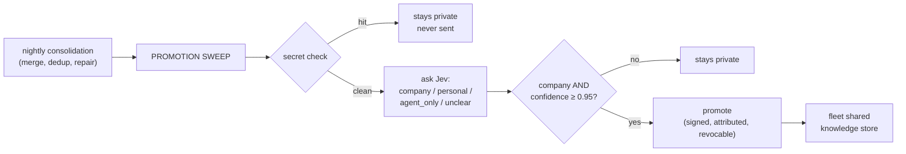

# Memory Promotion — Sharing Company Knowledge Across the Fleet

> **Walkthrough**  ·  Set up  ·  how private agent memory becomes shared fleet knowledge, safely
> [Docs home](../README.md)  ·  [7. The Memory Lifecycle](07-memory-lifecycle.md)  ·  [10. The Security Model](10-security-model.md)  ·  [Audit and the WORM Chain](audit-and-the-worm-chain.md)

---

## In one breath

Every agent learns things privately: insights, procedures, and facts about
entities it deals with. Most of that should stay with the agent. Some of it —
a deal's terms, a client's name, how a process works — belongs to the whole
company. **Memory promotion** is a nightly, opt-in sweep that asks a
third-party classifier (TypeSafe **Jev**) one question about each new or
changed item: *company, personal, agent-only, or unclear?* Only a confident
`company` answer promotes the item into the fleet's shared knowledge store,
where every other agent can find it. Everything else — including anything
Jev is unsure about — stays private. A deterministic secret check runs
before anything is sent, so credentials never leave the box. Promotion is
off by default, cannot be turned on at federal tier, and every egress and
every decision is audited.



## What promotes, and what never does

The line is **company vs. personal, not secret vs. not**. A deal's dollar
figure or a client's name does not block promotion by itself — it is exactly
the kind of thing that should be shared. What decides is who the fact
belongs to:

| Answer | Meaning | Result |
|---|---|---|
| `company` @ confidence ≥ **0.95** (floor 0.90) | Company operations, deals, clients, pricing, market info, reusable process | **Promoted** |
| `company` @ confidence below the threshold | Same topic, but Jev isn't sure enough | Stays private |
| `personal` | The operator's own life or personal side projects | Stays private |
| `agent_only` | Housekeeping only this one agent needs (its own quirks, scratch notes) | Stays private |
| `unclear` | Not enough information, or not a statement about work or personal life | Stays private |

A second, cheaper question — "is this about the operator's personal life?"
— runs alongside the main one as a cross-check. If that comes back above
**0.10** (configurable), the item stays private even if the main answer was
`company`. This exists because Jev is known to be overconfident in the
middle of its range; the cross-check is one more reason to say no, never a
reason to say yes on its own.

**Never promotable, at any confidence:** `episodic` events and `daily` logs.
Only `insight`, `procedure`, and `entity` records are ever candidates.

**Never sent, at all:** anything that trips the secret check — API keys,
passwords, tokens, AWS/GitHub keys, private-key blocks, database connection
strings with credentials in them. The check runs *before* anything reaches
the classifier; a match means zero bytes leave the box, and the item is
recorded as blocked, not evaluated.

## Installing the classifier

Jev is an optional, removable piece — not a hard dependency of Arc:

```bash
pip install arcllm[jev]
```

This installs `typesafe-sdk` (pinned) into the one folder that is allowed to
use it (`arcllm/classifiers/jev/`). Nothing else in Arc imports it.

**To remove it** — either uninstall the extra, or simply delete
`arcllm/classifiers/jev/` from the install. Either way, the classifier
reports itself unavailable and the nightly sweep records status
`classifier_unavailable`: nothing is sent, nothing promotes, and nothing
else in Arc changes. There is no partial-broken state.

## Setting the key

One key, `TYPESAFE_API_KEY`, is shared fleet-wide — there is no per-agent
key. It never appears in any TOML file; it lives only in the existing
write-only key store. Set it from whichever surface you're already in:

```bash
# from the CLI, general key store (provider name "jev")
arc keys set jev

# or from the agent-specific promotion verb (same store, same key)
arc agent promotion key set <agent_dir>
```

Both prompt for the value (hidden if you're at a terminal, or read one line
from piped stdin) and never print it back. `arc agent promotion show
<agent_dir>` and `arc keys list` both report only `set` / `not set` — never
the value.

In **ArcUI**, the same key is set from the agent's page, **Knowledge tab →
"Memory sharing" panel**, in a write-only key field with a "key set" badge.
It writes to the same store via `PUT /api/keys/TYPESAFE_API_KEY`.

## Turning it on

### From the CLI

```bash
arc agent promotion show <agent_dir>
arc agent promotion set  <agent_dir> --enabled [--threshold 0.96] [--model jev-1.13]
arc agent promotion set  <agent_dir> --disabled
```

- `show` prints `enabled`, `confidence_threshold`, `classifier_model`, the
  agent's `tier`, whether that tier locks promotion off, and whether the key
  is stored — never the key.
- `set` validates the change against the agent's tier before writing
  anything: a threshold below **0.90**, a model named `*-latest` (versions
  must be pinned, never floating), or `--enabled` on a **federal** agent are
  all refused with nothing written to disk.
- Every accepted change writes `[modules.memory.config.promotion]` with
  `tomlkit` (every other setting and comment in the file survives) and emits
  one `memory.promotion.config_changed` audit event, field by field,
  old → new.

### From ArcUI

The agent's page → **Knowledge tab → "Memory sharing"** panel has the same
three settings (toggle, threshold, pinned model) plus the write-only key
field described above. It is disabled with an on-screen reason at federal
tier. Every change is validated and audited the same way as the CLI path
(`GET`/`PUT /api/agents/{id}/memory/promotion`, operator role required).

## When it runs

Promotion is not a separate schedule — it is the last step of each agent's
existing **nightly consolidation** (roughly 3am local, once per local day),
running after entity merge, backlink repair, and dedup. For each insight,
procedure, or entity that is new or has changed since the last time it was
evaluated:

1. Render the item to the same bytes that would be published.
2. Check a signed ledger — unchanged since last time? Skip it. (An edited
   item is re-evaluated; an untouched one is never re-sent.)
3. Run the secret check.
4. Ask Jev the Choice + Noul question.
5. Decide: promote, or keep private.
6. Record a signed ledger row either way.
7. Publish everything that decided to promote.

The ledger lives at `<workspace>/memory/promotion/ledger.jsonl` inside the
agent's own workspace (never touched by ordinary project tools — this is
agent state, written by direct filesystem I/O). Each row records the item,
its content hash, the classifier's id and version, the label, the
confidence, the decision, and a signature — never the item's text.

If the sweep fails for any reason — Jev is down, times out, or errors mid
batch — **nothing that night promotes**, including items already classified
`company` earlier in the same run. Everything already answered is kept
`pending` in the signed ledger and published on the next night that
succeeds, without being re-sent to Jev. The nightly hygiene pass itself
still completes and stamps its date even when the promotion sweep fails —
one failing sweep never blocks the rest of consolidation.

## What egresses, and what is audited

**What actually leaves the box**, per item sent to Jev: the item's rendered
text, and nothing else — no agent DID, no agent name, no workspace path.

**What is audited, and never carries the content:**

| Event | When | Carries |
|---|---|---|
| `memory.promotion.egress` | Once per batch, written durably *before* the first request | count, item ids, total bytes, classifier id/version, host, question version |
| `memory.promotion.decision` | Once per evaluated item | item kind/id, content hash, label, confidence, personal-probability, classifier version, decision |
| `memory.promotion.sweep` | Once per sweep | result status and counts |
| `knowledge.promotion_decision` / `knowledge.promotion_completed` | Once per publish, on the shared-store side | item id, confidence, classifier version, decision |
| `memory.promotion.config_changed` | Any CLI/UI settings or key change | field, old → new (never the key value) |

## Federal: impossible by design

On **federal** tier, promotion cannot be turned on — not "discouraged,"
refused. Two independent gates enforce this: `arc agent promotion set
--enabled` and the ArcUI panel's `PUT` both validate against the agent's
config model, which raises before anything is written if the tier is
federal; and the nightly sweep itself re-checks the tier it was built with
and returns `tier_forbidden` before making a single classifier call, even if
a classifier were somehow force-composed. Federal deployments may hold
CUI or classified material, and TypeSafe is not a FedRAMP-authorized
processor — see ADR-038 (`.claude/architecture/decisions/ADR-038-memory-promotion-third-party-classifier.md`)
for the full reasoning.

## Revoking a promoted item

If something was promoted that shouldn't have been, revoke it — the
`shared_knowledge_revoke` tool removes it from the fleet store so no other
agent can find or read it anymore. The originating agent keeps its own
private copy; only the shared, fleet-visible copy is removed. For an entity
that multiple agents contributed to, revoking removes only the revoking
agent's own contributed block — other agents' contributions to that same
entity are untouched. The ledger keeps the historical row, so what happened
and when stays visible even after a revoke.

## Troubleshooting

| Symptom | What it means | What to do |
|---|---|---|
| `classifier_unavailable` in the sweep result | The `arcllm[jev]` extra isn't installed, or the folder was removed | `pip install arcllm[jev]` if you want promotion; otherwise nothing else needs fixing |
| `classifier_error` in the sweep result | Jev returned an error (bad key, rate limit, overloaded) or timed out | Check the key is set (`arc agent promotion show`); nothing promoted that night, it retries tomorrow |
| `tier_forbidden` | The agent is on federal tier | Expected — promotion cannot run there |
| An item never seems to get sent | It's unchanged since the last successful evaluation | Edit it, or check the ledger row for its last decision |
| A secret-looking item never sends | The secret check tripped | Expected — remove the credential-shaped text if the item should ever promote |
