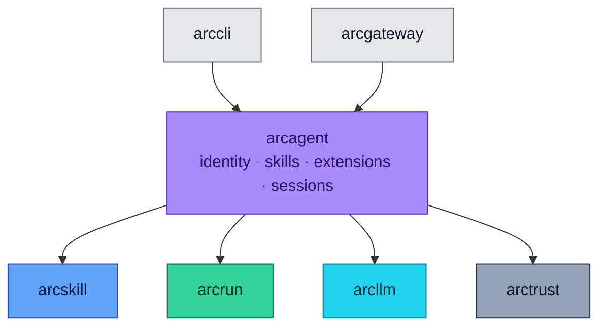

<div align="center">

# 🤖 arcagent

### **The Agent Itself**
*DID-required at construction. Skills, extensions, sessions, module bus. Wraps arcrun + arcllm with everything an autonomous agent needs to be accountable.*

[](https://opensource.org/licenses/Apache-2.0)
[](#status)
[](#status)
[](#status)
[](#-the-four-pillars-built-in)

</div>

---

## ✨ What is arcagent?

`arcagent` is the agent. It's the thing that has an identity, a memory, a workspace, and a personality.

It wraps the lower layers (`arcrun` for the loop, `arcllm` for the model, `arctrust` for identity/audit/policy) with everything an autonomous agent needs to be more than a chatbot:

- 🪪 **Cryptographic identity** — refuses to start without a valid DID
- 📚 **Skill discovery** — markdown files with YAML frontmatter, loaded into context
- 🧩 **Extension loading** — Python tools running in configurable sandboxes
- 💾 **Persistent sessions** — JSONL transcripts of every conversation
- 🚌 **Module bus** — priority-ordered event handlers with veto power
- 🪟 **Progressive context management** — observation masking + emergency truncation
- ⚙️ **TOML configuration** — one file, full surface area, validated by Pydantic

> 🛡️ **Identity required. Tools deny-by-default. Every action audited. Sessions on disk you can read.**

---

## 🏗️ Where It Fits



Depends on `arcrun`, `arcllm`, `arcskill`, `arctrust`.

---

## 🚀 Install

```bash
pip install arc-agent          # full agent stack
# or
pip install arcmas             # everything (includes CLI, dashboard, etc.)
```

---

## 🎬 Five-Minute Quickstart

```bash
# 1. Set up Arc once (interactive: tier, provider, API key)
arc init

# 2. Create an agent
arc agent create my-agent --model anthropic/claude-sonnet-4-5-20250929

# 3. Validate
arc agent build my-agent --check

# 4. Talk to it
arc agent chat my-agent
```

Or one-shot:

```bash
arc agent run my-agent "Summarize the CSVs in workspace/data/"
```

What `arc agent create` scaffolds:

```
my-agent/
├── arcagent.toml            # config (TOML, Pydantic-validated)
├── identity.md              # the agent's identity card (immutable to the agent)
└── workspace/
    ├── extensions/          # Python files that register tools
    ├── skills/              # markdown files with YAML frontmatter
    └── sessions/            # JSONL transcripts of past conversations
```

A fresh Ed25519 keypair is generated. The public DID is written into `arcagent.toml`. **Without that DID, the agent will refuse to start.**

---

## 🧪 Quick Example (Python API)

```python
from arcagent.core.agent import ArcAgent
from arcagent.core.config import load_config

config = load_config("my-agent/arcagent.toml")
agent = ArcAgent(config, config_path="my-agent/arcagent.toml")

await agent.startup()

result = await agent.run("Summarize the files in workspace/reports/")
print(result.content)
print(f"{result.turns} turns · ${result.cost_usd:.4f} · {result.tokens_used} tokens")

# Multi-turn chat
reply = await agent.chat("Now extract the action items.")
print(reply.content)

await agent.shutdown()
```

---

## 🏛️ The Four Pillars (Built In)

`arcagent` enforces all four guarantees automatically:

| Pillar | How It Shows Up |
|---|---|
| 🪪 **Identity** | `ArcAgent.__init__` refuses construction without a resolvable DID. Identity loaded from `[identity].did` in TOML; keypair from `key_dir`. Hard error on missing or wrong-permission keyfile |
| ✍️ **Sign** | Skills, extensions, and pairings are verified before loading. No "skip for testing" backdoors |
| ✅ **Authorize** | Every tool call goes through the 5-layer policy pipeline (`arctrust.policy`). First DENY wins. Fail-closed |
| 📜 **Audit** | Every operation emits an `arctrust.AuditEvent`. Sinks fan out: JSONL for compliance, hash-chained for tamper-evidence, WebSocket for live dashboards |

---

## ⚙️ Configuration: `arcagent.toml`

```toml
[agent]
name = "my-agent"
org = "acme"
type = "executor"
workspace = "./workspace"

[llm]
model = "anthropic/claude-sonnet-4-5-20250929"
max_tokens = 8192
temperature = 0.7

[identity]
did = "did:arc:acme:executor/abc123..."   # filled by `arc agent create`
key_dir = "~/.arcagent/keys"

[vault]
backend = ""                              # vault URL, or empty for env var fallback

[tools.policy]
allow = ["read_file", "write_file", "execute_python"]
deny = []
timeout_seconds = 30

[telemetry]
enabled = true
service_name = "my-agent"
log_level = "INFO"
export_traces = false                     # OpenTelemetry export

[context]
max_tokens = 128000

[session]
retention_count = 50
retention_days = 30

[extensions]
global_dir = "~/.arcagent/extensions"

[modules.memory]
enabled = true

[modules.policy]
enabled = true

[modules.ui_reporter]
enabled = false                           # set true with `arc agent serve --ui`
```

**Three rules to know:**
- 🛑 The agent **refuses to start** without a valid DID under `[identity]`.
- 🛑 The tool allowlist is **deny-by-default**. Anything not in `allow` cannot be called.
- 🛑 These config paths **cannot be overridden by environment variables**: `vault.backend`, `tools.native`, `tools.process`, `identity.key_dir`. They must be set in this file. Prevents runtime injection.

---

## 🧩 Skills

Skills are markdown files with YAML frontmatter. The agent discovers them at startup and adds them to the model's context as capability descriptions.

`workspace/skills/data-analysis.md`:

```markdown
---
name: data-analysis
description: Analyze CSV files for trends, anomalies, and summaries.
required_tools: [read_file, execute_python]
---

# When to use
Whenever the user asks for trend analysis, summaries, or anomaly detection
on tabular data.

# How to do it
1. List files in the workspace data directory
2. Read each CSV with pandas
3. Compute summary statistics
4. Identify outliers using IQR
5. Return findings as a structured report
```

Manage skills:

```bash
arc skill create data-analysis --dir my-agent/workspace/skills
arc skill list --agent my-agent
arc skill search "data analysis" --agent my-agent
arc skill validate my-agent/workspace/skills/data-analysis.md
```

For verified skill installs (Sigstore + Rekor + scan + sandboxed dry-run), enable the skill hub:

```toml
[skills.hub]
enabled = true
```

---

## 🧰 Extensions

Extensions are Python files that register tools and hooks. Drop them in `workspace/extensions/` (per-agent) or `~/.arcagent/extensions/` (shared).

`workspace/extensions/web_search.py`:

```python
from arcagent.extensions import extension

@extension(name="web-search", version="0.1.0")
def setup(agent):
    @agent.tool
    async def web_search(params: dict, ctx) -> str:
        url = "https://api.example.com/search"
        # ctx.http is the egress proxy — enforces per-tool origin allowlist
        resp = await ctx.http.get(url, params={"q": params["query"]})
        return resp.text
```

Manage:

```bash
arc ext create web-search --dir my-agent/workspace/extensions
arc ext validate my-agent/workspace/extensions/web_search.py
arc ext install ./my_extension.py        # copies to ~/.arcagent/extensions/
arc ext list --agent my-agent
```

### Extension Sandbox Modes

| Mode | Filesystem | Subprocess | Network |
|---|---|---|---|
| `workspace` | unrestricted | ✅ | ✅ |
| `paths` | workspace + explicitly allowed paths | ✅ | ✅ |
| `strict` | workspace only | 🚫 | 🚫 |

`strict` mode patches `subprocess.run`, `os.system`, `urllib.request.urlopen` while loading the extension, then restores them in a `finally` block. Set the mode in `arcagent.toml`:

```toml
[extensions]
sandbox_mode = "strict"
allowed_paths = []
```

---

## 💾 Sessions

Every conversation persists as a JSONL transcript:

```
my-agent/workspace/sessions/
├── 2026-04-28T14-30-00-abc123.jsonl
├── 2026-04-28T15-12-44-def456.jsonl
└── ...
```

Each line is one event: a user message, a model response, a tool call, a tool result, a turn boundary. Open the file in any text editor — there's no opaque format.

```bash
arc agent sessions my-agent                              # list with timestamps + sizes
arc agent chat my-agent --session-id abc123              # resume a session
```

In-chat: `/sessions`, `/switch <id>`.

Retention is configurable:

```toml
[session]
retention_count = 50
retention_days = 30
```

---

## 🚌 The Module Bus

Inside `arcagent`, every event flows through a priority-ordered module bus. Modules can observe events and **veto** actions (e.g., deny a tool call).

| Priority | Default Modules | Purpose |
|---|---|---|
| **10** | policy | Hardest gate — first to see, last to fail. Veto here = call denied |
| **50** | security | PII detection, classification checks |
| **100** | memory, default handlers | Standard processing |
| **200** | ui_reporter, logging | Observation only |

**Same-priority handlers run concurrently. Cross-priority groups run sequentially.**

Crucially: even if priority 10 vetoes the call, **all other modules still execute** so the audit record is complete. You see *what would have happened* + *who blocked it* + *why*.

Toggle modules in `arcagent.toml`:

```toml
[modules.memory]
enabled = true

[modules.policy]
enabled = true

[modules.ui_reporter]
enabled = true                            # streams events to the arcui dashboard
```

---

## 🪟 Progressive Context Management

Context window usage is managed in three tiers automatically:

| Threshold | Action |
|---|---|
| **< 70%** | No action |
| **70–95%** | **Observation masking** — old tool outputs replaced with `[output pruned]` placeholders |
| **> 95%** | **Emergency truncation** |

Recent messages are always protected within a 40% window so the model never loses immediate context.

---

## 📟 CLI Commands

```bash
# Lifecycle
arc agent create my-agent --model anthropic/claude-sonnet-4-5-20250929
arc agent build my-agent --check          # validate (always pass --check)
arc agent reload my-agent                 # hot-reload skills + extensions

# Run
arc agent chat my-agent                   # interactive REPL
arc agent run my-agent "task"             # one-shot
arc agent serve my-agent                  # long-running daemon
arc agent serve my-agent --ui             # daemon + push events to dashboard

# Inspect
arc agent status my-agent                 # DID, model, counts
arc agent config my-agent --json          # full parsed config
arc agent tools my-agent                  # what tools it can call
arc agent skills my-agent                 # discovered skills
arc agent extensions my-agent             # loaded extensions
arc agent sessions my-agent               # past transcripts
arc agent strategies                      # available strategies (react, code)
arc agent events                          # all event types it emits
```

In-chat REPL: `/help`, `/quit`, `/tools`, `/model`, `/cost`, `/reload`, `/skills`, `/extensions`, `/session`, `/sessions`, `/switch <id>`, `/identity`, `/status`.

---

## 🛡️ Security Architecture

### Self-Improving Policy Engine

Every N turns, a reflector model critiques the agent's behavior. Good behaviors score up, harmful patterns score down. Bullets that drop below score 2 are automatically removed. The policy file is atomically written via tmp+rename, capped at 200 rules, and sorted by effectiveness. Every change is audited.

This is the ACE framework (arXiv:2510.04618).

### Dynamic Tool Safety (Four Defense Layers)

When the agent registers a new tool at runtime, the loader applies four defenses:

1. **Source encoding check** — reject non-UTF-8 coding declarations (codec attacks lose **before** the AST parser).
2. **AST validator** — rejects 9 bypass categories: privileged imports (`os`, `ctypes`, `subprocess`, `pickle`, `sys`...), frame traversal (`gi_frame`, `f_back`, `__subclasses__`), dynamic execution (`eval`, `exec`, `compile`, `__import__`), `sys.modules` subscription, `__builtins__` assignment, `__init_subclass__` definitions, starred `__builtins__` unpacking. References real CVEs.
3. **Restricted builtins** — execute with a scrubbed `__builtins__` dict (36 safe names). `__import__`, `eval`, `exec`, `compile`, `open` are deliberately **not** present.
4. **Egress proxy** — network only via `ToolContext.http`, with per-tool origin allowlist (scheme + host + port). Deny-by-default. Every request audit-logged.

Tier gates: Federal refuses dynamic tool creation entirely. Enterprise allows it with high-priority approval audit. Personal allows freely.

---

## 🧱 Public API

```python
from arcagent import (
    # Errors
    ArcAgentError, ConfigError, IdentityError, IdentityRequired,
    ToolError, ToolVetoedError, ContextError, ModuleBusError,
)

from arcagent.core import (
    ArcAgent,                 # the main agent class
    ArcAgentConfig,           # Pydantic config model
)

from arcagent.core.config import load_config
```

Every operation emits arctrust audit events.

---

## 📋 Compliance Mapping

| NIST 800-53 | What `arcagent` Provides |
|---|---|
| AC-3 | Tool allowlist deny-by-default |
| AC-6 | Per-agent allowlist + extension sandbox modes |
| AU-2, AU-3, AU-12 | Module bus emits structured audit events on every operation |
| CM-5 | Federal tier refuses dynamic tool/extension creation |
| CM-7 | Tools opt-in; sandbox modes; minimal context window |
| IA-3 | DID required at construction; refuses to start without one |
| SC-28 | Sessions persist with normal file permissions; keys with 0600 |

| OWASP Agentic | Mitigation |
|---|---|
| ASI01 (Goal Hijack) | `identity.md` is read-only to the agent; policy engine enforces boundaries |
| ASI02 (Tool Misuse) | 5-layer policy pipeline; parameter validation; full audit |
| ASI03 (Identity Abuse) | Per-agent DID required; HKDF child identities for spawned subagents |
| ASI05 (RCE) | 4-layer dynamic tool defense; sandboxed extensions; restricted builtins |
| ASI06 (Memory/Context Poisoning) | Workspace boundary; observation masking; protected recent-message window |

---

## 🧪 Status

```bash
uv run --no-sync pytest packages/arcagent/tests
```

- **Tests:** 3,136+
- **Coverage:** core components ≥ 90%
- **Type check:** `mypy --strict` (active cleanup in progress)
- **Lint:** `ruff check`

---

## 📄 License

Apache 2.0 · Copyright © 2025-2026 BlackArc Systems.
