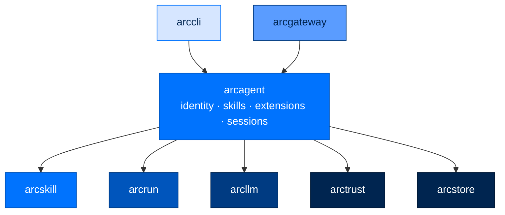

<div align="center">

# 🤖 arcagent

### **The Agent Itself**
*DID-required at construction. Unified capability loader (tools · skills · hooks · background tasks), sessions, module bus. Wraps arcrun + arcllm with everything an autonomous agent needs to be accountable.*

[](https://opensource.org/licenses/Apache-2.0)
[](#status)
[](#status)
[](#status)
[](#-the-four-pillars-built-in)

</div>

---

## ✨ What is arcagent?

`arcagent` is the agent. It's the thing that has an identity, a memory, a workspace, and a personality.

It wraps the lower layers (`arcrun` for the loop, `arcllm` for the model, `arctrust` for identity/audit/policy) with everything an autonomous agent needs to be more than a chatbot:

- 🪪 **Cryptographic identity** — refuses to start without a valid DID
- 🧩 **Unified capability system (SPEC-021)** — one loader discovers `@tool` / `@hook` / `@background_task` / `@capability`-class Python files and `SKILL.md` folders across four scan roots with explicit precedence
- 💾 **Persistent sessions** — JSONL transcripts of every conversation
- 🚌 **Module bus** — priority-ordered event handlers with veto power
- 🪟 **Cache-preserving context management** — append-only turns + discrete, structured compaction at a boundary
- ⚙️ **TOML configuration** — one file, full surface area, validated by Pydantic

> 🛡️ **Identity required. Tools deny-by-default. Every action audited. Sessions on disk you can read.**

---

## 🏗️ Where It Fits



Depends on `arcrun`, `arcllm`, `arctrust`, `arcstore`; manages `arcskill` capabilities. `arcui` reads agent activity from `arcstore` on demand (the Observe plane) — arcagent doesn't push to it directly.

---

## 🚀 Install

```bash
pip install arc-agent          # full agent stack
# or
pip install arcmas             # everything (includes CLI, dashboard, etc.)
```

---

## 🎬 Five-Minute Quickstart

```bash
# 1. Set up Arc once (interactive: tier, provider, API key)
arc init

# 2. Create an agent
arc agent create my-agent --model anthropic/claude-sonnet-4-5-20250929

# 3. Validate
arc agent build my-agent --check

# 4. Talk to it
arc agent chat my-agent
```

Or one-shot:

```bash
arc agent run my-agent "Summarize the CSVs in workspace/data/"
```

What `arc agent create` scaffolds:

```
my-agent/
├── arcagent.toml            # config (TOML, Pydantic-validated)
├── identity.md              # the agent's identity card (immutable to the agent)
├── capabilities/            # per-agent capabilities (.py + SKILL.md folders) — trusted
└── workspace/
    ├── .capabilities/       # agent-authored capabilities — UNTRUSTED, AST-validated
    └── sessions/            # JSONL transcripts of past conversations
```

> ℹ️ The runtime no longer reads `workspace/extensions/` or `workspace/skills/`. Capabilities now live under `<agent>/capabilities/` (operator-curated) or `<workspace>/.capabilities/` (agent-authored). See [Capabilities & Loading](#-capabilities--loading) below.

A fresh Ed25519 keypair is generated. The public DID is written into `arcagent.toml`. **Without that DID, the agent will refuse to start.**

---

## 🧪 Quick Example (Python API)

```python
from arcagent.core.agent import ArcAgent
from arcagent.core.config import load_config

config = load_config("my-agent/arcagent.toml")
agent = ArcAgent(config, config_path="my-agent/arcagent.toml")

await agent.startup()

result = await agent.run("Summarize the files in workspace/reports/")
print(result.content)
print(f"{result.turns} turns · ${result.cost_usd:.4f} · {result.tokens_used} tokens")

# Multi-turn chat
reply = await agent.chat("Now extract the action items.")
print(reply.content)

await agent.shutdown()
```

---

## 🏛️ The Four Pillars (Built In)

`arcagent` enforces all four guarantees automatically:

| Pillar | How It Shows Up |
|---|---|
| 🪪 **Identity** | `ArcAgent.__init__` refuses construction without a resolvable DID. Identity loaded from `[identity].did` in TOML; keypair from `key_dir`. Hard error on missing or wrong-permission keyfile |
| ✍️ **Sign** | Agent-authored capabilities are signed on write (`.arcsig` sidecar, content hash + Ed25519) and **re-verified at load**, independent of any install-time check. A TOFU gate adjudicates first-sight and drift above personal tier. No "skip for testing" backdoors |
| ✅ **Authorize** | Every tool call goes through the 5-layer policy pipeline (`arctrust.policy`). First DENY wins. Fail-closed |
| 📜 **Audit** | Every operation emits an `arctrust.AuditEvent`. Sinks fan out: JSONL for compliance, hash-chained for tamper-evidence, WebSocket for live dashboards |

---

## ⚙️ Configuration: `arcagent.toml`

```toml
[agent]
name = "my-agent"
org = "acme"
type = "executor"
workspace = "./workspace"

[llm]
model = "anthropic/claude-sonnet-4-5-20250929"
max_tokens = 8192
temperature = 0.7

[identity]
did = "did:arc:acme:executor/abc123..."   # filled by `arc agent create`
key_dir = "~/.arcagent/keys"

[vault]
backend = ""                              # vault URL, or empty for env var fallback

[tools.policy]
allow = ["read_file", "write_file", "execute_python"]
deny = []
timeout_seconds = 30

[telemetry]
enabled = true
service_name = "my-agent"
log_level = "INFO"
export_traces = false                     # OpenTelemetry export

[context]
max_tokens = 128000

[session]
retention_count = 50
retention_days = 30

[security]
tier = "personal"                         # "personal" | "enterprise" | "federal"

[security.validators]
auto_run_agent_code = false               # personal-only escape hatch; federal/enterprise require TOFU

# [[security.validators.approved]]        # appended by `arc trust approve` — never hand-edited
# name = "my-validator"
# hash = "sha256:..."
# approver = "ops@acme"
# timestamp = "2026-04-29T12:00:00Z"

[modules.memory]
enabled = true

[modules.policy]
enabled = true
```

**Three rules to know:**
- 🛑 The agent **refuses to start** without a valid DID under `[identity]`.
- 🛑 The tool allowlist is **deny-by-default**. Anything not in `allow` cannot be called.
- 🛑 These config paths **cannot be overridden by environment variables**: `vault.backend`, `tools.native`, `tools.process`, `identity.key_dir`. They must be set in this file. Prevents runtime injection.

---

## 🧩 Capabilities & Loading

A **capability** is anything the loader picks up from one of four scan roots — a `.py` file with a decorated callable or class, or a folder containing a `SKILL.md`. There are four decorators (`@tool`, `@hook`, `@background_task`, and the `@capability` class form for resources that need `setup()` / `teardown()`).

### Scan roots & precedence (last-wins)

`CapabilityLoader` walks these in order. Later roots **override earlier ones by name** for tools, skills, and `@capability` classes; hooks fan out (all keep firing in priority order); background tasks drain-then-replace.

| # | Root | Trust | Who writes it | What goes here |
|---|------|-------|---------------|----------------|
| 1 | `arcagent/builtins/capabilities/` | trusted | ships with the package | `bash`, `read`, `write`, `edit`, `find`, `grep`, `ls`, `reload`, plus the self-mod tools (`create_tool`, `create_skill`, `update_tool`, `update_skill`) and the 4 self-mod skill folders |
| 2 | `~/.arc/capabilities/` | **untrusted** (writable by the operator, but a compromised agent can plant a file here via `bash`) | the human operator | global, opt-in capabilities shared across every agent |
| 3 | `<agent_root>/capabilities/` | **untrusted** (same reasoning) | the human operator | per-agent capabilities and skill folders |
| 4 | `<agent_root>/workspace/.capabilities/` | **untrusted** | the agent itself, at runtime | passes through the AST validator + TOFU + OS sandbox before being imported |

Roots 2-4 all go through the same gate — AST validator, Sign/TOFU check, restricted-builtins exec (`CapabilityLoader._UNTRUSTED_ROOTS`). Only root 1 (`builtins`) and the `module:<mod>` roots below are trusted and skip it entirely — they're the harness's own shipped Python, trusted via the normal package supply chain (`pip-audit`, code review), not a per-load signature check.

> Override by collision: define `web_search` (a `@tool`) at root 2, then again at root 3, and root 3 wins. The reload diff names it explicitly: `~1 replaced (web_search 1.0.0→1.1.0)`.

Plus: any module in `arcagent/modules/<mod>/` that has `[modules.<mod>].enabled = true` and a `capabilities.py` is loaded as an extra scan root (`module:<mod>`) — trusted, shipped code, same as root 1. Disabled modules are silently skipped.

### Skill folders

Skills are folders with a `SKILL.md` plus optional `references/`, `scripts/`, and `templates/`. The frontmatter's `name`, `description`, and `triggers` show up in the system prompt; the body is read lazily via the built-in `read` tool when the model decides to use it.

```
my-agent/capabilities/data-analysis/
├── SKILL.md                 # frontmatter + when-to-use + steps
├── references/
│   └── outlier-detection.md
└── scripts/
    └── summarize.py
```

```markdown
---
name: data-analysis
version: 1.0.0
description: Analyze CSV files for trends, anomalies, and summaries.
triggers: [csv, analysis, anomaly]
required_tools: [read, bash]
---

# When to use
…
```

### Decorator examples

```python
# my-agent/capabilities/web_search.py
from arcagent.tools._decorator import tool, hook, background_task, capability

@tool(
    name="web_search",
    description="Search the web via the configured engine.",
    classification="read_only",
    when_to_use="When the user needs current information from the public web.",
    version="1.0.0",
)
async def web_search(query: str) -> str:
    ...

@hook(name="log_tool_calls", event="tool:invoked", priority=200)
async def log_tool_calls(ctx) -> None:
    ...

@background_task(name="poll_inbox", interval=60.0)
async def poll_inbox() -> None:
    ...

@capability(name="browser", depends_on=())
class BrowserCapability:
    async def setup(self, ctx) -> None: ...
    async def teardown(self) -> None: ...
```

### Reload diff

`/reload` (REPL) and `arc agent reload` re-walk all four roots and emit a single-line diff:

```
reload: +2 added (web_search, log_tool_calls), ~1 replaced (data-analysis 1.0.0→1.1.0), -1 removed (legacy_scraper), 0 errors
```

Errors append one indented line per failure (`<path>: <short reason>`), and each emits `capability:registration_failed` on the bus + an audit event.

### Trust tiers in this loader

The workspace, global (`~/.arc/capabilities/`), and per-agent (`<agent_root>/capabilities/`) roots are all treated as untrusted code — anywhere a compromised agent could plant a `.py` file via `bash` and trigger a reload. Only `builtins` and the `module:<mod>` extra roots (the harness's own shipped Python) are trusted and skip the gate below entirely. Untrusted roots go through:

1. **Source encoding check** — non-UTF-8 coding declarations rejected before the parser runs
2. **AST validator** — rejects 9 bypass categories (privileged imports, frame traversal, `eval`/`exec`/`compile`/`__import__`, `sys.modules` subscription, `__builtins__` mutation, `__init_subclass__`, starred `__builtins__` unpacking)
3. **Restricted builtins** — execute with a scrubbed `__builtins__` (36 safe names; no `open`/`eval`/`exec`/`compile`/`__import__`)
4. **Egress proxy** — network only via `ToolContext.http` with per-tool origin allowlist

Tier policy still composes on top: federal refuses agent-authored capabilities outright; enterprise requires TOFU approval recorded under `[security.validators.approved]`; personal allows them with `auto_run_agent_code = true`.

### Verified install (optional)

For supply-chain-secure third-party skill installs (Sigstore + Rekor + static scan + sandboxed dry-run), enable the skill hub:

```toml
[skills.hub]
enabled = true
```

Verified skills land under `~/.arc/capabilities/` (root 2) just like operator-installed ones.

### Skill self-improvement (optional, SPEC-044)

arcagent writes, loads, and runs skills on its own — no extra install needed. It also
defines a `SkillAdapter` seam (mirrors the `Brain` seam above) that a separate package
can plug into to make skills *improve themselves*. arcagent ships **improver-less by
default** (`NullSkillAdapter`: silent no-op, zero files written) and holds only the thin
wiring — all optimization logic lives in the optional `arcskill` package.

```toml
[modules.skills]
adapter = "none"                     # none (default) | arcskill | "pkg.mod:Class" (signed BYO)
tier = "personal"                    # personal | enterprise | federal
sweep_poll_seconds = 3600            # Curator retire/revive sweep cadence (@background_task)

[modules.skills.improver]            # forwarded verbatim to arcskill.improver.ImproverConfig
```

Set `adapter = "arcskill"` (after `pip install arcskill`) to turn it on. What the thin
wiring does:

- Module-bus hooks forward primitive per-turn signals to the adapter — a skill read
  opens a usage span, each subsequent tool call is `observe`d, `agent:post_plan` closes
  the span, and `agent:pre_respond` triggers a bounded improvement pass once a skill
  crosses its usage threshold.
- `agent:ready` hands the adapter the real `CapabilityRegistry` (as `skill_registry`) so
  it can resolve a skill name to its on-disk bundle.
- A retired skill is suppressed from the agent's offering (`CapabilityRegistry.suppress_skill`)
  — excluded from both the prompt manifest and the arcrun tool surface, reversibly, and
  the suppressed set is rehydrated from disk on restart.
- Builds two separate signers: an agent-DID sidecar `Signer` for mutated skill artifacts
  (`.arcsig`, same convention as `create_skill`), and an operator-key WORM `AuditSink`
  (`<agent>/.audit/skills.worm`) for the audit trail — the audited subject is never its
  own audit authority.
- Binds the improver's operator-approval seam to the shared `HumanGate` (SPEC-035/043):
  federal approves every mutation and retire/revive, enterprise approves code mutations,
  personal auto-applies with an audit record.
- If memory (`[modules.memory]`) is active, the `agent:pre_respond` recall hook places
  Brain-derived context on `ctx.data["insight"]` before the skills hook runs, giving the
  improver's mutator grounded context; empty when memory is off (REQ-060).

See `packages/arcskill/README.md` for what the improver itself does (code-repair
mutation, golden-task gate, change-bound edits, Curator lifecycle).

---

## 🧩 Extension Points & Blueprints (SPEC-047)

Every place arcagent lets an operator swap in optional, potentially third-party behavior is
generalized into one mechanism: `arcagent.extension.ExtensionPoint` + `select_extension` —
shared choice dispatch, a fail-closed refuse-before-import BYO gate, and one dotted-path
importer. Four families:

| Family | Kind | Built-in / null default | Optional package |
|---|---|---|---|
| `brain` | select-one | `NullBrain` (no-op, zero memory files) | `arcmemory` (dual-speed analogical memory, SPEC-041) |
| `skills` | select-one | `NullSkillAdapter` (no-op) | `arcskill` (self-improvement, SPEC-044) |
| `tools` | scan-many | the unified `CapabilityLoader` scan roots | — |
| `hook-builds` | scan-many | module-bus hook registrations | — |

`brain` and `skills` each resolve via `[modules.memory].config.brain` / `[modules.skills].adapter`
= `none` (default) / the package name / a signed `pkg.mod:Class` BYO path. `arc ext inspect`
(read-only) shows the selected/available/signed state of all four families for an agent;
`arc ext verify` reports any selection that would be refused at load (federal change-control
gate, non-zero exit on a refusal).

### Blueprints — signed preset-config bootstrap

A **blueprint** is a versioned, signed TOML preset that bootstraps a deployment's
`arcagent.toml` in one command (`arcagent.blueprints`). `apply_blueprint` verifies the
signature (fail-closed above `personal`), deep-merges the preset **under** the target's
existing config (identity + user values always win — not a clobber-write), and floors the
tier by **stringency-max**: a blueprint can only raise a tier floor, never weaken federal.
Three packaged presets ship provenance-trusted: `personal-assistant`, `enterprise-ops`,
`federal-analyst`. User presets live in `~/.arc/blueprints/` and must be signed to the
deployment operator key above `personal` (`arc blueprint sign`) — an unsigned, tampered, or
wrong-key preset is refused before merge.

```bash
arc blueprint list
arc blueprint show enterprise-ops
arc blueprint apply enterprise-ops --agent my-agent      # verify -> deep-merge -> write
arc blueprint apply enterprise-ops --agent my-agent --dry-run
arc init --blueprint federal-analyst                     # bootstrap a new deployment from a preset
```

### Config-relaxable tiers

`arcagent.tiers` declares, in one table (`RELAXABLE_KNOBS`), every tier-relaxable config
knob, its federal floor, and whether `personal`/`enterprise` may relax it; `resolve_tier_floor`
is the one shared decision the `SecurityConfig` validators and the blueprint-apply floor
delegate to (an explicit weaker value at a tier that forbids relaxation fails closed). Tier
vocabulary is `personal` / `enterprise` / `federal` everywhere — there is no `open` tier.

---

## 💾 Sessions

Every conversation persists as a JSONL transcript:

```
my-agent/workspace/sessions/
├── 2026-04-28T14-30-00-abc123.jsonl
├── 2026-04-28T15-12-44-def456.jsonl
└── ...
```

Each line is one event: a user message, a model response, a tool call, a tool result, a turn boundary. Open the file in any text editor — there's no opaque format.

```bash
arc agent sessions my-agent                              # list with timestamps + sizes
arc agent chat my-agent --session-id abc123              # resume a session
```

In-chat: `/sessions`, `/switch <id>`.

Retention is configurable:

```toml
[session]
retention_count = 50
retention_days = 30
```

---

## 🚌 The Module Bus

Inside `arcagent`, every event flows through a priority-ordered module bus. Modules can observe events and **veto** actions (e.g., deny a tool call).

| Priority | Default Modules | Purpose |
|---|---|---|
| **10** | policy | Hardest gate — first to see, last to fail. Veto here = call denied |
| **50** | security | PII detection, classification checks |
| **100** | memory, default handlers | Standard processing |
| **200** | logging | Observation only |

**Same-priority handlers run concurrently. Cross-priority groups run sequentially.**

Crucially: even if priority 10 vetoes the call, **all other modules still execute** so the audit record is complete. You see *what would have happened* + *who blocked it* + *why*.

Toggle modules in `arcagent.toml`:

```toml
[modules.memory]
enabled = true

[modules.policy]
enabled = true
```

Agent activity shows up in `arcui` without any opt-in module: agents write through `arcstore`
(the durable spool + WORM), and `arc ui start` reads it back on demand (the Observe plane) —
see `packages/arcui/README.md`.

---

## 🪟 Cache-Preserving Context Management

Context is managed to keep the **provider prompt cache** warm: the model caches the
longest stable prefix of consecutive requests, so anything that rewrites earlier
messages mid-conversation busts the cache and re-bills the whole history every turn.
The rule is therefore **append-only between turns, compact once at a boundary**.

**Per turn** — the context hook is append-only. It returns messages unchanged so the
cache prefix stays byte-stable. Its *only* in-turn action is a last-resort **emergency
truncation** if a single long run reaches the hard ceiling before a compaction boundary
(it drops the oldest messages, always keeping the newest).

**At a boundary** — when the estimated context fill crosses the compact threshold
(checked between runs), one **discrete, persisted compaction** fires and writes a new
baseline. You pay a single cache miss, then turns append cheaply again:

| Step | What happens |
|---|---|
| **1. Deep split** | Keep a recent tail (~45% of the window), summarize everything older. Compacting deep avoids re-firing next turn (debounce). |
| **2. Durable flush** | Extract key facts/decisions from the old segment to `context.md` (sanitized) so nothing is truly lost, even across sessions. |
| **3. Structured summary** | Summarize the old segment into a **fixed schema** (not free prose) via the eval model — see below. |
| **4. Boundary masking** | Replace stale tool-output bodies in the kept tail with `[output pruned]` placeholders (tool-call metadata retained), persisted into the new baseline. |
| **5. Write back** | `[summary, …masked recent]` becomes the session's messages; a `context.compaction` audit event is emitted. |

The summary is not free-form prose — **structure forces preservation**. Fields:
`goal` · `constraints` · `progress` · `key_facts` · `files_modified` · `decisions` ·
`rejected_approaches` · `open_questions` · `next_step`. `goal` and `constraints` are
copied **verbatim** (they carry security-relevant instructions), and the summary is
sanitized before it re-enters context (defense against context poisoning).

> Thresholds are configurable under `[context]` in `arcagent.toml`
> (`compact_threshold`, `emergency_threshold`, `max_tokens`). Compaction triggers off
> the estimated fill of the current messages, which drops after a boundary.

See ADR-025..028 and SPEC-029 for the design rationale.

---

## 📟 CLI Commands

```bash
# Lifecycle
arc agent create my-agent --model anthropic/claude-sonnet-4-5-20250929
arc agent build my-agent --check          # validate (always pass --check)
arc agent reload my-agent                 # re-walk all four capability scan roots

# Run
arc agent chat my-agent                   # interactive REPL
arc agent run my-agent "task"             # one-shot
arc agent serve my-agent                  # long-running daemon

# Inspect
arc agent status my-agent                 # DID, model, counts
arc agent config my-agent --json          # full parsed config
arc agent tools my-agent                  # what tools it can call
arc agent skills my-agent                 # discovered skills
arc agent extensions my-agent             # loaded extensions
arc agent sessions my-agent               # past transcripts
arc agent strategies                      # available strategies (react, code)
arc agent events                          # all event types it emits
```

In-chat REPL: `/help`, `/quit`, `/tools`, `/model`, `/cost`, `/reload`, `/skills`, `/extensions`, `/session`, `/sessions`, `/switch <id>`, `/identity`, `/status`.

---

## 🛡️ Security Architecture

### Self-Improving Policy Engine

Every N turns, a reflector model critiques the agent's behavior. Good behaviors score up, harmful patterns score down. Bullets that drop below score 2 are automatically removed. The policy file is atomically written via tmp+rename, capped at 200 rules, and sorted by effectiveness. Every change is audited.

This is the ACE framework (arXiv:2510.04618).

### Dynamic Tool Safety (Four Defense Layers)

The four defenses gate every untrusted scan root — `<workspace>/.capabilities/` (agent-authored), `~/.arc/capabilities/` (global), and `<agent_root>/capabilities/` (per-agent) — anywhere a compromised agent could plant a file and trigger a reload. Only `builtins` and the `module:<mod>` roots (the harness's own shipped Python) are trusted and skip the AST gate.

1. **Source encoding check** — reject non-UTF-8 coding declarations (codec attacks lose **before** the AST parser).
2. **AST validator** — rejects 9 bypass categories: privileged imports (`os`, `ctypes`, `subprocess`, `pickle`, `sys`...), frame traversal (`gi_frame`, `f_back`, `__subclasses__`), dynamic execution (`eval`, `exec`, `compile`, `__import__`), `sys.modules` subscription, `__builtins__` assignment, `__init_subclass__` definitions, starred `__builtins__` unpacking. References real CVEs.
3. **Restricted builtins** — execute with a scrubbed `__builtins__` dict (36 safe names). `__import__`, `eval`, `exec`, `compile`, `open` are deliberately **not** present.
4. **Egress proxy** — network only via `ToolContext.http`, with per-tool origin allowlist (scheme + host + port). Deny-by-default. Every request audit-logged.

Tier gates: Federal refuses agent-authored capabilities entirely. Enterprise allows them only after a human records approval via `arc trust approve` (persisted under `[security.validators.approved]`). Personal allows them with `[security.validators] auto_run_agent_code = true`.

### Sign-Pillar Enforcement (SPEC-033)

The signed-on-write / re-verified-at-load mechanism below is specific to the agent's own self-mod tools (`create_skill`, `create_tool`, ...), which only ever write into the workspace root. But the load-time Sign/TOFU gate itself (`CapabilityLoader._passes_trust_gate`) also covers the global (`~/.arc/capabilities/`) and per-agent (`<agent_root>/capabilities/`) roots — a missing/invalid signature denies outright above personal tier there too. Only `builtins` and the `module:<mod>` roots (arcagent's own shipped modules — `bio_memory`, `pulse`, `scheduler`, etc.) are genuinely out of scope: they are ordinary installed Python, trusted via the normal package supply chain, never signature-checked at load.

| Control | What It Does |
|---|---|
| **Restricted-builtins execution** | Workspace-root modules exec under `RESTRICTED_BUILTINS` + a denylist-enforcing `__import__` instead of a bare full-builtins `exec`. Fast-fail linter / defense-in-depth in front of the SPEC-036 sandbox — not a boundary, not a substitute for it |
| **Signed on write** | `create_skill`, `create_tool`, `update_skill`, `update_tool` write a detached `.arcsig` sidecar (content hash + Ed25519, keyed to the agent's own DID) alongside every artifact they produce |
| **Re-verified at load** | The capability loader recomputes the content hash and re-checks the signature on every load — independent of, and in addition to, whatever check ran at create/install time |
| **TOFU first-load approval** | A missing/invalid signature denies outright above personal tier; first-sight and drift are adjudicated by `TofuLayer` and recorded via `arc trust approve` |
| **WORM-chained skill-improver audit** | Skill mutations from the self-improvement loop are signed and audited through an `arctrust.AuditSink` (a `WormSink` in production) — no plaintext `audit.jsonl` |

Honest scope: a valid signature proves the artifact is unmodified since the signer wrote it and attributes it to that DID — it does not prove the content is safe. Safety is the TOFU gate's and the execution sandbox's job.

---

## 🧱 Public API

```python
from arcagent import (
    # Errors
    ArcAgentError, ConfigError, IdentityError, IdentityRequired,
    ToolError, ToolVetoedError, ContextError, ModuleBusError,
)

from arcagent.core import (
    ArcAgent,                 # the main agent class
    ArcAgentConfig,           # Pydantic config model
)

from arcagent.core.config import load_config
```

Every operation emits arctrust audit events.

---

## 📋 Compliance Mapping

| NIST 800-53 | What `arcagent` Provides |
|---|---|
| AC-3 | Tool allowlist deny-by-default |
| AC-6 | Per-agent allowlist + extension sandbox modes |
| AU-2, AU-3, AU-12 | Module bus emits structured audit events on every operation |
| CM-5 | Federal tier refuses dynamic tool/extension creation |
| CM-7 | Tools opt-in; sandbox modes; minimal context window |
| IA-3 | DID required at construction; refuses to start without one |
| SC-28 | Sessions persist with normal file permissions; keys with 0600 |

| OWASP Agentic | Mitigation |
|---|---|
| ASI01 (Goal Hijack) | `identity.md` is read-only to the agent; policy engine enforces boundaries |
| ASI02 (Tool Misuse) | 5-layer policy pipeline; parameter validation; full audit |
| ASI03 (Identity Abuse) | Per-agent DID required; HKDF child identities for spawned subagents |
| ASI05 (RCE) | 4-layer dynamic tool defense; sandboxed extensions; restricted builtins |
| ASI06 (Memory/Context Poisoning) | Workspace boundary; observation masking; protected recent-message window |

---

## 🧪 Status

```bash
uv run --no-sync pytest packages/arcagent/tests
```

- **Tests:** 2,301+
- **Coverage:** core components ≥ 90%
- **Type check:** `mypy --strict` (active cleanup in progress)
- **Lint:** `ruff check`

---

## 📄 License

Apache 2.0 · Copyright © 2025-2026 BlackArc Systems.
