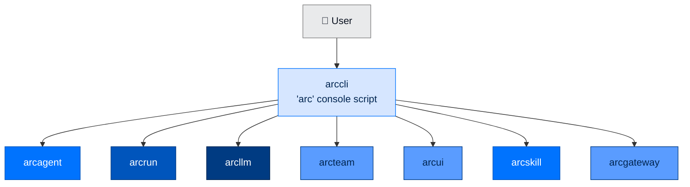

<div align="center">

# ⌨️ arccli

### **The `arc` Command-Line Tool**
*Slash-command registry. JSON output on every data command. The single front door to the entire Arc stack.*

[](https://opensource.org/licenses/Apache-2.0)
[](#status)
[](#status)
[](#)

</div>

---

## ✨ What is arccli?

`arccli` is the unified `arc` command-line tool. Every Arc operation — creating an agent, running it, listing tools, inspecting LLM providers, starting the dashboard, approving a chat-platform pairing — is one `arc` subcommand.

It's built on a **centralized slash-command registry** with lazy handler dispatch. **No Click, no Typer, no third-party CLI framework.** Subcommand groups (agent, llm, run, etc.) use stdlib `argparse` internally, but the top-level routing is a flat `CommandDef` registry shared by arccli, arcgateway, and platform adapters.

> ⚡ **Two modes: one-shot (`arc <command>`) and interactive REPL (`arc`). `--json` on every data command. CI-friendly by default.**

---

## 🏗️ Where It Fits



`arccli` is a **terminal layer** — nothing in Arc depends on it. It installs the `arc` console script.

---

## 🚀 Install

```bash
pip install arccli              # standalone
# or
pip install arcmas              # full Arc stack (includes arccli)
```

After install, the `arc` command is on your PATH:

```bash
arc version                     # one-shot mode
arc                             # interactive REPL with tab-completion
```

---

## 🎬 Five-Minute Tour

```bash
# First-time setup (interactive: tier, provider, API key)
arc init

# Or quick-start with personal tier
arc init --quick

# Create an agent
arc agent create my-agent --model anthropic/claude-sonnet-4-5-20250929

# Validate
arc agent build my-agent --check

# Interactive chat
arc agent chat my-agent

# One-shot task
arc agent run my-agent "Summarize workspace/data/"

# One-shot with context file
arc agent run my-agent "Analyze this" --context ./report.md --json
```

---

## 🧱 Command Groups

| Group | Purpose |
|---|---|
| **`arc agent`** | Agent lifecycle — create, build, chat, run, serve, status, tools, skills, extensions, sessions, config, reload, strategies, events |
| **`arc llm`** | LLM provider operations — version, config, providers, provider, models, prompt, validate |
| **`arc run`** | arcrun loop without an agent directory — version, exec, task |
| **`arc skill`** | Skill management — list, create, validate, search |
| **`arc ext`** | Capability + extension-point management — list, create, install, validate, inspect, verify |
| **`arc blueprint`** | Signed preset-config bootstrap — list, show, apply, verify, sign |
| **`arc team`** | Team messaging (Slack for agents) — create, add-member, remove-member, up, down, serve, send, inbox, read, thread, channels, register, entities, status, config, init, memory-status, backfill-workspaces |
| **`arc ui`** | Multi-agent dashboard — start, tail |
| **`arc gateway pair`** | Gateway pairing operator commands — list, approve, revoke |
| **`arc init`** | Interactive first-time setup wizard with tier presets, optional `--blueprint` bootstrap |
| **`arc help`, `arc version`** | Info and REPL utilities |

`--json` is supported on every data-returning subcommand for CI/CD integration.

---

## 📟 The Cheat Sheet

```bash
# === Setup ===
arc init                                                  # tier wizard (interactive)
arc init --tier federal --provider anthropic               # non-interactive
arc init --quick                                          # quick-start, personal tier
arc init --blueprint enterprise-ops                       # bootstrap from a packaged preset

# === Agents ===
arc agent create my-agent --model anthropic/claude-sonnet-4-5-20250929
arc agent create my-agent --with-code-exec                # with sandboxed code execution
arc agent create my-agent --no-register                   # skip arcteam registration
arc agent build my-agent --check                          # ALWAYS pass --check
arc agent chat my-agent
arc agent chat my-agent --task "one-shot question"        # non-interactive single turn
arc agent chat my-agent --session-id <id>                 # resume session
arc agent chat my-agent --max-turns 20                    # override turn limit
arc agent run my-agent "task description"
arc agent run my-agent "analyze this" --context ./data.md # stage context file
arc agent run my-agent "summarize" --json                 # structured output
arc agent run my-agent "task" --max-turns 5 -v            # verbose with turn limit
arc agent serve my-agent                                  # daemon
arc agent status my-agent
arc agent config my-agent --json
arc agent tools my-agent --json
arc agent tools my-agent --with-code-exec
arc agent skills my-agent
arc agent extensions my-agent
arc agent sessions my-agent
arc agent reload my-agent                                 # hot-reload
arc agent strategies                                      # available strategies
arc agent events                                          # event types

# === LLM introspection ===
arc llm version
arc llm config
arc llm config --module audit
arc llm providers
arc llm provider anthropic
arc llm models
arc llm models --provider openai
arc llm models --tools
arc llm models --vision
arc llm validate
arc llm validate --provider anthropic
arc llm prompt "What is 2+2?" --model anthropic/claude-haiku-4-5-20251001

# === Direct runs (no agent dir) ===
arc run version
arc run task "Calculate 2^32" --with-calc --model anthropic/claude-haiku-4-5-20251001
arc run task "Write a script" --with-code-exec --strategy code
arc run task "Research topic" --no-spawn                  # disable parallel sub-tasks
arc run exec "print(2 ** 32)"                             # sandboxed Python execution
arc run exec "import math; print(math.pi)" --timeout 10

# === Skills (SPEC-021 folder format) ===
arc skill list
arc skill list --agent my-agent
arc skill create data-analysis                                  # creates ./data-analysis/SKILL.md
arc skill create data-analysis --dir my-agent/capabilities      # per-agent (trusted)
arc skill create shared --global                                # ~/.arc/capabilities/shared/
arc skill validate ./data-analysis                              # folder OR ./data-analysis/SKILL.md
arc skill search "data"
arc skill search "report" --agent my-agent

# === Capability files (Python @tool / @hook / @background_task / @capability) ===
arc ext list
arc ext list --agent my-agent
arc ext create web-search                                       # ./web-search.py with @tool template
arc ext create scraper --dir my-agent/capabilities              # per-agent (trusted)
arc ext create scraper --dir my-agent/workspace/.capabilities   # agent-authored (UNTRUSTED, AST-validated)
arc ext install ./my_capability.py                              # copies to ~/.arc/capabilities/
arc ext validate ./my_capability.py
arc ext inspect                                                  # selected/available/signed, all 4 extension families
arc ext inspect --agent my-agent
arc ext verify --agent my-agent                                  # non-zero exit on a refused selection

# === Blueprints (signed preset-config bootstrap) ===
arc blueprint list                                               # packaged + ~/.arc/blueprints presets
arc blueprint show enterprise-ops
arc blueprint apply enterprise-ops --agent my-agent               # verify -> deep-merge -> write
arc blueprint apply enterprise-ops --agent my-agent --dry-run     # print merged config, no write
arc blueprint verify enterprise-ops
arc blueprint sign ./my-preset.toml                               # operator-sign, writes .arcsig sidecar

# === Team messaging (Slack for agents) ===
# -- Stand up a team --
arc team create mfg --channel ops --members "procurement,picking,inventory"  # team + default channel + members
arc team add-member mfg demand-planning                        # add a member (handle or DID)
arc team remove-member mfg picking
arc team up mfg                                                 # boot members as supervised daemons on NATS
arc team down mfg                                              # stop the team's daemons
arc team serve ./agents --no-browser                           # all-in-one: NATS + register + dashboard for a folder

# -- Register / inspect --
arc team init                                                  # initialize the team data dir
arc team init --root /var/arc/team                             # explicit data root (else ${ARC_CONFIG_DIR:-~/.arc}/team)
arc team register agent-1 --name "Analyst" --type agent
arc team register lead-1 --name "Lead" --type agent --roles lead,reviewer
arc team status
arc team entities                                              # optional: --role lead
arc team channels
arc team memory-status
arc team backfill-workspaces                                    # sync workspace paths from arcagent.toml

# -- Messaging --
arc team send --sender agent://procurement --to ops --body "PO-2026-0412 received" --action
arc team read --sender agent://lead --channel ops --limit 50   # or --dm <handle>
arc team inbox --sender agent://procurement
arc team thread --stream ops <thread_id>

# === Multi-agent dashboard ===
arc ui start
arc ui start --port 9000 --show-tokens
arc ui start --host 0.0.0.0 --max-agents 500
arc ui start --team-root ./team                                 # agent discovery directory
arc ui start --gateway-config ./gateway.toml                    # enable Slack/Telegram
arc ui start --no-browser                                       # headless / CI
arc ui start --no-chat                                          # disable web chat platform
arc ui tail --viewer-token <t>
arc ui tail --viewer-token <t> --layer llm
arc ui tail --viewer-token <t> --agent did:arc:acme:.../
arc ui tail --viewer-token <t> --group research-team

# === Gateway pairing ===
arc gateway pair list
arc gateway pair approve ABCD1234
arc gateway pair revoke ABCD1234

# === Help & REPL ===
arc help
arc version
arc                                                             # start interactive REPL
```

---

## 💬 In-Chat REPL Commands

While inside `arc agent chat`:

| Command | Effect |
|---|---|
| `/quit` | Exit chat |
| `/tools` | List tools the agent can call |
| `/model` | Show current model |
| `/cost` | Running USD spend |
| `/reload` | Hot-reload skills + extensions |
| `/skills` | List discovered skills |
| `/extensions` | List loaded extensions |
| `/session` | Current session info |
| `/sessions` | List past sessions |
| `/switch <id>` | Resume a previous session |
| `/identity` | Show DID, org, type |
| `/status` | Full agent summary |

---

## 🎚️ The Tier Wizard

`arc init` is interactive by default. It writes a sensible config based on your tier choice.

| Tier | Telemetry | Audit | Retry | Fallback | OpenTelemetry | PII redaction + signing |
|---|---|---|---|---|---|---|
| `personal` | off | off | off | off | off | off |
| `enterprise` | ✅ | ✅ | ✅ (3x) | ✅ | off | off |
| `federal` | ✅ | ✅ | ✅ (3x) | ✅ | ✅ (OTLP) | ✅ |

Tiers are config-relaxable within limits (`arcagent.tiers.RELAXABLE_KNOBS`) — personal/enterprise may relax specific knobs, federal floors are never relaxable. A signed **blueprint** (`arc blueprint apply`) can only raise a deployment's tier floor (stringency-max merge), never lower it.

`[security] tier` also sets the `execute_python` isolation floor: `federal` → VM (Firecracker/KVM), `enterprise`/`personal` → container. A `personal`-tier agent can opt into `[execution] relax_isolation = "off"` in its `config.toml` to run code directly on the host (no container) — rejected at `enterprise`/`federal`, which cannot go below their tier floor. `arc` forwards the agent's tier and this config to arcrun on every `execute_python` call.

Non-interactive variant:

```bash
arc init --tier federal --provider anthropic --dir /etc/arc
```

---

## 🛡️ Architecture: Slash-Command Registry

`arccli` uses a **centralized `CommandDef` registry** — the same registry that arcgateway and platform adapters (Slack, Telegram, web) consume. Each command is a frozen dataclass with metadata (name, description, category, aliases, visibility flags) and a lazily-attached handler.

Why this design:

1. **Fewer dependencies in the trust path.** No Click, no Typer — `argparse` ships with Python and is only used inside subcommand groups, not at the top level.
2. **Shared contract.** The registry is the single source of truth for arccli, arcgateway, and chat platforms. Gateway-only commands (`gateway pair *`) are invisible in the CLI help. CLI-only commands (`init`, `quit`) don't appear in Telegram menus.
3. **Easier to read and modify.** Every command entry is a `CommandDef` in `arccli.commands.registry`. Handlers are plain functions. No metaclasses, no decorator trees.

---

## 📋 Compliance Notes

`arccli` itself doesn't implement compliance controls — it's the operator interface to the packages that do. Useful properties:

- **No reflection on user input.** All commands flow through argparse subparsers — no `eval`, no `getattr` on user strings.
- **`--json` everywhere.** Structured output is the default for any data-returning command, so CI/CD pipelines can parse without scraping.
- **Audited side-effects.** `arc gateway pair approve`, `arc team register`, `arc skill validate`, `arc blueprint apply`/`sign` — every operator action emits an arctrust audit event before completing (`arc blueprint apply --dry-run` writes nothing and audits nothing).
- **No interactive defaults.** Every interactive command has a non-interactive equivalent (e.g. `arc init --tier`, `arc agent build --check`) so it can be scripted without `expect`.

---

## 🧪 Status

```bash
uv run --no-sync pytest packages/arccli/tests
```

- **Tests:** 303
- **Type check:** `mypy --strict` clean
- **Lint:** `ruff check` clean

---

## 📚 Full Reference

The complete `arc <command>` reference with every flag, default, and example: [docs/cli.md](../../docs/cli.md).

---

## 📄 License

Apache 2.0 · Copyright © 2025-2026 BlackArc Systems.
