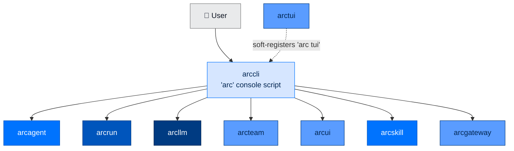

<div align="center">

# ⌨️ arccli

### **The `arc` Command-Line Tool**
*Slash-command registry. JSON output on every data command. The single front door to the entire Arc stack.*

[](https://opensource.org/licenses/Apache-2.0)
[](#status)
[](#status)
[](#)

</div>

---

## ✨ What is arccli?

`arccli` is the unified `arc` command-line tool. Every Arc operation — creating an agent, running it, listing tools, inspecting LLM providers, starting the dashboard, approving a chat-platform pairing — is one `arc` subcommand.

It's built on a **centralized slash-command registry** with lazy handler dispatch. **No Typer, no third-party top-level CLI framework.** The top-level routing is a flat `CommandDef` registry shared by arccli, arcgateway, and platform adapters; subcommand groups (agent, llm, run, etc.) use stdlib `argparse` internally. (Two agent module CLIs — `arc agent policy` / `arc agent browser` — delegate to their packages' Click groups, so Click stays a dependency.)

> ⚡ **Two modes: one-shot (`arc <command>`) and interactive REPL (`arc`). `--json` on every data command. CI-friendly by default.**

---

## ⭐ Top Features

What makes `arccli` the definitive command-line interface for agent operations:

### **Unified Interface**
- **Single `arc` command** — Every Arc operation is one `arc` subcommand; no scattered CLI tools to remember
- **Slash-command registry** — Shared registry with `arcgateway` and platform adapters; same contract across CLI, Slack, Telegram, web chat
- **No third-party CLI frameworks** — Uses stdlib `argparse` internally; fewer dependencies in the trust path

### **Operator Experience**
- **Interactive REPL** — Multiline editor with Shift+Enter for newlines; tab-completion; `/commands` for in-chat actions
- **`--json` on every data command** — Structured output for CI/CD pipelines; no screen-scraping required
- **Non-interactive variants** — Every interactive command has a scripted equivalent (`arc init --tier`, `arc agent build --check`)

### **Comprehensive Coverage**
- **13 command groups** — Agent lifecycle, LLM ops, team messaging, tasks, memory, connectors, modules, blueprints, workflows, approvals, and more
- **Soft-imported surfaces** — Optional packages (`arcui`, `arcgateway`, `arctui`) register their commands only when installed
- **Cheat sheet built-in** — Every command documented with examples; `--help` shows tier defaults and flag combinations

### **Command Architecture**
- **Slash-command registry** — Shared registry with `arcgateway` and platform adapters; same contract across CLI, Slack, Telegram, web chat
- **No third-party CLI frameworks** — Uses stdlib `argparse` internally; fewer dependencies in the trust path
- **Two agent module CLIs** — `arc agent policy` / `arc agent browser` delegate to their packages' Click groups

### **Interactive Features**
- **REPL mode** — Multiline editor with Shift+Enter for newlines; tab-completion; `/commands` for in-chat actions
- **JSON output** — `--json` flag on every data command; structured output for CI/CD pipelines
- **Command discovery** — `/help` shows all available commands; dynamic based on installed packages

### **Tier Wizard**
- **Interactive setup** — `arc init` walks through tier selection, provider configuration, and API key setup
- **Tier defaults** — Personal, Enterprise, Federal tiers provide different security and sandbox defaults
- **Validation built-in** — `arc agent build --check` validates agent configuration before deployment

---

## 🏗️ Where It Fits


```mermaid
flowchart TB
    classDef entry fill:#D6E6FF,stroke:#0073FE,color:#002550
    classDef agent fill:#0073FE,stroke:#0055BC,color:#FFFFFF
    classDef runtime fill:#0055BC,stroke:#003B82,color:#FFFFFF
    classDef llm fill:#003B82,stroke:#002550,color:#FFFFFF
    classDef surface fill:#5A9CFF,stroke:#003B82,color:#002550
    classDef other fill:#E9EAEB,stroke:#7F7F7F,color:#0B1220

    User[👤 User]:::other --> arccli
    arccli[arccli<br/>'arc' console script]:::entry --> arcagent[arcagent]:::agent
    arccli --> arcrun[arcrun]:::runtime
    arccli --> arcllm[arcllm]:::llm
    arccli --> arcteam[arcteam]:::surface
    arccli --> arcui[arcui]:::surface
    arccli --> arcskill[arcskill]:::agent
    arccli --> arcgateway[arcgateway]:::surface
    arctui[arctui]:::surface -.soft-registers 'arc tui'.-> arccli
```

`arccli` is a **terminal layer** — nothing in the nucleus depends on it. It installs the `arc` and
`arc-agent-worker` console scripts. Optional surfaces (`arcui`, `arcgateway`, `arctui`) are
soft-imported: their subcommands appear only when the package is installed, and the core CLI works
without them. `arctui` hard-depends on `arccmd` and registers `arc tui` on import — the arrow points
*into* arccli, never out of it.

---

## 🚀 Install

```bash
pip install arccmd              # standalone (PyPI name is arccmd; import package is arccli)
# or
pip install arcmas              # full Arc stack (arcmas depends on arccmd)
```

After install, the `arc` command is on your PATH:

```bash
arc version                     # one-shot mode
arc                             # interactive REPL with tab-completion
```

---

## 🎬 Five-Minute Tour

```bash
# First-time setup (interactive: tier, provider, API key)
arc init

# Or quick-start with personal tier
arc init --quick

# Create an agent
arc agent create my-agent --model anthropic/claude-sonnet-4-5-20250929

# Validate
arc agent build my-agent --check

# Interactive chat
arc agent chat my-agent

# One-shot task
arc agent run my-agent "Summarize workspace/data/"

# One-shot with context file
arc agent run my-agent "Analyze this" --context ./report.md --json
```

---

## 🧱 Command Groups

### Agents, runs, and LLM

| Group | Purpose |
|---|---|
| **`arc agent`** | Agent lifecycle — create, build, chat, run, serve, status, tools, skills, extensions, sessions, config, memory, reload, strategies, events (plus the `policy` / `browser` module CLIs) |
| **`arc run`** | arcrun loop without an agent directory — version, exec, task |
| **`arc llm`** | LLM provider operations — version, config, providers, provider, models, prompt, validate |
| **`arc keys`** | Provider API keys — list, set (hidden prompt), remove |

### Setup, install, and bring-up

| Group | Purpose |
|---|---|
| **`arc init`** | Interactive first-time setup wizard with tier presets, optional `--blueprint` bootstrap |
| **`arc install`** | Install every module each agent's config enables, then verify the checkout |
| **`arc up`** | One supervised bring-up of the whole stack — preflight, modules, verify, start |
| **`arc runtime`** | Install-level framework version control — list, and flip `current` (update or rollback) |
| **`arc identity`** | Manage the standalone signing authority for direct arcrun/arcllm runs |

### Tools, skills, and extensibility

| Group | Purpose |
|---|---|
| **`arc skill`** | Skill management — list, create, validate, search |
| **`arc ext`** | Capability + extension-point management — list, create, install, validate, inspect, verify |
| **`arc connector`** | Connect an agent to an external system — add, auth, list, probe, remove |
| **`arc module`** | Signed module bundles — list, bundle, install, remove |
| **`arc blueprint`** | Signed preset-config bootstrap — list, show, apply, verify, sign |
| **`arc prompt`** | View + edit/overwrite editable system prompts — list, show, diff, edit, reset |
| **`arc workflow`** | ArcFlow — list, show, create, edit, archive, unarchive, purge, run, cancel, sign, verify |

### Team, tasks, and observability

| Group | Purpose |
|---|---|
| **`arc team`** | Team messaging (Slack for agents) — create, add-member, remove-member, up, down, serve, send, inbox, read, thread, channels, register, entities, status, config, init, memory-status, backfill-workspaces |
| **`arc task`** | Mission Control task system (SPEC-056) — create, list, edit, assign, complete, talk |
| **`arc ui`** | Multi-agent dashboard — start, tail |
| **`arc tui`** | Terminal viewpoint onto a served agent (soft-registered by `arctui` when installed) |
| **`arc store`** | Operational store lifecycle — init, status, verify, backfill |
| **`arc memory`** | Agent memory maintenance — dedup pre-canonicalization card duplicates, status (semantic recall) |

### Operator controls

| Group | Purpose |
|---|---|
| **`arc approve`** | Mechanical operator approval for blocked agent actions (SPEC-035) — list, `<id>`, `--deny` |
| **`arc trust`** | Operator approval for gated capabilities — list, approve, disapprove |
| **`arc stop`** | Operator kill switch — stop a running agent run by run id or session |
| **`arc user`** | Accounts that can sign in — add, list, passwd, role, telegram |
| **`arc gateway pair`** | Gateway pairing operator commands — list, approve, revoke |
| **`arc gateway adapter`** | List / install official gateway adapter packages (telegram, slack, mattermost) |
| **`arc gateway connect-telegram`** | Guided: bind one agent to one Telegram bot (paste token + user ID) |
| **`arc help`, `arc version`** | Info and REPL utilities |

`--json` is supported on data-returning subcommands for CI/CD integration.

---

## 📟 The Cheat Sheet

```bash
# === Setup ===
arc init                                                  # tier wizard (interactive)
arc init --tier federal --provider anthropic               # non-interactive
arc init --quick                                          # quick-start, personal tier
arc init --blueprint enterprise-ops                       # bootstrap from a packaged preset

# === Agents ===
arc agent create my-agent --model anthropic/claude-sonnet-4-5-20250929
arc agent create my-agent --with-code-exec                # with sandboxed code execution
arc agent create my-agent --no-register                   # skip arcteam registration
arc agent build my-agent --check                          # ALWAYS pass --check first (validate, write nothing)
arc agent build my-agent --force                          # regenerate an existing arcagent.toml (DID + name preserved)
arc agent build my-agent --tier federal                   # set the deployment tier for every subsystem
arc agent chat my-agent
arc agent chat my-agent --task "one-shot question"        # non-interactive single turn
arc agent chat my-agent --session-id <id>                 # resume session
arc agent chat my-agent --max-turns 20                    # override turn limit
arc agent run my-agent "task description"
arc agent run my-agent "analyze this" --context ./data.md # stage context file
arc agent run my-agent "summarize" --json                 # structured output
arc agent run my-agent "task" --max-turns 5 -v            # verbose with turn limit
arc agent serve my-agent                                  # daemon
arc agent status my-agent
arc agent config my-agent --json
arc agent tools my-agent --json
arc agent tools my-agent --with-code-exec
arc agent skills my-agent
arc agent extensions my-agent
arc agent sessions my-agent
arc agent reload my-agent                                 # hot-reload
arc agent strategies                                      # available strategies
arc agent events                                          # event types

# === LLM introspection ===
arc llm version
arc llm config
arc llm config --module audit
arc llm providers
arc llm provider anthropic
arc llm models
arc llm models --provider openai
arc llm models --tools
arc llm models --vision
arc llm validate
arc llm validate --provider anthropic
arc llm prompt "What is 2+2?" --model anthropic/claude-haiku-4-5-20251001

# === Direct runs (no agent dir) ===
arc run version
arc run task "Calculate 2^32" --with-calc --model anthropic/claude-haiku-4-5-20251001
arc run task "Write a script" --with-code-exec --strategy code
arc run task "Research topic" --no-spawn                  # disable parallel sub-tasks
arc run exec "print(2 ** 32)"                             # sandboxed Python execution
arc run exec "import math; print(math.pi)" --timeout 10

# === Skills (SPEC-021 folder format) ===
arc skill list
arc skill list --agent my-agent
arc skill create data-analysis                                  # creates ./data-analysis/SKILL.md
arc skill create data-analysis --dir my-agent/capabilities      # per-agent (trusted)
arc skill create shared --global                                # ~/.arc/capabilities/shared/
arc skill validate ./data-analysis                              # folder OR ./data-analysis/SKILL.md
arc skill search "data"
arc skill search "report" --agent my-agent

# === Capability files (Python @tool / @hook / @background_task / @capability) ===
arc ext list
arc ext list --agent my-agent
arc ext create web-search                                       # ./web-search.py with @tool template
arc ext create scraper --dir my-agent/capabilities              # per-agent (trusted)
arc ext create scraper --dir my-agent/workspace/.capabilities   # agent-authored (UNTRUSTED, AST-validated)
arc ext install ./my_capability.py                              # copies to ~/.arc/capabilities/
arc ext validate ./my_capability.py
arc ext inspect                                                  # selected/available/signed, all 4 extension families
arc ext inspect --agent my-agent
arc ext verify --agent my-agent                                  # non-zero exit on a refused selection

# === Blueprints (signed preset-config bootstrap) ===
arc blueprint list                                               # packaged + ~/.arc/blueprints presets
arc blueprint show enterprise-ops
arc blueprint apply enterprise-ops --agent my-agent               # verify -> deep-merge -> write
arc blueprint apply enterprise-ops --agent my-agent --dry-run     # print merged config, no write
arc blueprint verify enterprise-ops
arc blueprint sign ./my-preset.toml                               # operator-sign, writes .arcsig sidecar

# === Team messaging (Slack for agents) ===
# -- Stand up a team --
arc team create mfg --channel ops --members "procurement,picking,inventory"  # team + default channel + members
arc team add-member mfg demand-planning                        # add a member (handle or DID)
arc team remove-member mfg picking
arc team up mfg                                                 # boot members as supervised daemons on NATS
arc team down mfg                                              # stop the team's daemons
arc team serve ./agents --no-browser                           # all-in-one: NATS + register + dashboard for a folder

# -- Register / inspect --
arc team init                                                  # initialize the team data dir
arc team init --root /var/arc/team                             # explicit data root (else ${ARC_CONFIG_DIR:-~/.arc}/team)
arc team register agent-1 --name "Analyst" --type agent
arc team register lead-1 --name "Lead" --type agent --roles lead,reviewer
arc team status
arc team entities                                              # optional: --role lead
arc team channels
arc team memory-status
arc team backfill-workspaces                                    # sync workspace paths from arcagent.toml

# -- Messaging --
arc team send --sender agent://procurement --to ops --body "PO-2026-0412 received" --action
arc team read --sender agent://lead --channel ops --limit 50   # or --dm <handle>
arc team inbox --sender agent://procurement
arc team thread --stream ops <thread_id>

# === Tasks (Mission Control, SPEC-056) ===
arc task create "Draft the Q3 report" --actor @lead --priority high  # unowned -> team backlog
arc task create "Ship it" --actor @lead --owner @analyst-1           # assigned at creation
arc task list --scope mine --actor @analyst-1                  # omit --scope for the team-wide view
arc task edit <task_id> --actor @lead --priority urgent         # at-rest only — 409 if in_progress
arc task assign <task_id> @analyst-1 --actor @lead              # atomic; notifies + wakes the assignee
arc task complete <task_id> --actor @analyst-1 --resolution "done"
arc task talk <task_id> "any update?" --actor @lead              # steer an in-progress owner, not an edit

# === Memory maintenance ===
arc memory dedup ./agents                     # dry-run: report legacy duplicate memory cards that would merge
arc memory dedup --apply ./agents             # merge variant-slug cards into the canonical file, delete variants
arc memory dedup --apply <agent-dir>/workspace  # one workspace, or a root that is searched for nested workspaces
arc memory status ./agents                    # is semantic (vector) recall LIVE, or degraded to BM25 + graph? (exit 1 if down)
arc agent memory ./my-agent --json            # straight database view of one agent's stored memory

# === Multi-agent dashboard ===
arc ui start
arc ui start --port 9000 --show-tokens
arc ui start --host 0.0.0.0 --max-agents 500
arc ui start --team-root ./team                                 # agent discovery directory
arc ui start --gateway-config ./gateway.toml                    # enable Slack/Telegram
arc ui start --no-browser                                       # headless / CI
arc ui start --no-chat                                          # disable web chat platform
arc ui tail --viewer-token <t>
arc ui tail --viewer-token <t> --layer llm
arc ui tail --viewer-token <t> --agent did:arc:acme:.../
arc ui tail --viewer-token <t> --group research-team

# === Gateway pairing & connect ===
arc gateway pair list
arc gateway pair approve ABCD1234
arc gateway pair revoke ABCD1234
arc gateway adapter list                                       # official adapter packages + install status
arc gateway adapter install telegram                            # pip/uv-install arcgateway-telegram
arc gateway connect-telegram --agent ./my-agent                 # guided: paste @BotFather token (hidden) + your user ID
arc gateway connect-telegram --agent ./my-agent --user-id 12345 # non-interactive user ID (token still prompted securely)

# === Terminal UI (needs arctui installed) ===
arc tui                                                         # attach to a local gateway, or spawn one
arc tui --agent employee                                       # pick a roster agent
arc tui --url http://host:8420 --token <viewer-token>          # attach to a remote gateway

# === Provider API keys ===
arc keys list
arc keys set anthropic                                          # hidden prompt; written to the env file, never config/LLM
arc keys remove openai

# === Connectors (external systems) ===
arc connector list --agent ./my-agent
arc connector add ./my-agent <connector>                       # connection is deployment-wide; grant is per-agent
arc connector auth ./my-agent <connector>
arc connector probe ./my-agent <connector>
arc connector remove ./my-agent <connector>

# === Signed module bundles (SPEC-066) ===
arc module list
arc module bundle ./my-module                                   # produce a signed bundle
arc module install ./my-module.arcbundle
arc module remove <module>

# === ArcFlow workflows (SPEC-061) ===
arc workflow list
arc workflow show <name>
arc workflow run <name>
arc workflow sign ./my-workflow.toml
arc workflow verify <name>

# === Editable system prompts (arcprompt) ===
arc prompt list
arc prompt show <id>
arc prompt diff <id>
arc prompt edit <id>                                            # overlay pinned to the operator key
arc prompt reset <id>

# === Install / bring-up / runtime ===
arc install --team-root ./team                                 # install every enabled module, then verify
arc up --check --team-root ./team                              # preflight only
arc up --team-root ./team                                      # supervised bring-up of the whole stack
arc runtime list                                               # installed framework versions
arc runtime activate 0.8.0                                     # flip 'current' (atomic update or rollback)
arc identity init                                              # create the standalone signing authority
arc identity show

# === Operator controls ===
arc approve list                                               # pending mechanical-approval requests
arc approve <id>                                               # sign an operator grant (or: --deny)
arc trust list
arc trust approve <capability>                                 # signs, not a hash pin
arc stop list                                                  # running agent runs
arc stop <run_id> --reason "operator halt"
arc stop --session <session-key>

# === Sign-in accounts ===
arc user list
arc user add alice --role operator
arc user passwd alice
arc user telegram alice 12345                                  # bind a Telegram user ID

# === Operational store ===
arc store status
arc store init
arc store verify
arc store backfill

# === Help & REPL ===
arc help
arc version
arc                                                             # start interactive REPL
```

---

## 💬 In-Chat REPL Commands

`arc agent chat` uses a multiline editor in a TTY: **Enter sends**, **Shift+Enter** (or
**Alt+Enter**) inserts a newline — so you can compose multi-paragraph prompts before submitting.
Piped/non-interactive stdin still reads a line at a time.

While inside `arc agent chat`:

| Command | Effect |
|---|---|
| `/quit` | Exit chat |
| `/tools` | List tools the agent can call |
| `/model` | Show current model |
| `/cost` | Running USD spend |
| `/reload` | Hot-reload skills + extensions |
| `/skills` | List discovered skills |
| `/extensions` | List loaded extensions |
| `/session` | Current session info |
| `/sessions` | List past sessions |
| `/switch <id>` | Resume a previous session |
| `/identity` | Show DID, org, type |
| `/status` | Full agent summary |

---

## 🎚️ The Tier Wizard

`arc init` is interactive by default. It writes a sensible config based on your tier choice.

| Tier | Telemetry | Audit | Retry | Fallback | OpenTelemetry | PII redaction + signing |
|---|---|---|---|---|---|---|
| `personal` | off | off | off | off | off | off |
| `enterprise` | ✅ | ✅ | ✅ (3x) | ✅ | off | off |
| `federal` | ✅ | ✅ | ✅ (3x) | ✅ | ✅ (OTLP) | ✅ |

Tiers are config-relaxable within limits (`arcagent.tiers.RELAXABLE_KNOBS`) — personal/enterprise may relax specific knobs, federal floors are never relaxable. A signed **blueprint** (`arc blueprint apply`) can only raise a deployment's tier floor (stringency-max merge), never lower it.

`[security] tier` also sets the `execute_python` isolation floor: `federal` → VM (Firecracker/KVM), `enterprise`/`personal` → container. A `personal`-tier agent can opt into `[execution] relax_isolation = "off"` in its `config.toml` to run code directly on the host (no container) — rejected at `enterprise`/`federal`, which cannot go below their tier floor. `arc` forwards the agent's tier and this config to arcrun on every `execute_python` call.

Non-interactive variant:

```bash
arc init --tier federal --provider anthropic --dir /etc/arc
```

---

## 🛡️ Architecture: Slash-Command Registry

`arccli` uses a **centralized `CommandDef` registry** — the same registry that arcgateway and platform adapters (Slack, Telegram, web) consume. Each command is a frozen dataclass with metadata (name, description, category, aliases, visibility flags) and a lazily-attached handler.

Why this design:

1. **Fewer dependencies in the trust path.** No Typer, and no Click at the top level — `argparse` ships with Python and is only used inside subcommand groups. (Click is pulled in only for the two delegated agent-module CLIs, `arc agent policy` / `arc agent browser`.)
2. **Shared contract.** The registry is the single source of truth for arccli, arcgateway, and chat platforms. Gateway-only commands (`gateway pair *`) are invisible in the CLI help. CLI-only commands (`init`, `quit`) don't appear in Telegram menus.
3. **Easier to read and modify.** Every command entry is a `CommandDef` in `arccli.commands.registry`. Handlers are plain functions. No metaclasses, no decorator trees.

### Gateway slash-commands

The gateway surfaces (Slack, Telegram, web chat) share the same registry pattern for **in-chat
slash-commands** an end user types to the agent:

| Command | Effect |
|---|---|
| `/new` | Start a fresh conversation — rotates the session epoch (a new generation → a new, empty session key). The old conversation is not deleted and stays resumable |
| `/reset` | Alias for `/new` |
| `/help` | List the registered slash-commands (generated from the live registry) |

`/new` persists its rotation across gateway restarts, so "New session" doesn't silently un-rotate
on the next bounce. Slack subscribes the registered names as native slash-commands and re-injects
them as inbound events.

---

## 📋 Compliance Notes

`arccli` itself doesn't implement compliance controls — it's the operator interface to the packages that do. Useful properties:

- **No reflection on user input.** All commands flow through argparse subparsers — no `eval`, no `getattr` on user strings.
- **`--json` everywhere.** Structured output is the default for any data-returning command, so CI/CD pipelines can parse without scraping.
- **Audited side-effects.** `arc gateway pair approve`, `arc team register`, `arc skill validate`, `arc blueprint apply`/`sign` — every operator action emits an arctrust audit event before completing (`arc blueprint apply --dry-run` writes nothing and audits nothing).
- **No interactive defaults.** Every interactive command has a non-interactive equivalent (e.g. `arc init --tier`, `arc agent build --check`) so it can be scripted without `expect`.

---

## 🧪 Status

```bash
uv run --no-sync pytest packages/arccli/tests
```

- **Tests:** 790+ across 87 files
- **Type check:** `mypy --strict` clean
- **Lint:** `ruff check` clean

---

## 📚 Full Reference

The complete `arc <command>` reference with every flag, default, and example: [docs/cli.md](../../docs/cli.md).

---

## 📄 License

Apache 2.0 · Copyright © 2025-2026 BlackArc Systems.
