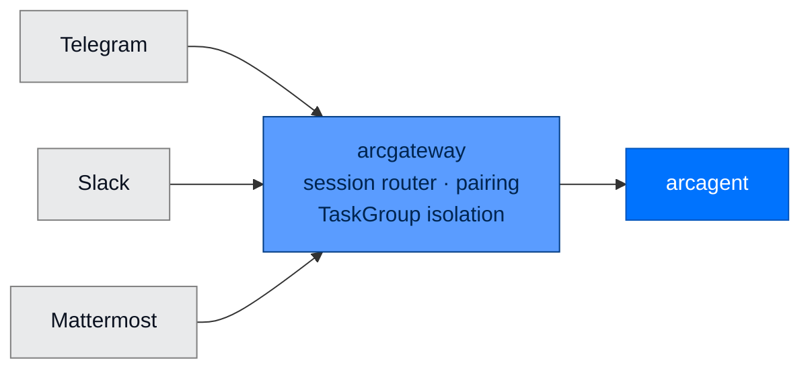
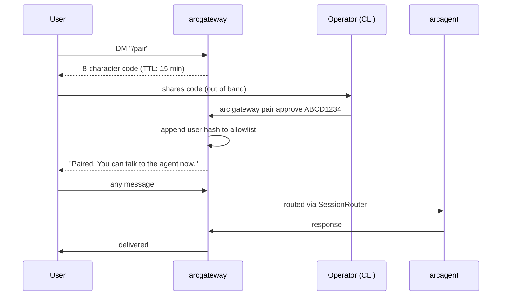

<div align="center">

# 📡 arcgateway

### **Make Your Agents Reachable from Telegram, Slack, Mattermost — Safely**
*Long-running daemon. Multi-platform adapters. Operator-approved pairing. TaskGroup isolation per platform.*

[](https://opensource.org/licenses/Apache-2.0)
[](#-status)
[](#-status)
[](#-status)
[](#-operator-approved-pairing)

</div>

---

## ✨ What is arcgateway?

`arcgateway` is the long-running daemon that lets users talk to your agents through chat platforms — Telegram, Slack, Mattermost — **without** giving anyone implicit access to anything.

Every DM gets a per-(user, agent) session. Every session must be **explicitly paired** by an operator before the agent will respond. One platform crashing never takes down the others. Every action emits an audit event.

> 🛡️ **No pairing → no response. Operator-approved allowlist. TaskGroup isolation. Replay-protected.**

---

## ⭐ Top Features

What makes `arcgateway` uniquely secure for multi-platform agent access:

### **Security & Access Control**
- **Operator-approved pairing** — Sessions don't respond until an operator explicitly approves; eliminates unauthorized access from shared chat platforms
- **TaskGroup isolation** — Each platform runs in its own TaskGroup; a crash in Slack doesn't affect Telegram or Mattermost connections
- **Per-session WORM chains** — Every interaction gets a hash-chained audit trail; operators can detect tampering or gaps

### **Multi-Platform Support**
- **Telegram, Slack, Mattermost** — Native adapters with identical session semantics; same agent works across all platforms
- **Slash-command registry** — `/commands` work identically across web, Slack, Telegram, and terminal interfaces
- **Platform-aware routing** — Messages route correctly even when an agent appears on multiple platforms simultaneously

### **Session Management**
- **Per-(user, agent) sessions** — Each user gets an isolated conversation with each agent; no cross-contamination
- **Session continuity** — Sessions survive platform disconnects; messages queue and replay when reconnected
- **Graceful degradation** — If a platform is unreachable, other platforms continue unaffected

### **Platform Adapters**
- **In-tree adapters** — Telegram, Slack, Mattermost adapters live in the same package; no separate dependencies
- **Extras for client libraries** — Each platform has optional extra for its SDK (`[telegram]`, `[slack]`, `[mattermost]`)
- **Multi-bot support** — Run multiple bots for different agents; each with its own config block

### **Configuration**
- **TOFU pairing** — Trust-on-first-use with operator approval; sessions don't respond until paired
- **Allowlist enforcement** — `allowed_user_ids` restricts who can message the agent
- **Federal tier blocking** — Platforms without proper extras refused at federal tier

---

## 🏗️ Where It Fits


```mermaid
flowchart LR
    classDef surface fill:#5A9CFF,stroke:#003B82,color:#002550
    classDef agent fill:#0073FE,stroke:#0055BC,color:#FFFFFF
    classDef other fill:#E9EAEB,stroke:#7F7F7F,color:#0B1220

    Telegram[Telegram]:::other --> arcgateway
    Slack[Slack]:::other --> arcgateway
    Mattermost[Mattermost]:::other --> arcgateway
    arcgateway[arcgateway<br/>session router · pairing<br/>TaskGroup isolation]:::surface --> arcagent[arcagent]:::agent
```

Depends on `arcagent` and `arctrust`. **No other Arc package depends on arcgateway** — it's a terminal node.

---

## 🚀 Install

For end-users, install the meta package:

```bash
pip install arcmas              # arcgateway is included in the meta package
```

Remote platforms are **in-tree adapter folders** (Telegram, Slack, Mattermost),
not separate packages. What is optional is the third-party client each needs, so
each ships as an **extra**:

```bash
pip install 'arcgateway[telegram]'      # adds python-telegram-bot
pip install 'arcgateway[slack]'         # adds slack-bolt / slack-sdk
pip install 'arcgateway[mattermost]'    # adds aiohttp
```

Without its extra, a platform is skipped at personal/enterprise tier (reason
recorded) and refuses startup at federal tier.

For Arc monorepo development, install the sibling packages in editable mode together — installing only `arcgateway` leaves `arcagent`, `arcllm`, `arcrun`, `arccli` un-linked and import errors surface as cryptic "module not found" failures during test runs:

```bash
uv pip install -e packages/arcgateway \
               -e packages/arccli \
               -e packages/arcagent \
               -e packages/arcllm \
               -e packages/arcrun
```

`make install` runs the canonical command from the repo root.

---

## 🧪 Quick Example

```python
from arcgateway import GatewayRunner, AsyncioExecutor

# In-process executor (Personal / Enterprise tier)
executor = AsyncioExecutor(agent_config_path="my-agent/arcagent.toml")
runner = GatewayRunner(executor=executor)

await runner.run()              # blocks; SIGINT/SIGTERM handled gracefully
```

Configure platform adapters in `gateway.toml` (enable a block **and** install
its extra):

```toml
[gateway]
agent_did = "did:arc:agent:default"

[security]
require_pairing = true

# pip install 'arcgateway[telegram]'
[platforms.telegram]
enabled = true
token_env = "TELEGRAM_BOT_TOKEN"
allowed_user_ids = [123456789]

# pip install 'arcgateway[slack]'
[platforms.slack]
enabled = false
bot_token_env = "SLACK_BOT_TOKEN"
app_token_env = "SLACK_APP_TOKEN"
```

**Multi-bot (one bot per agent):** name the block freely and set `platform =`
to pick the adapter folder. `arc gateway connect-telegram` (or the arcui
settings panel) does this for you — it stores the bot token in the gateway's
env file (`0600`, **never** the config or an agent chat) and writes the block:

```toml
[platforms.olivia_telegram]
enabled = true
platform = "telegram"
agent_did = "did:arc:agent:olivia"
token_env = "TELEGRAM_BOT_TOKEN_OLIVIA"
```

---

## 🤝 Operator-Approved Pairing

Anyone can DM the bot. **Nothing happens** until an operator approves the pairing.

### The pairing flow


```mermaid
sequenceDiagram
    participant U as User
    participant G as arcgateway
    participant O as Operator (CLI)
    participant A as arcagent

    U->>G: DM "/pair"
    G-->>U: 8-character code (TTL: 15 min)
    U->>O: shares code (out of band)
    O->>G: arc gateway pair approve ABCD1234
    G->>G: append user hash to allowlist
    G-->>U: "Paired. You can talk to the agent now."
    U->>G: any message
    G->>A: routed via SessionRouter
    A->>G: response
    G->>U: delivered
```

### CLI commands

```bash
arc gateway pair list                    # show pending (unexpired, unconsumed) codes
arc gateway pair approve ABCD1234        # approve a code; adds user hash to allowlist
arc gateway pair revoke ABCD1234         # revoke a pending code
```

**Codes are exactly 8 characters, uppercase, with TTL.** They auto-expire. `pair list` shows the remaining minutes.

User identifiers are stored as **hashes**, not raw IDs. The allowlist contains nothing personally identifying.

Every approve / revoke / pair-attempt emits an arctrust audit event with the operator's identity, the code, and the outcome.

---

## 💬 Slash-Commands

A user can type a slash-command to the agent from any surface (Slack, Telegram, web). They flow
through one shared `CommandRegistry` — a message is intercepted only when a **registered** command
matches; an unknown `/foo` falls through to the agent as ordinary text. Adding a command is a
one-liner (`registry.register(MyCommand())`); Slack subscribes the registered names as native
slash-commands and re-injects them as inbound events.

| Command | Effect |
|---|---|
| `/new` | Start a fresh conversation — rotates the **session epoch** (bumps a per-session generation folded into the session key, so a new generation opens a new, empty session). No file is reset; the old conversation stays resumable |
| `/reset` | Alias for `/new` |
| `/help` | List the registered slash-commands (generated from the live registry) |

The session epoch (`SessionEpochStore`) persists across gateway restarts when db-backed, so
"New session" doesn't silently un-rotate on the next bounce.

---

## 🧱 Public API

```python
from arcgateway import (
    GatewayRunner,           # supervises all platform adapters
    SessionRouter,           # per-(user, agent) session routing
    build_session_key,       # canonical (user_hash, agent_did) tuple

    InboundEvent,            # normalized event from any surface (ordered parts + flattened text)
    Delta,                   # streamed response chunk

    Executor,                # protocol
    AsyncioExecutor,         # in-process implementation

    DeliveryTarget,          # parsed "platform:chat_id[:thread_id]" address

    # SPEC-065 — the part vocabulary + inbound-media custody
    Part, TextPart, MediaPart, flatten_text,
    MediaStore, StoredMedia, MediaTooLargeError,
)

# SPEC-022 — agent data plane (read-only)
from arcgateway import (
    fs_reader,               # read_file() / list_tree() with audit + size cap
    fs_watcher,              # WatcherManager (lazy, ref-counted, watchfiles+poll)
    policy_parser,           # parse_bullets() — pure ACE bullet parser
    team_roster,             # list_team() — discover agents from team/<id>_agent/
    agent_config,            # load_ui_section() — optional [ui] in arcagent.toml
    file_events,              # FileChangeEvent + FileEventBus async pub/sub
)
```

### Agent data plane (SPEC-022)

The `fs_reader`, `fs_watcher`, `policy_parser`, `team_roster`, `agent_config`, and `file_events` modules together form the **single read API for `team/<agent>/...`**. arcui consumes them in-process; nothing else may. ADR-020 explains why this lives in gateway.

| Module | Responsibility |
|--------|----------------|
| `fs_reader` | All read access. `read_file(scope, agent_id, agent_workspace, rel_path, caller_did)` and `list_tree(...)`. Path traversal blocked, size capped at 1 MB, depth-limited tree. Read-only by structure (no write methods exist). `scope: agent\|team\|shared` arg from day one — only `agent` is wired today; `team` and `shared` raise `NotImplementedError` for forward-compat. |
| `fs_watcher` | Per-agent watcher lifecycle. `WatcherManager.subscribe(agent_id, workspace_root)` lazy-starts a watcher, ref-counted; `unsubscribe()` decrements and tears down at zero. Uses `watchfiles` when available, polls stdlib mtime otherwise (D-007). |
| `policy_parser` | Pure parser for ACE policy bullets `- [P##] <text> {score:N, ...}`. Text in / dataclasses out. No I/O coupling. Same parser used in arcui detail Policy tab and fleet Policy Engine page. |
| `team_roster` | `list_team(team_root, online_ids) -> list[RosterEntry]`. Walks `team/*_agent/arcagent.toml`, applies `[ui]` overrides, overlays online/offline status from caller-supplied set. |
| `agent_config` | `load_ui_section(toml_dict) -> UISection`. Optional `[ui]` block: `display_name`, `color`, `role_label`, `hidden`. ADR-021. |
| `file_events` | `FileChangeEvent` dataclass + `FileEventBus` in-process async pub/sub. Bus is fanout — every subscriber sees every event. Audit emission is direct via `arcgateway.audit.emit_event` (D-022-B). |

Audit events emitted on every fs op: `gateway.fs.read`, `gateway.fs.tree`, `gateway.fs.changed`. Each row carries `caller_did`, `agent_id`, `path`, `scope` for NIST AU-2.

### How the runner stays resilient

`GatewayRunner` supervises N platform adapters inside an `asyncio.TaskGroup`. **A crash in one adapter never kills its siblings.** Telegram disconnects → Slack and Mattermost keep serving. The crashed adapter is logged, audited, and restarted with backoff.

### How the session router prevents races

`SessionRouter` uses a **synchronous pre-await guard** to guarantee exactly **one agent task per session key**, regardless of how many concurrent inbound messages arrive at the same instant. This closes a race condition where two messages arriving on the same TCP connection could both spawn a fresh agent task.

---

## 🔌 Platform Adapters — the filesystem is the registry

The gateway core names **zero** platforms. A platform is a **folder**:
`src/arcgateway/adapters/<name>/` exporting a module-level
`PLATFORM = AdapterSpec(...)` (SPEC-065 REQ-308). The registry finds it by
directory scan — adding a platform is adding a folder, deleting the folder
deletes the platform, and `registry.py` is never edited either way.

The one built-in that always ships is `web` (the in-process browser chat surface
arcui hosts — no token, no client library). The remote platforms are in-tree
folders whose third-party client is an optional extra:

| Platform | Folder | Extra | Bot Token Source |
|---|---|---|---|
| **web** | `adapters/web.py` | — (always on) | none |
| **Telegram** | `adapters/telegram/` | `arcgateway[telegram]` | `TELEGRAM_BOT_TOKEN` env or vault |
| **Slack** | `adapters/slack/` | `arcgateway[slack]` | `SLACK_BOT_TOKEN` / `SLACK_APP_TOKEN` |
| **Mattermost** | `adapters/mattermost/` | `arcgateway[mattermost]` | `MM_BOT_TOKEN` env or vault |

Install a platform's client from the CLI (uv/pip under the hood, official names only):

```bash
arc gateway adapter list                # official adapters + install status
arc gateway adapter install telegram    # installs the arcgateway[telegram] extra
# standalone daemon equivalent:
arcgateway adapter install telegram
```

…or install the extra directly:

```bash
pip install 'arcgateway[telegram]'      # only the clients you need
```

At startup `arcgateway.adapters.registry`:
1. **Discovers** every platform folder that exports a `PLATFORM` descriptor. An
   import failure is caught, audited, and skipped — one broken folder can't take
   down the daemon.
2. **Authorizes** it — validates the name (regex; no path traversal/injection)
   and applies a tier-aware allowlist (official platforms always allowed;
   unofficial ones load with an audit warning at personal/enterprise and are
   **blocked** at federal).
3. **Builds** an adapter for each enabled `[platforms.<name>]` block, gating on
   credential/dependency presence (a missing token or extra skips at personal,
   fails closed at federal).
4. **Audits** every load / skip / block (`gateway.adapter.*`).

**Writing a new platform** = one folder: an adapter class satisfying the
`BasePlatformAdapter` protocol (`connect` / `disconnect` / `to_parts` / `send`),
a Pydantic config model, and `PLATFORM = AdapterSpec(name, requires, supports, build)`.
Add its client to `[project.optional-dependencies]` and import it **lazily inside
`connect()`** — never at module import — so a gateway without the extra still
starts. No changes to the gateway core. An adapter does exactly three things
(lifecycle, `to_parts`, `send`); download, naming, size ceilings, audit, session
identity, pairing, and message splitting all belong to the gateway (one
implementation each). See `adapters/telegram/` as the reference.

---

## 🛡️ Security Architecture

### Pairing-Gate

| Layer | Defense |
|---|---|
| **Allowlist** | Stored as user hashes, not raw IDs. Operator-approved. Persisted to JSONL |
| **Code TTL** | Codes expire (default 15 min). `pair list` shows time remaining |
| **Code throttling** | `PairingThrottle` (`pairing.py`) rate-limits pairing-code generation per user |
| **Pairing signature** | Every pairing record is signed (Ed25519 via arctrust) — tampering with the allowlist file is detectable |
| **Replay protection** | Codes are single-use. `approve` consumes the code immediately |

### Per-Platform Isolation

| Property | How |
|---|---|
| **Crash containment** | TaskGroup isolation — one platform's `RuntimeError` never kills siblings |
| **Backoff on restart** | Exponential backoff with jitter on adapter restart |
| **Per-platform queues** | Inbound events queue per-platform — slow Slack doesn't backpressure Telegram |

### Audit on Everything

Every pair attempt, every approve, every revoke, every inbound event, every outbound delta emits an arctrust audit event. The dashboard (`arcui`) surfaces these in real time.

---

## 📋 Compliance Mapping

| NIST 800-53 | What `arcgateway` Provides |
|---|---|
| AC-3 | Allowlist-gated session routing — no pair → no response |
| AC-6 | Per-session DID-bound agent task; no shared session state |
| AU-2, AU-12 | Every pair, approve, revoke, inbound, outbound is audited |
| IA-3 | Each session keyed on (user_hash, agent_DID) |
| SC-13 | Pairing records signed with Ed25519 |

| OWASP Agentic | Mitigation |
|---|---|
| ASI03 (Identity Abuse) | Per-(user, agent) session keys; user IDs hashed; no shared credentials |
| ASI07 (Insecure Inter-Agent Comms) | Pairing signed; allowlist tamper-evident |
| ASI08 (Cascading Failures) | TaskGroup isolation; backoff restart; per-platform queue |
| ASI09 (Trust Exploitation) | Operator approval required; nothing happens implicitly |

---

## 🧪 Status

```bash
uv run --no-sync pytest packages/arcgateway/tests
```

- **Tests:** 494
- **Coverage:** 94%
- **Type check:** `mypy --strict` clean
- **Lint:** `ruff check` clean

---

## 📄 License

Apache 2.0 · Copyright © 2025-2026 BlackArc Systems.
