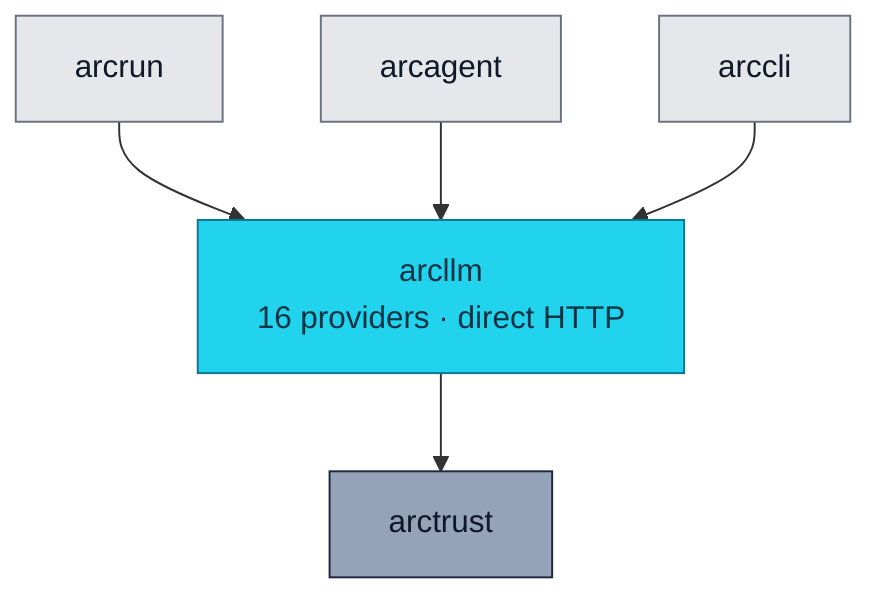

<div align="center">

# 🌐 arcllm

### **One LLM Client. 16 Providers. Zero SDKs.**
*Direct HTTP to every major model provider. PII redaction, request signing, OpenTelemetry, and audit baked in.*

[](https://opensource.org/licenses/Apache-2.0)
[](#status)
[](#status)
[](#status)
[](#-supported-providers)
[](#-zero-provider-sdks)

</div>

---

## ✨ What is arcllm?

`arcllm` is a provider-agnostic LLM client built around one principle: **never import a vendor SDK.**

Every call to OpenAI, Anthropic, Google, Cohere, Mistral, Groq — all 16 supported providers — is a direct HTTP request via `httpx`. You can read every byte. You can audit the wire format. You can run in environments where pulling in a transitive dependency you don't control isn't an option.

It also handles the boring-but-critical stuff that every production LLM client eventually grows: PII redaction, request signing, retries with exponential backoff, fallback chains across providers, rate limiting, OpenTelemetry export, structured audit events.

> 🛡️ **Three runtime dependencies. No vendor SDKs. Every byte on the wire is yours to inspect.**

---

## 🏗️ Where It Fits



Depends on: `arctrust` (for audit emission), `httpx`, `pydantic`. **That's the entire runtime dependency graph.**

---

## 🚀 Install

```bash
pip install arcllm           # standalone
# or
pip install arcmas           # full Arc stack
```

---

## 🧪 Quick Example

```python
from arcllm import load_model, Message

# Load a provider adapter with telemetry + audit enabled
model = load_model("anthropic", telemetry=True, audit=True)

response = await model.invoke([
    Message(role="user", content="Summarize this document.")
])

print(response.content)              # "The document describes..."
print(response.usage.total_tokens)   # 412
print(response.usage.cost_usd)       # 0.00318
print(response.stop_reason)          # "end_turn"
```

That's it. Switch to OpenAI? Change `"anthropic"` to `"openai"`. Switch to a local Ollama? Change it to `"ollama"`. **No code changes downstream.**

---

## 🌐 Supported Providers

All 16 go through direct HTTP. None pulls in a vendor SDK.

| Cloud | On-Prem (air-gapped) |
|---|---|
| **Anthropic** · Claude | **Ollama** — `localhost:11434` (Llama, Mistral, etc.) |
| **OpenAI** · GPT, o1, o3 | **vLLM** — `localhost:8000` (high-throughput GPU) |
| **Azure OpenAI** | **HuggingFace TGI** — `localhost:8080` |
| **Google** · Gemini | |
| **Cohere** · Command | |
| **Mistral** · Mistral, Codestral | |
| **Groq** · Llama, Mixtral | |
| **DeepSeek** · DeepSeek-V3, R1 | |
| **xAI** · Grok | |
| **Together** · open-weight models | |
| **Fireworks** · open-weight models | |
| **OpenRouter** · multi-provider gateway | |
| **NVIDIA** · NIM-hosted models | |
| **Moonshot** · Kimi | |
| **HuggingFace** · Inference API | |

Browse from the CLI:

```bash
arc llm providers                # list configured providers
arc llm provider anthropic       # show one provider's models + pricing
arc llm models --tools           # all models that support tool calling
arc llm models --vision          # all models that support vision
arc llm validate                 # test API key + connectivity per provider
```

---

## 🧩 The Module Stack (Decorator Pattern)

`arcllm` wraps the bare adapter in a stack of opt-in modules. The stacking order is deterministic:

```
Otel → Telemetry → Audit → Security → Retry → Fallback → RateLimit → Adapter
```

Each module is one decorator that adds one concern.

| Module | What It Does | Why You Want It |
|---|---|---|
| **Otel** | Creates the root OpenTelemetry span; GenAI semantic conventions | Distributed tracing across services |
| **Telemetry** | Wall-clock timing, per-call USD cost from provider pricing TOML | Cost attribution + latency tracking |
| **Audit** | Emits structured `arctrust` audit events | Compliance, forensics, post-hoc replay |
| **Security** | Bidirectional PII redaction, HMAC-SHA256 request signing | Lethal Trifecta protection, tamper-evidence |
| **Retry** | Exponential backoff, jitter, retryable-error classification | Survives transient provider failures |
| **Fallback** | Failover chain across providers / models | Continuity when a provider is down |
| **RateLimit** | Token bucket per provider | Stay inside provider quotas |
| **Adapter** | Direct HTTP to the provider | The actual call |

Toggle any of them per call:

```python
model = load_model(
    "anthropic",
    telemetry=True,      # cost tracking
    audit=True,          # arctrust audit events
    security=True,       # PII redaction + signing
    retry=True,          # exponential backoff
    rate_limit=True,
    otel=True,           # OpenTelemetry export
)
```

---

## 🛡️ Zero Provider SDKs

This is the headline. Arc imports **nothing** from `openai`, `anthropic`, `google-cloud-aiplatform`, `cohere`, `mistralai`, etc.

**Why it matters:**

- ❌ **No transitive dependency risk.** You can't be compromised by something your model SDK pulled in.
- ❌ **No opaque SDK behavior** in the trust boundary. SDKs do clever retries, masked headers, hidden state — Arc surfaces all of that explicitly.
- ❌ **No SDK version churn.** Provider releases a new SDK with breaking changes? Doesn't affect you.
- ✅ **Auditable byte-for-byte.** You can `tcpdump` the traffic. You can verify it.
- ✅ **Minimal supply chain.** `pydantic`, `httpx`, `opentelemetry-api`. Everything else is a dev dependency.

---

## 🛡️ Security Features

### 🚫 PII Redaction (Bidirectional)

Sensitive data gets redacted before it leaves your environment **and** when it comes back.

```python
# Default detectors
SSN, Credit Card, Email, Phone, IP

# Pluggable for custom patterns
- CUI / FOUO markings
- Classification stamps (CONFIDENTIAL, SECRET, etc.)
- Internal project codenames
- API keys, JWTs, AWS access keys
- Anything you can write a regex or NER model for
```

Redacted patterns are replaced with `[PII:TYPE]` placeholders. The original is **never persisted in audit logs unless explicitly enabled at DEBUG level.**

### ✍️ Request Signing

Every LLM request can be cryptographically signed:

1. Messages, tools, and model name are serialized to **canonical JSON** (`sort_keys=True`, compact separators).
2. The canonical bytes are signed with **HMAC-SHA256** (Ed25519 in progress).
3. Signature + algorithm get attached to the response metadata.

Downstream systems can verify exactly what was sent — no "trust me, the prompt was..." in compliance reports.

### 🌐 HTTPS Enforcement

Provider base URLs are validated at config load. HTTP is **rejected** for all remote hosts. HTTP is permitted only for `localhost`, `127.0.0.1`, `[::1]` so local model servers (Ollama, vLLM) still work.

### 🔐 Vault Integration

API keys resolve from an external vault with TTL caching. The vault is a Protocol — any backend implementing `get_secret(path) -> str` works (HashiCorp Vault, AWS Secrets Manager, Azure Key Vault, custom).

```toml
[vault]
backend = "https://vault.example.com"     # or empty for env-var fallback
token_path = "secret/arc/api-keys"
ttl_seconds = 300
```

Environment variable fallback is automatic when the vault is unreachable.

### 🪵 Log Injection Prevention

All structured log output sanitizes control characters (`\n`, `\r`, `\t`). Error bodies are truncated to 500 characters. Audit logs emit metadata only by default — content requires explicit DEBUG opt-in.

### 🛡️ Stateless Model Layer

The model object holds **configuration**, not conversation state. There is no hidden message history accumulating inside the provider abstraction. **Your code owns the message list.** State is explicit, inspectable, and serializable at every point.

---

## ⚙️ Configuration: TOML, Not Code

Adding a new provider that speaks the OpenAI API format takes a 5-line adapter file and a TOML config. **Zero registry edits, zero import changes.**

`providers/anthropic.toml`:

```toml
[provider]
name = "anthropic"
base_url = "https://api.anthropic.com/v1"
api_key_env = "ANTHROPIC_API_KEY"

[[models]]
id = "claude-sonnet-4-5-20250929"
context_window = 200000
max_output = 8192
supports_tools = true
supports_vision = true
input_price_per_1m = 3.00
output_price_per_1m = 15.00

[[models]]
id = "claude-haiku-4-5-20251001"
context_window = 200000
max_output = 8192
supports_tools = true
supports_vision = true
input_price_per_1m = 0.80
output_price_per_1m = 4.00
```

That's the entire model registry. No code change required to add a new model.

---

## 🧱 Public API

```python
from arcllm import (
    # Loader
    load_model, clear_cache,

    # Types
    LLMProvider, LLMResponse,
    Message, Tool, ToolCall, ToolUseBlock, ToolResultBlock,
    TextBlock, ImageBlock, ContentBlock,
    StopReason, Usage,

    # Config
    GlobalConfig, ProviderConfig, ProviderSettings,
    ModelMetadata, ModuleConfig, DefaultsConfig, VaultConfig,
    load_global_config, load_provider_config,

    # Errors
    ArcLLMError, ArcLLMAPIError, ArcLLMConfigError, ArcLLMParseError,
    QueueFullError, QueueTimeoutError,
)
```

Provider adapters are lazy-imported — they're only loaded when you call `load_model("provider_name")`.

---

## 📋 Compliance Mapping

| NIST 800-53 | What `arcllm` Provides |
|---|---|
| AC-4 (Information Flow) | Bidirectional PII redaction at the trust boundary |
| AU-2, AU-12 | Audit module emits structured events on every call |
| AU-9 | Audit module integrates with `arctrust.SignedChainSink` |
| IA-5 | Vault-backed API key resolution; TTL caching; no plaintext on disk |
| SC-8 | HTTPS enforcement; HTTP only for loopback addresses |
| SC-13 | HMAC-SHA256 request signing |
| SI-4 | OpenTelemetry export with GenAI semantic conventions |

| OWASP LLM (2025) | Mitigation |
|---|---|
| LLM01 (Prompt Injection) | PII redaction strips many injection vectors before the model sees them |
| LLM02 (Sensitive Info Disclosure) | Bidirectional PII detection, audit emits metadata only by default |
| LLM03 (Supply Chain) | Zero SDK imports, three runtime deps |
| LLM04 (Data Poisoning) | Canonical-JSON request signing |
| LLM07 (System Prompt Leakage) | Vault-backed credentials, no secrets in prompts |
| LLM10 (Unbounded Consumption) | Token budget tracking, per-call cost calc, rate limiter, retry caps |

---

## 🧪 Status

```bash
uv run --no-sync pytest packages/arcllm/tests
```

- **Tests:** 885
- **Coverage:** 99%
- **Type check:** `mypy --strict` clean
- **Lint:** `ruff check` clean

---

## 📄 License

Apache 2.0 · Copyright © 2025-2026 BlackArc Systems.
