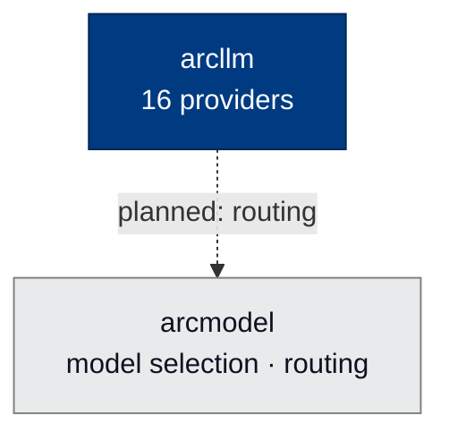

# 🧠 arcmodel

### **Model Management and Routing for Arc**
*Future home of multi-tenant model selection, capability discovery, and tiered routing.*

---

## ✨ What is arcmodel?

`arcmodel` is reserved as the home of cross-tenant model selection, capability discovery, and tiered routing logic — concerns that are currently embedded in `arcllm` configs but will eventually have their own surface.

> ⚠️ **Status: early scaffolding.** The package installs and exports `__version__` only. No public API yet.

---

## 🏗️ Where It Fits

Reserved to sit beside `arcllm`, lifting routing and model-selection concerns out of provider configs. The dotted edge is planned, not yet wired.

---

## 🔭 Future Scope

- **Capability-aware routing** — pick the right model for each call (tools / vision / long context)
- **Tier-aware fallback** — federal-only models for sensitive calls, open models for the rest
- **Cost-bounded selection** — automatically downgrade to a cheaper model when the running budget approaches a threshold
- **Multi-tenant model registries** — per-org model catalogs with ACLs
- **Capability discovery** — query providers for current model lineup, prices, context windows
- **Per-call eligibility** — "this call requires SOC2-certified hosting" → only matching models considered

---

## 🧪 Status

- **Status:** scaffolding only — no public API yet
- **License:** Apache 2.0 · Copyright © 2025-2026 BlackArc Systems
