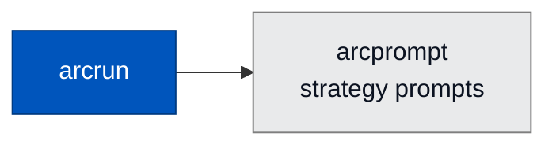

<div align="center">

# 💬 arcprompt

### **Strategy Prompt Provider for Arc**
*Serves model-facing guidance — system prompts and strategy context — to arcrun and arcagent.*

[](https://opensource.org/licenses/Apache-2.0)
[](#status)

</div>

---

## ✨ What is arcprompt?

`arcprompt` is the prompt provider for arcrun strategies. It serves the system prompts and strategy-specific guidance that the agent's loop hands to the model — so prompt content lives outside agent code, can be versioned independently, and can be swapped without recompiling.

> ⚠️ **Status: early scaffolding.** The package installs but exposes no stable public surface yet beyond what `arcrun` uses internally via `arcrun.prompts.get_strategy_prompts`.

---

## 🏗️ Where It Fits



A leaf-level utility. `arcrun` depends on it for `get_strategy_prompts`. No other Arc package currently consumes it.

---

## 🔭 Future Scope

- Versioned, signed prompt bundles
- Per-tenant prompt overrides
- Prompt eval harness integration
- A/B prompt rotation with audit
- Pluggable prompt sources (local file, vault, hub)

---

## 🧪 Status

```bash
uv run --no-sync pytest packages/arcprompt/tests
```

- **Status:** scaffolding only — no stable public API yet
- **License:** Apache 2.0 · Copyright © 2025-2026 BlackArc Systems
