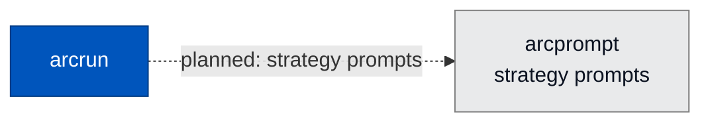

<div align="center">

# 💬 arcprompt

### **Strategy Prompt Provider for Arc**
*Reserved home for model-facing guidance — system prompts and strategy context — currently served by `arcrun.prompts`.*

[](https://opensource.org/licenses/Apache-2.0)
[](#status)

</div>

---

## ✨ What is arcprompt?

`arcprompt` is reserved as the future home of the strategy prompt provider — the system prompts and strategy-specific guidance the agent's loop hands to the model. The intent is for prompt content to live outside runtime code, versioned independently and swappable without recompiling. Today that logic lives in `arcrun.prompts` (`get_strategy_prompts`, built on `arcrun.strategies`); arcprompt is the reserved package it is slated to move into.

> ⚠️ **Status: early scaffolding.** The package installs and exports `__version__` only — no public API yet.

---

## 🏗️ Where It Fits

Reserved to sit beside `arcrun`, lifting strategy-prompt content out of runtime code. The dotted edge is planned, not yet wired — `arcrun.prompts` currently owns `get_strategy_prompts`.



A leaf-level utility. No Arc package currently depends on it.

---

## 🔭 Future Scope

- Versioned, signed prompt bundles
- Per-tenant prompt overrides
- Prompt eval harness integration
- A/B prompt rotation with audit
- Pluggable prompt sources (local file, vault, hub)

---

## 🧪 Status

```bash
uv run --no-sync pytest packages/arcprompt/tests
```

- **Status:** scaffolding only — no stable public API yet
- **License:** Apache 2.0 · Copyright © 2025-2026 BlackArc Systems
