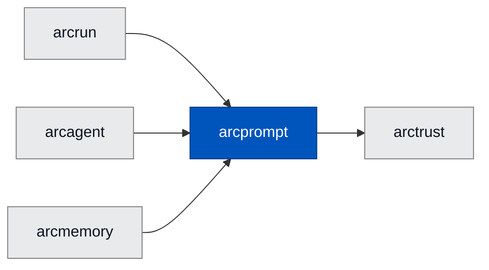

<div align="center">

# 💬 arcprompt

### **Editable, signed, inspectable system prompts for Arc**
*Every instruction Arc gives a model is a versioned, signed, inspectable artifact — readable in arcui, tunable per agent without a redeploy, attributable to exact bytes in the audit trail.*

[](https://opensource.org/licenses/Apache-2.0)
[](#status)

</div>

---

## ✨ What is arcprompt?

`arcprompt` owns prompt **storage and resolution** for every Arc package. Stock prompts ship as markdown under each owning package's `src/<pkg>/context/` directory; an agent may **override** any prompt with a signed markdown overlay in its config root. Resolution is two layers — overlay over stock, first-match-wins — snapshotted once per run so every turn of a run sees identical bytes.

It closes the last observability blind spot: traces, policy, config, skills, and memory are all inspectable, but the ~25 system prompts driving model behavior used to be triple-quoted string literals scattered across the codebase. Now they are files — enumerable, diffable, and provenance-audited.

---

## ⭐ Top Features

What makes `arcprompt` uniquely suited for auditable prompt management:

### **Signed Overlay System**
- **Ed25519 signature verification** — Every prompt overlay must be signed; unsigned or wrong-key overlays fail closed
- **Two-layer resolution** — Overlay prompts override stock prompts with first-match-wins semantics; snapshot at run start for consistency
- **No silent fallbacks** — Broken overlays raise errors; never silently replaced by stock prompts

### **Provenance & Audit**
- **Per-run prompt provenance events** — One audit event per run enumerates every prompt's source, hash, and signer DID
- **Version identity via sha256** — Content-derived hashes, not authored version fields; prevents version confusion attacks
- **Policy-gated writes** — `prompt:write` actions go through `arctrust.policy.PolicyPipeline`; deny-by-default enforcement

### **Prompt Discovery**
- **PromptCatalog** — Discovers every stock prompt across installed packages automatically
- **Frontmatter metadata** — `{name, description, tunable}` in YAML; self-documenting prompts
- **Package-relative loading** — `load_stock()` for packages to load their own shipped prompts

### **Overlay Management**
- **Two-layer resolution** — Overlay prompts override stock prompts with first-match-wins semantics
- **Snapshot at run start** — Every turn sees identical prompt bytes; no mid-run changes
- **Signature sidecars** — `<name>.md.arcsig` Ed25519 signature files; tamper evidence

---

## 🧩 Core API

```python
from arcprompt import (
    PromptCatalog,      # discover every stock prompt across installed packages
    PromptResolver,     # two-layer overlay-over-stock resolution, mandatory signature pinning
    PromptSnapshot,     # run-start freeze; one prompt-provenance audit event per run
    load_stock,         # a package loading its own shipped prompt body
    render_prompt,      # author a stock/overlay file (frontmatter + body + newline rule)
)
```

- **Stock file**: `packages/<pkg>/src/<pkg>/context/<name>.md` — markdown with YAML frontmatter `{name, description, tunable}`.
- **Overlay file**: `<agent_root>/context/<package>/<name>.md` — same schema, plus a detached `<name>.md.arcsig` Ed25519 signature sidecar.
- **Version identity**: a `sha256` digest derived from the raw file bytes — never an authored `version` field.
- **Fail-loud**: a present-but-broken overlay (unparseable, empty, unsigned, wrong-key) raises — it is **never** silently replaced by stock.

## 🔐 The Four Pillars

- **Sign** — every overlay is verified against a pinned Ed25519 key before its text enters any model context, at **every** tier, with no bypass flag. An unpinned key fails closed (an unpinned floor is no floor).
- **Authorize** — overlay writes route through `arctrust.policy.PolicyPipeline` as a `prompt:write` action.
- **Audit** — one provenance event per run enumerates each prompt's package, name, source, sha256, and the resolved overlay signer DID — resolved values only, never a default.
- **Identity** — the signer is resolved from the authenticated principal of the write request; no key is referenced at the call site.

---

## 🏗️ Where It Fits

A leaf package: it imports **only** `arctrust` and is imported by `arcrun`, `arcagent`, and `arcmemory`. `arcskill` houses its own prompts and loads them independently; arcprompt can still discover, view, and manage them.


```mermaid
flowchart LR
    classDef leaf fill:#0055BC,stroke:#003B82,color:#FFFFFF
    classDef consumer fill:#E9EAEB,stroke:#7F7F7F,color:#0B1220

    arcrun[arcrun]:::consumer --> arcprompt[arcprompt]:::leaf
    arcagent[arcagent]:::consumer --> arcprompt
    arcmemory[arcmemory]:::consumer --> arcprompt
    arcprompt --> arctrust[arctrust]:::consumer
```

---

## 🧪 Status

```bash
uv run pytest packages/arcprompt/tests
```

- **Status:** alpha — core storage/resolution/snapshot API stable
- **License:** Apache 2.0 · Copyright © 2025-2026 BlackArc Systems
