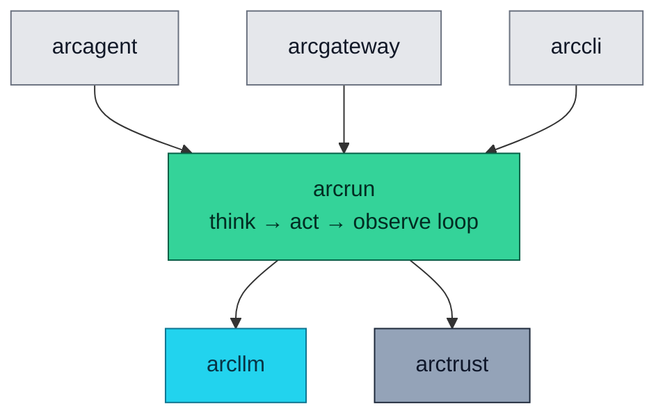

<div align="center">

# ⚙️ arcrun

### **The Loop That Runs an Agent**
*Async ReAct execution engine. Tool sandbox, streaming, parallel dispatch, hash-chained event log.*

[](https://opensource.org/licenses/Apache-2.0)
[](#status)
[](#status)
[](#status)
[](#)

</div>

---

## ✨ What is arcrun?

`arcrun` is the loop. You hand it a model, a set of tools, and a task — it runs the **think → act → observe** cycle until the task is done, the turn limit is reached, or something explicitly cancels it.

Everything else is built on top of this.

It's deliberately small. **No agent state.** No persistent identity. No skill discovery. No extension loading. Those concerns belong upstairs in `arcagent`. `arcrun` does one thing: drive a loop, safely.

> ⚡ **One async function call. Hash-chained event log. Sandboxed tools. Streamable. Cancelable. Steerable.**

---

## 🏗️ Where It Fits



Depends on `arcllm` and `arctrust`. Nothing else.

---

## 🚀 Install

```bash
pip install arcrun           # standalone (pulls in arcllm + arctrust)
# or
pip install arcmas           # full Arc stack
```

---

## 🧪 Quick Example

```python
from arcllm import load_model
from arcrun import run, Tool, ToolContext

async def read_file(params: dict, ctx: ToolContext) -> str:
    return open(params["path"]).read()

model = load_model("anthropic")
result = await run(
    model=model,
    tools=[Tool(
        name="read_file",
        description="Read a file from the workspace.",
        input_schema={
            "type": "object",
            "properties": {"path": {"type": "string"}},
            "required": ["path"],
        },
        execute=read_file,
    )],
    task="Read /workspace/report.txt and summarize it.",
    max_turns=10,
)

print(result.content)
print(f"{result.turns} turns, ${result.cost_usd:.4f}")
print(f"{len(result.events)} events emitted")
```

---

## 🎬 Run It Without Writing Code

`arccli` ships an `arc run` command for one-shot tasks with no agent directory:

```bash
arc run task "Calculate 2^32" --with-calc --model anthropic/claude-haiku-4-5-20251001
```

Or just call a tool directly:

```bash
arc run exec --tool calculator --params '{"expression": "2 ** 32"}'
```

---

## 🧩 What's Inside

### The Loop API

| Symbol | What It Does |
|---|---|
| `run(...)` / `run_async(...)` | Synchronous and async one-shot execution. Returns a `LoopResult` |
| `RunHandle` | Long-running execution with **steer**, **follow-up**, and **cancel** |
| `run_stream(...)` | Async generator yielding `StreamEvent`s for real-time UIs |
| `LoopResult` | `content`, `turns`, `tool_calls_made`, `tokens_used`, `cost_usd`, `strategy_used`, `events` |
| `make_spawn_tool(...)` | Factory for a sandboxed subprocess tool that spawns child arcrun loops (parallel dispatch) |

### Tool API

| Symbol | What It Does |
|---|---|
| `Tool` | Definition: `name`, `description`, `input_schema`, `execute(params, ctx)` |
| `ToolContext` | Per-call context: `run_id`, `caller_did`, `http` (egress proxy), workspace, audit sink |
| `ToolRegistry` | Deny-by-default registry; tools must be explicitly registered |

### Sandbox API

| Symbol | What It Does |
|---|---|
| `make_execute_tool(config)` | Factory for the built-in `execute_python` tool |
| `SandboxConfig` | Workspace path, env vars, timeout, output cap |
| `SandboxError`, `SandboxOOMError`, `SandboxRuntimeError`, `SandboxTimeoutError`, `SandboxUnavailableError` | Typed exception hierarchy |

### Event API

| Symbol | What It Does |
|---|---|
| `Event` | Structured event: `event_type`, `ts`, `run_id`, `data` |
| `EventBus` | Inline emission; observers get every event |
| `verify_chain(events)` | Verify a hash chain end-to-end. Returns `ChainVerificationResult` |
| `GENESIS_PREV_HASH` | The known starting hash for chain verification |

### Streaming Events

| Event | Fires When |
|---|---|
| `StreamEvent` | Base class |
| `TokenEvent` | Each streamed token from the model |
| `ToolStartEvent` | A tool call begins |
| `ToolEndEvent` | A tool call returns |
| `TurnEndEvent` | The model finishes a turn |

### Strategies

| Symbol | What It Does |
|---|---|
| `Strategy` | Pluggable execution style |
| `get_strategy_prompts(name)` | Return the system + user prompts for a strategy |

Built-in strategies: `react` (default — Reason + Act), `code` (code-first generation).

---

## 🛡️ Tool Sandbox: Deny-by-Default

Tools are not callable unless explicitly registered. JSON Schema parameter validation runs on **every call.**

The built-in `execute_python` tool runs code in a **stripped subprocess**:

| Defense | What |
|---|---|
| **Minimal environment** | Only `PATH=/usr/bin:/bin`, `HOME=/tmp`, `LANG=en_US.UTF-8`. Host env never inherited |
| **Process group isolation** | `start_new_session=True`, two-phase timeout (SIGTERM → 5s grace → SIGKILL) |
| **Fresh workspace** | Each execution gets a temp directory; destroyed afterward |
| **Output truncation** | stdout/stderr capped at 64 KB |
| **Workspace path validation** | Null byte guard, symlink traversal guard, `Path.relative_to()` boundary check |
| **Egress proxy** | Network access only via `ToolContext.http`, with per-tool origin allowlist |

---

## 🪵 Hash-Chained Event Log

Every tool call, LLM invocation, and turn boundary emits a structured event. Events are hash-chained — each one includes the hash of the previous one. **Tampering becomes detectable** with `verify_chain()`.

```python
from arcrun import verify_chain

result = await run(model=model, tools=tools, task="...")
verification = verify_chain(result.events)

if not verification.valid:
    print(f"Chain broken at index {verification.broken_at}")
    print(f"Reason: {verification.reason}")
```

This is the foundation that makes the agent loop **forensically auditable**.

---

## ⚡ Parallel Tool Dispatch

When the model returns multiple tool calls in one turn, `arcrun` can dispatch them in parallel — significantly cutting wall-clock time on independent calls. Each dispatch:

- Runs in its own subprocess (sandbox boundary)
- Gets its own `ToolContext` with per-call audit emission
- Joins back to the main loop with results in the original order

`make_spawn_tool` lets the agent itself spawn sub-loops as a tool — the foundation for delegated subagents.

---

## 🎮 Mid-Execution Steering

Long-running tasks support three intervention points:

| Mechanism | Effect |
|---|---|
| **Steer** | Inject a message mid-turn; remaining tool calls are skipped |
| **Follow-up** | Inject a message at end-of-turn; loop doesn't exit |
| **Cancel** | Cooperative cancellation via `asyncio.Event` |

```python
handle = await run_async(model=model, tools=tools, task="...")

# Mid-execution:
await handle.steer("Wait, focus on the 2024 data only.")

# Or cancel:
handle.cancel.set()

result = await handle.result
```

This is what makes Arc usable for human-in-the-loop workflows — the human can interject at any point without losing the run state.

---

## 🛡️ Security Properties

| Property | How |
|---|---|
| **Deny-by-default tools** | Tool registry is empty until you populate it; JSON Schema on every call |
| **Sandboxed subprocess** | Stripped env, process group, two-phase timeout, fresh workspace |
| **Workspace boundary** | All file paths route through `resolve_workspace_path()` |
| **Hash-chained events** | Every event includes the hash of the previous; `verify_chain()` detects tampering |
| **Non-optional event emission** | Inline. Cannot be disabled. Observer failures swallowed so a broken logger can't crash the loop |
| **Cooperative cancellation** | `asyncio.Event` lets external code interrupt a runaway loop without `kill -9` |
| **Output truncation** | 64 KB cap on subprocess output prevents disk exhaustion through audit |

---

## 📋 Compliance Mapping

| NIST 800-53 | What `arcrun` Provides |
|---|---|
| AC-3 | Tool registry deny-by-default |
| AU-2, AU-12 | Inline event emission on every action |
| AU-9 | Hash-chained event log; `verify_chain()` for tamper detection |
| CM-7 | Minimal subprocess environment |
| SC-28 | Ephemeral workspace per execution |
| SI-10 | JSON Schema parameter validation; null byte / symlink / boundary guards |

| OWASP Agentic | Mitigation |
|---|---|
| ASI02 (Tool Misuse) | Deny-by-default registry, parameter validation |
| ASI05 (RCE) | Sandboxed subprocess, restricted env, output cap, two-phase timeout |
| ASI06 (Memory/Context Poisoning) | Workspace boundary enforcement, path traversal guards |
| ASI08 (Cascading Failures) | Cooperative cancellation, two-phase timeout, output cap |

---

## 🧪 Status

```bash
uv run --no-sync pytest packages/arcrun/tests
```

- **Tests:** 513
- **Coverage:** spawn module 92%; overall high
- **Type check:** `mypy --strict` clean
- **Lint:** `ruff check` clean

---

## 📄 License

Apache 2.0 · Copyright © 2025-2026 BlackArc Systems.
