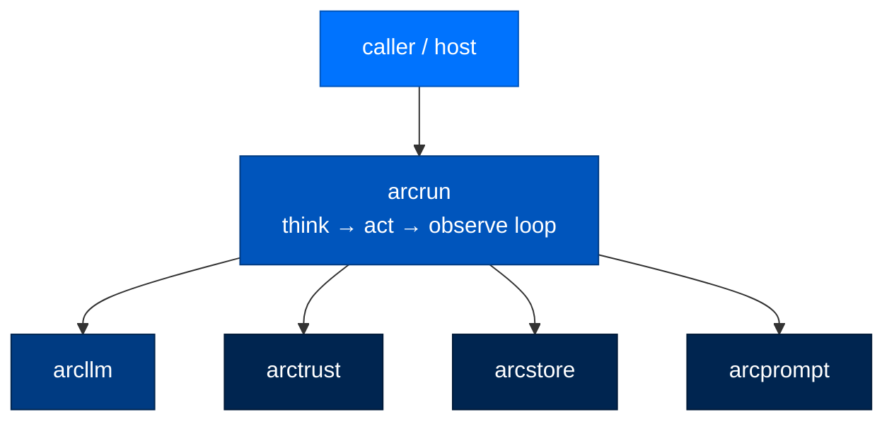

<div align="center">

# ⚙️ arcrun

### **The Loop That Runs an Agent**
*Async ReAct execution engine. Tool sandbox, streaming, parallel dispatch, hash-chained event log.*

[](https://opensource.org/licenses/Apache-2.0)
[](#status)
[](#status)
[](#status)
[](#)

</div>

---

## ✨ What is arcrun?

`arcrun` is the loop. You hand it a model, a set of tools, and a task — it runs the **think → act → observe** cycle until the task is done, the turn limit is reached, or something explicitly cancels it.

Everything else is built on top of this.

It's deliberately small. **No agent state.** No persistent identity. No skill discovery. No extension loading. Those concerns belong to its caller. `arcrun` does one thing: drive a loop, safely.

> ⚡ **One async function call. Hash-chained event log. Sandboxed tools. Streamable. Cancelable. Steerable.**

---

## 🏗️ Where It Fits


```mermaid
flowchart TB
    classDef entry fill:#D6E6FF,stroke:#0073FE,color:#002550
    classDef agent fill:#0073FE,stroke:#0055BC,color:#FFFFFF
    classDef runtime fill:#0055BC,stroke:#003B82,color:#FFFFFF
    classDef llm fill:#003B82,stroke:#002550,color:#FFFFFF
    classDef found fill:#002550,stroke:#001A38,color:#FFFFFF

    caller[caller / host]:::agent --> arcrun
    arcrun[arcrun<br/>think → act → observe loop]:::runtime --> arcllm[arcllm]:::llm
    arcrun --> arctrust[arctrust]:::found
    arcrun --> arcstore[arcstore]:::found
    arcrun --> arcprompt[arcprompt]:::found
```

Depends on `arcllm`, `arctrust`, `arcstore`, and `arcprompt`. Nothing else.

`arcrun` owns the **model-execution seam**: it re-exports the ArcLLM model facade
(`load_model`, `Model`, `Message`, `ToolCall`, …), so a caller reaches the model
through `import arcrun` and never has to `import arcllm` directly.

---

## 🚀 Install

```bash
pip install arcrun           # standalone (pulls in arcllm + arctrust + arcstore + arcprompt)
# or
pip install arcmas           # full Arc stack
```

---

## 🧪 Quick Example

`run(...)` takes a **model**, a **capability provider** (the tools), a **system prompt**,
and a **task**. `StaticProvider` adapts a fixed `list[Tool]` to the provider contract.

```python
from arcrun import run, StaticProvider, Tool, ToolContext, load_model

async def read_file(params: dict, ctx: ToolContext) -> str:
    return open(params["path"]).read()

model = load_model("anthropic")
result = await run(
    model,
    StaticProvider([Tool(
        name="read_file",
        description="Read a file from the workspace.",
        input_schema={
            "type": "object",
            "properties": {"path": {"type": "string"}},
            "required": ["path"],
        },
        execute=read_file,
    )]),
    "You are a careful file-reading assistant.",   # system_prompt
    "Read /workspace/report.txt and summarize it.",  # task
    max_turns=10,
)

print(result.content)
print(f"{result.turns} turns, ${result.cost_usd:.4f}")
print(f"used strategy '{result.strategy_used}', {len(result.events)} events emitted")
```

---

## 🎬 Run It Without Writing Code

`arccli` ships an `arc run` command for one-shot tasks with no agent directory:

```bash
arc run task "Calculate 2^32" --with-calc --model anthropic/claude-haiku-4-5-20251001
```

Or just call a tool directly:

```bash
arc run exec --tool calculator --params '{"expression": "2 ** 32"}'
```

---

## 🧩 What's Inside

### The Loop API

| Symbol | What It Does |
|---|---|
| `run(...)` | Blocking run to completion. `run(model, capabilities, system_prompt, task, *, max_turns=25, allowed_strategies=None, …)` → `LoopResult` |
| `run_async(...)` | Same arguments; returns a `RunHandle` immediately for steering a live run |
| `run_oneshot(model, *, user, ...)` | Single model call, no tool loop — the cheapest possible run |
| `run_stream(...)` | Async generator yielding `StreamEvent`s for real-time UIs; `collect()` folds them into a `RunResult` |
| `RunHandle` | Live run: `await steer(...)`, `await follow_up(...)`, `await cancel(...)`, `await result()` |
| `LoopResult` | `content`, `turns`, `tool_calls_made`, `tokens_used`, `cost_usd`, `strategy_used`, `events`, `completion_payload`, `completion_tool` |

> Child-loop spawning (`make_spawn_tool`) lives in **`arcagent`**, not arcrun — arcrun stays a pure loop and never owns sub-run orchestration.

### Capability / Tool API

| Symbol | What It Does |
|---|---|
| `CapabilityProvider` | Protocol the loop consumes: `advertise()`, `load()`, `invoke()`. Concrete providers (skills, trust layers) live in the host |
| `StaticProvider` | Adapts a fixed `list[Tool]` to the provider contract — the zero-config path |
| `provider_tools(provider, *, caller_did)` | Build the loop's internal registry tools from a provider |
| `Tool` | Definition: `name`, `description`, `input_schema`, `execute(params, ctx)`, `classification` (`read_only`/`state_modifying`), `signals_completion` |
| `ToolContext` | Per-call context: `run_id`, `caller_did`, `http` (egress proxy), workspace, audit sink |
| `ToolRegistry` | Deny-by-default registry; tools must be explicitly registered |

### Sandbox API

| Symbol | What It Does |
|---|---|
| `make_execute_tool(tier, relax, ...)` | Factory for the built-in `execute_python` tool. Resolves an isolation backend once at build time, tier-routed |
| `run_shell(command, *, tier, workspace, ...)` | Route a shell command through the tier-resolved backend; fails closed at federal with no VM |
| `resolve_execution_backend(tier, relax, platform_supports_vm)` | Pure router: `(tier, relax, platform fact)` → `"vm"` \| `"docker"` \| `"local"` (in `arcrun.builtins`) |
| `VmBackend` / `DockerBackend` / `LocalBackend` | Isolation backends in `arcrun.backends`; each honors the `ExecutorBackend` protocol |
| `SandboxConfig` | Workspace path, env vars, timeout, output cap |
| `SandboxError`, `SandboxOOMError`, `SandboxRuntimeError`, `SandboxTimeoutError`, `SandboxUnavailableError` | Typed exception hierarchy |
| `ExecutionIsolationError`, `IsolationUnavailableError`, `IsolationRelaxationError` | Tier-routing refusals — federal with no VM support, or a relax value below the tier floor |

### Event API

| Symbol | What It Does |
|---|---|
| `Event` | Structured event: `event_type`, `ts`, `run_id`, `data` |
| `EventBus` | Inline emission; observers get every event |
| `verify_chain(events)` | Verify a hash chain end-to-end. Returns `ChainVerificationResult` |
| `GENESIS_PREV_HASH` | The known starting hash for chain verification |
| `RunSeal`, `SealSigner`, `SealBroken` | Optional Ed25519 seal over a run's event chain (`arcrun.dynamic.seal`) |
| `LoopCheckpoint`, `to_checkpoint`, `apply_checkpoint` | Serializable per-turn checkpoint for resume (`resume_from=`); arcrun emits, the host persists |

### Streaming Events

| Event | Fires When |
|---|---|
| `StreamEvent` | Base class |
| `TokenEvent` | Streamed model text |
| `ToolStartEvent` | A tool call begins |
| `ToolEndEvent` | A tool call returns |
| `TurnEndEvent` | The model finishes a turn — always closes the stream |

### Strategies

| Symbol | What It Does |
|---|---|
| `Strategy` | ABC for a pluggable execution style. Required: `name`, `__call__`. Optional: `auto_selectable` (default `True`); `description` / `prompt_guidance` default to markdown (below) |
| `available_strategies()` | Read-only view of the registered strategies (triggers discovery on first use) |
| `get_strategy_prompts(*, allowed_strategies=None, tool_names=None, resolve=load_stock)` | Prompt fragments for the system prompt, keyed by section |
| `run_oneshot(model, *, user, ...)` | One bounded model call, no tools — the cheapest run |
| `run_structured(model, messages, *, tool, ...)` | One **forced tool call**; returns the tool arguments. Raises `StructuredCallError` if the model skips the tool |

Built-in strategies: `react` (Reason + Act; the fallback), `code` (code-first generation),
`dynamic` (model authors a restricted-Python orchestration script), `oneshot` (single
model call, no loop), `plan_execute` (runs a flat list of independent items concurrently).
When `allowed_strategies=None`, the model picks among the **auto-selectable** strategies per
run; passing a one-item list pins the run to that strategy with no selection call.

#### Writing a custom strategy

Strategies are **in-tree drop-in plugins**. Add a file under `arcrun/strategies/`
that defines a concrete `Strategy` subclass and it is discovered automatically —
registered by its `name`, with no central list to edit. Remove the file and it
is gone; a duplicate `name` is a hard error, never a silent shadow.

Two rules: the class must be **constructible with no arguments**, and its `name`
must be unique.

**Prompts are markdown, not Python.** `description` and `prompt_guidance` default
to loading `strategy_<name>_description.md` and `strategy_<name>.md` from
`arcrun/context/` (resolved through arcprompt, so operator overlays are honored).
Drop those two files beside the others and your copy ships — no inline strings.
A strategy with no markdown simply reports empty guidance; it still loads.

**What `__call__` receives, and how it calls arcllm.** The loop hands the
strategy the model, the run state, a sandbox, and a turn ceiling. The strategy
drives the model through `arcllm` — arcrun owns the call, so a strategy is the
one place a raw `model.invoke(...)` is correct.

```python
# arcrun/strategies/echo_once.py
from typing import Any

from arcrun.sandbox import Sandbox
from arcrun.state import RunState
from arcrun.strategies import Strategy
from arcrun.strategies.react import accumulate_usage, build_result
from arcrun.types import LoopResult


class EchoOnceStrategy(Strategy):
    @property
    def name(self) -> str:
        return "echo_once"                     # -> strategy_echo_once[_description].md

    async def __call__(
        self,
        model: Any,                            # the arcllm model handle
        state: RunState,                       # .messages, .registry, .event_bus,
        sandbox: Sandbox,                      #   .tool_choice, .max_tokens, .max_turns
        max_turns: int,
    ) -> LoopResult:
        tools = state.registry.list_schemas()  # advertise the run's tools to the model
        cap = {"max_tokens": state.max_tokens} if state.max_tokens is not None else {}

        # Generate through arcllm. Pass tools + tool_choice to force/allow calls;
        # the response carries .content, .tool_calls, .stop_reason, .usage.
        response = await model.invoke(state.messages, tools=tools, **cap)

        accumulate_usage(state, response)      # cost/tokens feed the budget breaker
        state.turn_count = 1
        state.event_bus.emit("turn.end", {"turn_number": 1})
        return build_result(state, (response.content or "").strip() or None)
```

Set `auto_selectable = False` (a property) when a strategy only makes sense when
a caller names it, so the selector never offers it for an arbitrary task.

For a bounded call **without** writing a loop, reuse the facades instead of
`model.invoke`: `run_oneshot` for one text answer, `run_structured` for one
forced tool call whose arguments you read back.

> **Trust:** the scan root is in-tree — it ships and is signed with the release
> wheel — so discovery adds no untrusted-load surface. An external, unsigned
> strategy is a separate, signature-verified path, not this drop-in scan.

---

## 🛡️ Tool Sandbox: Deny-by-Default

Tools are not callable unless explicitly registered. JSON Schema parameter validation runs on **every call.**

The built-in `execute_python` tool is **tier-routed**: the deployment tier picks the isolation floor, and `resolve_execution_backend()` maps it to a concrete backend:

| Tier | Backend | Isolation |
|---|---|---|
| `federal` | `VmBackend` (Firecracker microVM, jailer + seccomp-L2) | `vm` — own guest kernel behind a KVM boundary. Refuses (`IsolationUnavailableError`) if `/dev/kvm` isn't available; never downgrades |
| `enterprise` | `DockerBackend` | `container` — cannot be relaxed below this floor |
| `personal` (default) | `DockerBackend` | `container` |
| `personal` (`relax_isolation = "off"` / `"none"` / `"local"`) | `LocalBackend` | `none` — full host access, on the operator's own machine, explicit opt-in only |

Every backend selection — and every tier-permitted downgrade — emits an audit event (`code_exec.backend.selected`, `code_exec.isolation.downgraded`) before the first line of agent code runs.

`LocalBackend` (used at `isolation="none"`, and as the container backend's underlying process model) still runs code in a **stripped subprocess**:

| Defense | What |
|---|---|
| **Minimal environment** | Only `PATH=/usr/bin:/bin`, `HOME=/tmp`, `LANG=en_US.UTF-8`. Host env never inherited |
| **Process group isolation** | `start_new_session=True`, two-phase timeout (SIGTERM → 5s grace → SIGKILL) |
| **Fresh workspace** | Each execution gets a temp directory; destroyed afterward |
| **Output truncation** | stdout/stderr capped at 64 KB |
| **Workspace path validation** | Null byte guard, symlink traversal guard, `Path.relative_to()` boundary check |
| **Egress proxy** | Network access only via `ToolContext.http`, with per-tool origin allowlist |

---

## 🪵 Hash-Chained Event Log

Every tool call, LLM invocation, and turn boundary emits a structured event. Events are hash-chained — each one includes the hash of the previous one. **Tampering becomes detectable** with `verify_chain()`.

```python
from arcrun import verify_chain

result = await run(model=model, tools=tools, task="...")
verification = verify_chain(result.events)

if not verification.valid:
    print(f"Chain broken at index {verification.broken_at}")
    print(f"Reason: {verification.reason}")
```

This is the foundation that makes the agent loop **forensically auditable**.

---

## ⚡ Parallel Tool Dispatch

When the model returns multiple tool calls in one turn, `arcrun` can dispatch them in parallel — significantly cutting wall-clock time on independent calls. `BatchClassifier` reads each call's `Tool.classification` (`read_only` vs `state_modifying`) — the sole signal that decides the batch: a read-only batch runs concurrently through `dispatch_ready` (`asyncio.gather`, semaphore-bounded by `max_parallel`); anything state-modifying or unclassified runs sequential, fail-closed. Each dispatch:

- Runs concurrently within the loop's event group (no shared mutable state between reads)
- Gets its own `ToolContext` with per-call audit emission
- Joins back to the main loop with results in the original submission order

Child-loop spawning — an agent spawning sub-loops as a tool, the foundation for delegated subagents — is not part of arcrun; it lives in `arcagent`, which owns sub-run orchestration.

---

## 🎮 Mid-Execution Steering

Long-running tasks support three intervention points:

| Mechanism | Effect |
|---|---|
| **Steer** | `await handle.steer(caller_did, msg)` — inject a message mid-turn; remaining tool calls are skipped |
| **Follow-up** | `await handle.follow_up(caller_did, msg)` — inject a message at end-of-turn; loop doesn't exit |
| **Cancel** | `await handle.cancel(caller_did, reason=None)` — cooperative cancellation |

Every intervention carries a `caller_did` — the identity of whoever is steering — so the interjection is itself an audited, attributable event.

```python
handle = await run_async(
    model, capabilities, "You are a data analyst.", "Summarize every quarter.",
)

# Mid-execution:
await handle.steer(operator_did, "Wait, focus on the 2024 data only.")

# Or cancel:
await handle.cancel(operator_did, reason="scope changed")

result = await handle.result()
```

This is what makes Arc usable for human-in-the-loop workflows — the human can interject at any point without losing the run state.

---

## 🛡️ Security Properties

| Property | How |
|---|---|
| **Deny-by-default tools** | Tool registry is empty until you populate it; JSON Schema on every call |
| **Tier-routed isolation** | Federal → hardware VM (Firecracker), enterprise/personal → container; fail-closed when the required isolation is unavailable |
| **Sandboxed subprocess** | Stripped env, process group, two-phase timeout, fresh workspace |
| **Workspace boundary** | All file paths route through `resolve_workspace_path()` |
| **Hash-chained events** | Every event includes the hash of the previous; `verify_chain()` detects tampering |
| **Non-optional event emission** | Inline. Cannot be disabled. Observer failures swallowed so a broken logger can't crash the loop |
| **Cooperative cancellation** | `asyncio.Event` lets external code interrupt a runaway loop without `kill -9` |
| **Output truncation** | 64 KB cap on subprocess output prevents disk exhaustion through audit |

---

## 📋 Compliance Mapping

| NIST 800-53 | What `arcrun` Provides |
|---|---|
| AC-3 | Tool registry deny-by-default |
| AU-2, AU-12 | Inline event emission on every action |
| AU-9 | Hash-chained event log; `verify_chain()` for tamper detection |
| CM-7 | Minimal subprocess environment |
| SC-28 | Ephemeral workspace per execution |
| SC-39(1) | Hardware-enforced isolation boundary (Firecracker microVM) at federal tier |
| SI-10 | JSON Schema parameter validation; null byte / symlink / boundary guards |

| OWASP Agentic | Mitigation |
|---|---|
| ASI02 (Tool Misuse) | Deny-by-default registry, parameter validation |
| ASI05 (RCE) | Tier-routed isolation — hardware VM at federal, container at enterprise/personal, fail-closed on unavailable isolation; sandboxed subprocess, restricted env, output cap, two-phase timeout |
| ASI06 (Memory/Context Poisoning) | Workspace boundary enforcement, path traversal guards |
| ASI08 (Cascading Failures) | Cooperative cancellation, two-phase timeout, output cap |

---

## 🧪 Status

```bash
uv run --no-sync pytest packages/arcrun/tests
```

- **Tests:** 780+
- **Coverage:** spawn module 92%; overall high
- **Type check:** `mypy --strict` clean
- **Lint:** `ruff check` clean

---

## 📄 License

Apache 2.0 · Copyright © 2025-2026 BlackArc Systems.
