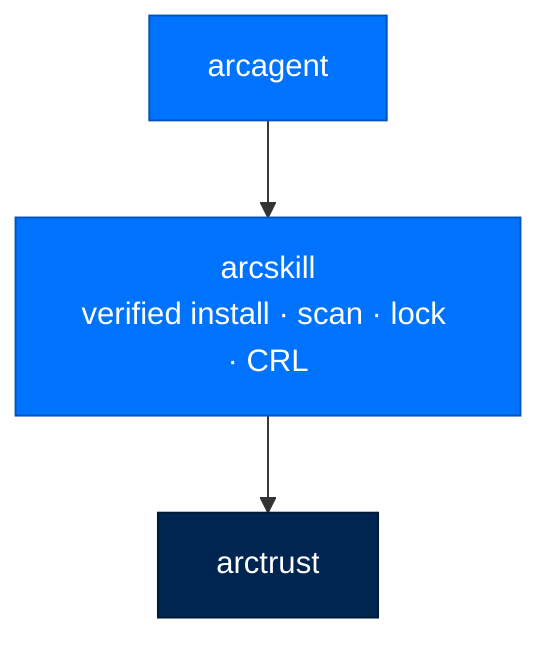
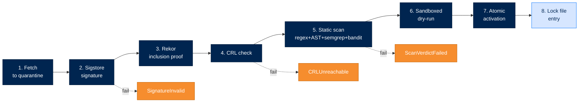

<div align="center">

# 🔧 arcskill

### **Verified Skill Hub for Arc**
*Sigstore + Rekor signature verification. Static scan. Sandboxed dry-run. Atomic activation. Revocation list.*

[](https://opensource.org/licenses/Apache-2.0)
[](#status)
[](#status)
[](#status)
[](#-the-install-pipeline)

</div>

---

## ✨ What is arcskill?

`arcskill` is the supply-chain-secure way to install skills into an Arc agent. It's the difference between *"download a markdown file from somewhere and trust it"* and *"verify the signature, check the revocation list, scan the code, dry-run it in a sandbox, then atomically activate."*

Skills can be three things:

- 📝 **Context for the LLM** — markdown instructions loaded into the model's prompt
- ⚙️ **Inline commands for arcrun** — small procedures the loop can invoke
- 🧩 **Persistent capabilities for arcagent** — discovered at startup, cached, hot-reloadable

`arcskill` manages the lifecycle for all three targets: validate → fetch → verify → scan → sandbox → activate → lock.

> 🛡️ **No skill activates without passing every gate. CRL-checked at boot. Tamper-evident lock file.**

---

## 🏗️ Where It Fits



Depends only on `arctrust` (audit + signing) — otherwise a leaf. `arcagent` drives `arcskill` for skill discovery and loading.

---

## 🚀 Install

```bash
pip install arcskill
# or
pip install arcmas           # full Arc stack
```

Enable in `arcagent.toml`:

```toml
[skills.hub]
enabled = true                # default: false (hub is inert)
```

The hub is **inert by default** — opt-in only. Without `enabled = true`, no install pipeline runs.

---

## 🧪 Quick Example

```python
from arcskill.hub import install, HubConfig

# Reads [skills.hub] section from arcagent.toml
config = HubConfig()

# Install a skill from a hub URL
await install(
    "data-analysis-skill",
    source_url="https://hub.example.com/skills/data-analysis",
    config=config,
)
# Pipeline:
#   1. Fetch to quarantine directory
#   2. Verify Sigstore signature against issuer pubkey
#   3. Verify Rekor inclusion proof
#   4. Check Certificate Revocation List
#   5. Static scan (regex + AST + optional semgrep + bandit)
#   6. Sandboxed dry-run (Firecracker microVM or Docker)
#   7. Atomic activation (rename into place)
#   8. Append to lock file with content hash + Rekor UUID + SLSA level
```

---

## 🔐 The Install Pipeline

Each skill goes through 8 gates. Any failure stops the install — no partial state.



| Gate | Defends Against |
|---|---|
| **1. Fetch to quarantine** | Partial-write attacks; nothing visible to the agent until activation |
| **2. Sigstore signature** | Unsigned skills, untrusted issuers |
| **3. Rekor inclusion proof** | Privately-signed skills not in the public transparency log |
| **4. CRL check** | Skills whose signing certs have been revoked since publication |
| **5. Static scan** | Known-bad patterns, suspicious AST nodes, semgrep/bandit findings |
| **6. Sandboxed dry-run** | Behavior the static scan can't see — runtime fingerprinting, network calls |
| **7. Atomic activation** | Half-activated skills (rename is atomic on POSIX) |
| **8. Lock file entry** | Forgetting what's installed; provides full audit trail of every active skill |

CRL is **also checked on boot** — `check_revocation_on_boot()` quarantines any locked skill whose cert was revoked since the last boot.

### Re-verified at load, not just at install

Install-time and load-time are different trust boundaries — a signed bundle can be tampered with on disk in between. `verify_artifact_at_load()` (`hub/verify.py`) recomputes the content hash from the bytes on disk right now and re-runs the same `verify_bundle` core the installer used, so a post-install byte change fails the load check. Same precedent as Linux kernel-module signing and `jarsigner`: signature checked once at install is not enough.

---

## 🧱 Public API

```python
from arcskill.hub import (
    # Lifecycle
    install,
    uninstall,
    quarantine_skill,
    check_revocation_on_boot,

    # Scan
    scan,
    ScanResult,

    # Config
    HubConfig,
    HubPolicy,
    TierPolicy,
    SkillSource,

    # Errors
    HubDisabled,
    SourceNotAllowed,
    SignatureInvalid,
    CRLUnreachable,
    SandboxRequired,
    ScanVerdictFailed,
    HubLockFileCorrupted,
)

from arcskill.lock import HubLockFile
```

### Errors at a Glance

| Exception | Means |
|---|---|
| `HubDisabled` | `[skills.hub].enabled = false` |
| `SourceNotAllowed` | URL not in the allowed-sources list for this tier |
| `SignatureInvalid` | Sigstore verification failed |
| `CRLUnreachable` | CRL fetch failed and tier requires it |
| `SandboxRequired` | Sandboxed dry-run enabled but sandbox unavailable |
| `ScanVerdictFailed` | Static scanner returned a blocking verdict |
| `HubLockFileCorrupted` | Lock file structurally invalid; manual recovery required |

---

## 🔒 The Lock File

`arcskill` keeps a single source of truth for everything installed: `~/.arcagent/skills.lock` (or per-agent `workspace/.skills.lock`).

```json
{
  "version": 1,
  "skills": {
    "data-analysis": {
      "version": "1.2.0",
      "content_hash": "sha256:a3f2c1...",
      "rekor_uuid": "24296fb24b8ad77a...",
      "slsa_level": 3,
      "signing_cert_fingerprint": "sha256:...",
      "scan_verdict": "pass",
      "installed_at": "2026-04-28T14:30:00Z",
      "install_path": "/home/user/.arcagent/skills/data-analysis"
    }
  }
}
```

Lock file writes are atomic (tmp+rename). Corruption is detectable — `HubLockFileCorrupted` is raised on load, manual recovery required.

This file is what answers "what skills did this agent have, on what date, signed by whom" for compliance reviews.

---

## 📟 CLI Commands

```bash
# Discover
arc skill list                                    # all skills (global + workspace)
arc skill list --agent my-agent                   # include agent workspace
arc skill search "data analysis"                  # by name or description
arc skill search "report" --agent my-agent

# Create
arc skill create data-analysis                    # scaffold to current dir
arc skill create data-analysis --dir my-agent/workspace/skills
arc skill create shared-skill --global            # to ~/.arcagent/skills/

# Validate
arc skill validate ./my-skill.md                  # checks frontmatter + structure
```

For programmatic install through the verified pipeline, use the Python API (`install()`).

---

## 🛡️ Tier-Based Policy

Skill install behavior is gated by deployment tier. The hub config maps each tier to its constraints.

| Tier | Sigstore | Rekor | CRL Required | Sandbox Dry-Run | Allowed Sources |
|---|---|---|---|---|---|
| **Personal** | optional (warn on self-signed) | optional | best-effort | optional | any |
| **Enterprise** | required | required | required | required | configured allowlist |
| **Federal** | required (FIPS) | required | required (hard fail if unreachable) | required | signed allowlist only |

Federal tier additionally requires:
- Signing certs chained to a configured root
- SLSA level ≥ 3
- Scan verdict must be `pass` (no `warn` skills allowed)

---

## 📋 Compliance Mapping

| NIST 800-53 | What `arcskill` Provides |
|---|---|
| CM-5 | Tier-based access restrictions on skill install |
| CM-7 | Skills are opt-in; hub is inert by default |
| CM-8 | Lock file is the canonical inventory of installed skills |
| SI-7 | Sigstore + Rekor verification of every skill |
| SI-7(15) | Federal tier requires signed-allowlist installs only |
| AU-2, AU-12 | Every install/uninstall/quarantine emits arctrust audit events |
| AC-3 | Source allowlist enforced before fetch |

| OWASP LLM (2025) | Mitigation |
|---|---|
| LLM03 (Supply Chain) | Sigstore + Rekor + CRL + scan + dry-run + atomic activation |
| LLM04 (Data Poisoning) | Content hash in lock file detects post-install tampering |

| OWASP Agentic | Mitigation |
|---|---|
| ASI04 (Agentic Supply Chain) | The full 8-gate pipeline is the answer to ASI04 — verified install with attestation |
| ASI06 (Memory/Context Poisoning) | Atomic activation prevents partial state; lock file is tamper-evident |

---

## 🧪 Status

**Wave-2 (current):**

- ✅ Validate, signed install, scan, partial version-control via lock, CRL lifecycle
- ✅ Sigstore + Rekor verification
- ✅ Sandboxed dry-run

**Wave-3 (deferred):**

- ⏳ GEPA skill-improvement loop (currently in arcagent — relocating)
- ⏳ Eval harness for automated skill quality scoring
- ⏳ Three-target skill loaders exposed as public API
- ⏳ `arc skill upgrade` workflow
- ⏳ Full version control beyond lock file (semver history, rollback)

```bash
uv run --no-sync pytest packages/arcskill/tests
```

- **Tests:** 342 (5 skipped)
- **Coverage:** 86%
- **Type check:** `mypy --strict` clean
- **Lint:** `ruff check` clean

---

## 📄 License

Apache 2.0 · Copyright © 2025-2026 BlackArc Systems.
