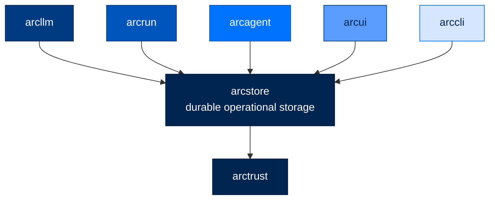

# 🗄️ arcstore

### **The Durable Storage Foundation for Arc**
*Operational, always-on persistence other layers read and write through.*

---

## ✨ What is arcstore?

`arcstore` is the operational, durable storage foundation of the Arc stack. It is the
always-on data plane the rest of Arc reads and writes through — `arcllm`, `arcrun`,
`arcagent`, and the UIs all persist and query their operational records here.

`arcstore` depends only on `arctrust`. It imports nothing else from Arc, sitting just
above the cryptographic floor so that every layer above it has a single, consistent
place to durably record and retrieve what happened.

---

## 🏗️ Where It Fits

`arcstore` depends only on `arctrust`; every operational layer above it reads and
writes through `arcstore`.

---

## 🗂️ The Mutable Directory Plane

Alongside the insert-once operational tables (spool, WORM ingest), arcstore has a
**mutable directory plane** — a `mutable_records(collection, key, value, updated_at,
PK(collection, key))` table with row-level update. It exists for records that change
over their lifetime rather than being appended once. Backend methods:

| Method | Purpose |
|---|---|
| `mutable_write` | Upsert a row (`collection`, `key`, `value`) |
| `mutable_read` | Read one row by key |
| `mutable_query` | List rows in a collection, optionally filtered by a `where` dict |
| `mutable_merge` | Server-side partial patch — merges disjoint fields atomically (no read-modify-write clobber) |
| `mutable_delete` | Hard-delete a row |
| `update_if` | **Atomic conditional write** — `UPDATE … WHERE <condition>`; the compare-and-swap primitive the whole task system's single-owner claim is built on |

Every `mutable_*` write emits an AU-2/AU-3 audit event, fail-open (AU-5) so a sink
outage can't block a durable write.

---

## ✅ The `tasks` Directory (`arcstore.tasks`)

The first consumer of the mutable plane is the **`tasks` collection** — the durable
backing for SPEC-056 Mission Control. `arcstore` owns the `Task` model and `TaskStore`;
the arcagent `tasks` module and arcui are thin surfaces over it, so a task created by an
agent tool, the CLI (`arc task`), or the arcui kanban is the same row visible to all
three.

### The `Task` model

A frozen Pydantic model — mutation always goes through `TaskStore` (read the durable row,
write a new one); nothing holds a live `Task` and edits it in place.

| Field | Meaning |
|---|---|
| `id`, `title`, `description` | Identity + free text (NFKC + injection-sanitized on construction) |
| `status` | `backlog` → `todo` → `in_progress` → `review` → `done` / `failed` |
| `priority` | `low` / `medium` / `high` / `critical` (claim order, critical first) |
| `owner_did`, `creator_did` | Single owner (nullable = unowned/backlog) + immutable creator |
| `parent_id`, `blocked_by` | Decomposition parent link + dependency DAG edges |
| `run_id` | The dispatched run's id, stamped in the same atomic write that starts the task — arcui joins it to the run's spooled events |
| `started_at`, `completed_at`, `duration_seconds` | Lifecycle timing — the board's DONE-TODAY / AVG-TIME metrics read these durable fields |
| `attempts`, `max_attempts`, `last_error`, `next_attempt_at` | Retry engine state (attempt count, ceiling, last failure, backoff gate) |
| `timeout_seconds`, `cancel_requested` | Per-task wall-clock cap + operator stop signal |
| `requires_review` | Opt-in human gate — a completed task lands in `review`, not `done` |
| `output`, `resolution` | Structured result + short terminal note |
| `classification` | No-write-down bound carried onto downstream notifications (default `UNCLASSIFIED`) |
| `created_at`, `updated_at` | Set by the store on write |

### `TaskStore`

`TaskStore` is a directory over the `tasks` collection. Its transitions are deterministic
and race-safe — every state change that two actors could contend (claim, assign, start,
requeue, dead-letter, review approve/reject, route) is a status-conditional `update_if`, so
exactly one writer wins and the loser no-ops rather than clobbering.

| Method | Transition |
|---|---|
| `create` | New task; unowned → `backlog`, owned → `todo` (unless status given explicitly) |
| `claim_next` | Self-claim the highest-priority ready unowned task (deps-met), respecting the one-`in_progress` cap |
| `start_task` | `todo`/`backlog` → `in_progress`; stamps `run_id`, `started_at`, increments `attempts` |
| `finish` | Owner completes: → `done`/`failed`, stamps `completed_at` + `duration_seconds` |
| `requeue` | Failed attempt below the ceiling → `todo` gated by `next_attempt_at` backoff |
| `dead_letter` | Retries exhausted / cancelled → terminal `failed` |
| `request_cancel` | Flag an `in_progress` task for operator cancellation |
| `assign` | Hand an at-rest task to another owner (→ `todo`); refuses `in_progress` |
| `route` | Assign an **unowned** task to a chosen agent (auto-routing) |
| `approve_review` / `reject_review` | Operator resolves a `review` task → `done` / back to `todo` |
| `decompose` support (`children`, `deps_met`, `deps_would_cycle`) | Subtask reconcile + acyclic dependency enforcement |

`MutableTaskBackend` is the narrow Protocol `TaskStore` depends on — not a concrete backend.

---

## 📄 License

Apache 2.0 · Copyright © 2025-2026 BlackArc Systems.
