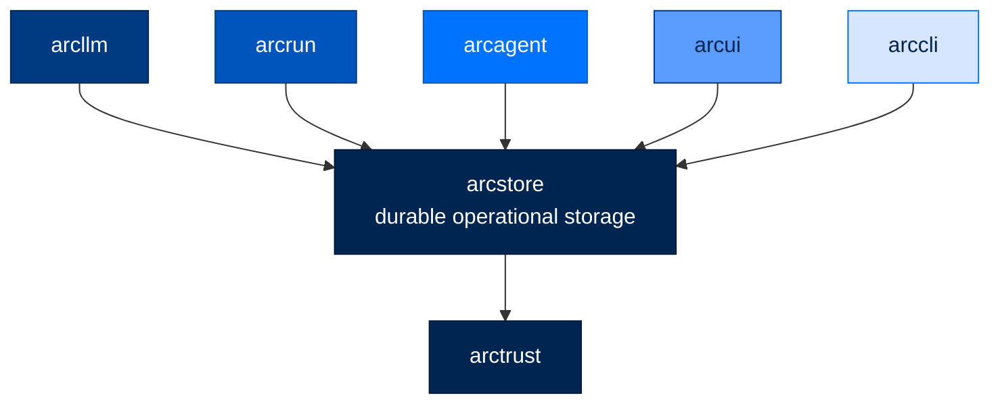

# 🗄️ arcstore

### **The Durable Storage Foundation for Arc**
*Operational, always-on persistence other layers read and write through.*

---

## ✨ What is arcstore?

`arcstore` is the operational, durable storage foundation of the Arc stack. It is the
always-on data plane the rest of Arc reads and writes through — `arcllm`, `arcrun`,
`arcagent`, and the UIs all persist and query their operational records here.

`arcstore` depends only on `arctrust`. It imports nothing else from Arc, sitting just
above the cryptographic floor so that every layer above it has a single, consistent
place to durably record and retrieve what happened.

---

## 🏗️ Where It Fits

`arcstore` depends only on `arctrust`; every operational layer above it reads and
writes through `arcstore`.

---

## 📄 License

Apache 2.0 · Copyright © 2025-2026 BlackArc Systems.
