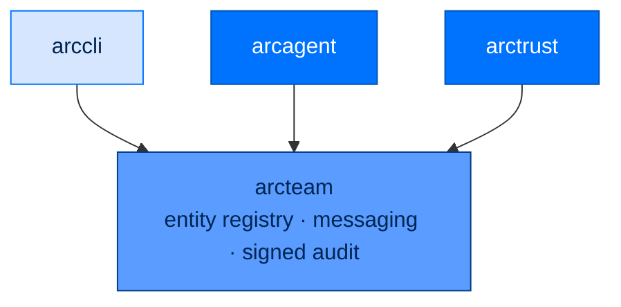

<div align="center">

# 🤝 arcteam

### **Multi-Agent Coordination for Arc**
*Entity registry. Channels and DMs. Operator-signed audit chain. Pluggable storage backends.*

[](https://opensource.org/licenses/Apache-2.0)
[](#status)
[](#status)
[](#%EF%B8%8F-security-architecture)

</div>

---

## ✨ What is arcteam?

`arcteam` is how multiple Arc agents talk to each other — and to humans — without re-inventing message routing, identity tracking, or audit logging for every project.

Think of it as a tiny Slack-for-agents:

- 👥 **Entity registry** — every agent and human gets registered with a type, role, and ID
- 📬 **Channels and DMs** — broadcast or direct messages, with priorities and message types
- 🪵 **Operator-signed audit chain** — every operation tamper-evident and non-repudiable
- 💾 **Pluggable storage** — file-backed for production, in-memory for tests
- 🧠 **Team memory** — per-entity memory index with dirty tracking

> 🛡️ **Every message audited. Asymmetrically signed chain. Per-entity DIDs. No shared credentials.**

---

## 🏗️ Where It Fits



Depends on `arctrust` for the signing primitive and audit event schema — the audit chain is signed with the OPERATOR's key (the audit authority, resolved via `arctrust`/`arccli`'s operator-key custody), never a team member's own DID, so no agent can forge its own trail (SPEC-053). `arccli` and `arcagent` consume `arcteam`.

---

## 🚀 Install

```bash
pip install arcteam            # standalone
# or
pip install arcmas             # full Arc stack
```

---

## 🧪 Quick Example

```python
from arcteam import MessagingService, EntityRegistry
from arcteam.backends.nats import NatsBackend
from arcteam.audit import AuditLogger
from arcteam.types import Entity, EntityType

# Set up (production substrate: NATS JetStream)
backend = await NatsBackend.connect("nats://127.0.0.1:4222")
audit = AuditLogger(backend, resolve_operator_signer())  # arccli.commands.operator
await audit.initialize()
registry = EntityRegistry(backend, audit)
svc = MessagingService(backend, registry, audit)

# Register two agents
await registry.register(Entity(
    id="analyst-1",
    name="Senior Analyst",
    type=EntityType("agent"),
    roles=["lead", "reviewer"],
))
await registry.register(Entity(
    id="executor-1",
    name="Task Executor",
    type=EntityType("agent"),
    roles=["worker"],
))

# Send a structured message
await svc.send(
    sender="analyst-1",
    to=["executor-1"],
    body="Analyze the CSVs in workspace/data/ and report trends.",
    msg_type="task",
    priority="high",
)
```

---

## 🎬 Set It Up From the CLI

```bash
# Initialize team data dir + bootstrap the operator audit-signing key (idempotent)
arc team init
arc team init --root /var/arc/team        # specify path

# Register an entity
arc team register agent-1 --name "Analyst" --type agent
arc team register lead-1  --name "Lead"    --type agent --roles lead,reviewer
arc team register alice   --name "Alice"   --type user

# Inspect
arc team status                           # entity count, channels, messages, audit entries
arc team config --json
arc team entities                         # list all entities
arc team entities --role lead             # filter by role
arc team channels                         # list channels
arc team memory-status                    # team memory index status
```

---

## 🧱 Public API

```python
from arcteam import (
    EntityRegistry,            # register, lookup, list entities
    MessagingService,          # send, receive, ack messages
    TeamConfig,                # Pydantic config

    TeamFileStore,             # file-backed workspace

    TeamMemoryService,         # entity memory index
    TeamMemoryConfig,
)

from arcteam.audit import AuditLogger
from arcteam.storage import StorageBackend, MemoryBackend
from arcteam.backends.nats import NatsBackend
from arcteam.types import (
    Entity, EntityType,
    Channel,
    Message, MsgType, Priority,
    Cursor,
    AuditRecord,
)
```

### Message Types and Priorities

| `MsgType` | Use For |
|---|---|
| `info` | General information |
| `task` | Work assignment |
| `result` | Result from an executed task |
| `alert` | Time-sensitive notification |
| `ack` | Acknowledgement |
| `broadcast` | One-to-many message |

| `Priority` | Use For |
|---|---|
| `low` | Background, can wait |
| `normal` | Default |
| `high` | Time-sensitive |
| `critical` | Stop-the-world |

---

## 🛡️ Security Architecture

### Operator-Signed Audit Chain

Every team operation appends to a signed audit stream. Each record is signed with an `arctrust` `Signer` (Ed25519, or ECDSA-P256 at federal/FIPS) over `prev_signature || canonical(record)` — chaining each record to the one before it, so flipping a single byte anywhere downstream breaks every signature after it.

The signer is the **operator's** audit-authority key, never a team member's own agent DID (SPEC-053) — this is what makes the chain non-repudiable: verification only requires the operator's *public* key, so a party that can verify the chain can never have forged it. A compromised or malicious agent cannot rewrite its own audit history.

`arc team init` bootstraps the operator key (idempotent — an existing key is loaded, never regenerated) under `~/.arc/operator/`, keeping it separate from any agent's own identity material.

### Per-Entity Identity

Entities (agents and humans) each have:

- **Unique ID** — used in all messages
- **Type** — `agent` or `user`
- **Roles** — comma-separated, used for routing and policy
- **DID** — for agents, ties back to the agent's cryptographic identity

**No shared credentials. No privilege inheritance.** A new role isn't automatic — it's an audited registration change.

### `TeamFileStore` Path Containment

`TeamFileStore` (shared-file workspace, e.g. `arcteam.files`) validates every resolved path
against the team root before a read or write — `path.resolve().is_relative_to(root.resolve())`
— so an entity ID or filename containing `..`, an absolute path, or a symlink escape can't
write or read outside the shared directory.

### Pluggable Storage

| Backend | Use For |
|---|---|
| `NatsBackend` | Production. NATS JetStream: durable streams, KV records, durable consumers |
| `MemoryBackend` | Tests, ephemeral coordination |

The `StorageBackend` Protocol is small enough to roll your own — point at SQLite, Redis, NATS JetStream, or whatever else fits your environment.

---

## 📋 Compliance Mapping

| NIST 800-53 | What `arcteam` Provides |
|---|---|
| AC-3 | Role-based message routing |
| AC-6 | Roles are explicit, audited registrations |
| AU-2, AU-12 | Every operation audited |
| AU-9, AU-10 | Operator-signed, chained audit trail; tampering detectable; non-repudiable (signer holds no verification secret an attacker could reuse to forge) |
| IA-3 | Per-entity ID + DID for agents |

| OWASP Agentic | Mitigation |
|---|---|
| ASI03 (Identity Abuse) | Per-entity ID; agent entities tied to DIDs; role changes audited |
| ASI07 (Insecure Inter-Agent Comms) | Operator-signed audit chain agents cannot forge; agents can sign messages with arctrust before sending |
| ASI08 (Cascading Failures) | Pluggable storage backends decouple message bus from delivery |
| ASI10 (Rogue Agents) | Audit trail surfaces unusual sender/receiver patterns; entity revocation supported |

---

## 🧪 Status

```bash
uv run --no-sync pytest packages/arcteam/tests
```

- **Tests:** 364+
- **Type check:** `mypy --strict` clean
- **Lint:** `ruff check` clean

---

## 📄 License

Apache 2.0 · Copyright © 2025-2026 BlackArc Systems.
