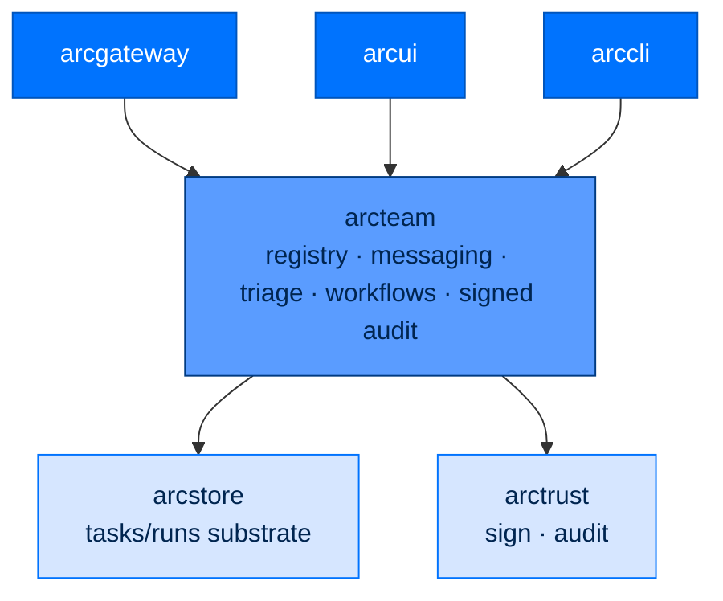

<div align="center">

# 🤝 arcteam

### **Multi-Agent Coordination for Arc**
*Entity registry. Channels and DMs. Relevance-triaged answers. Signed ArcFlow workflows. Operator-signed audit chain.*

[](https://opensource.org/licenses/Apache-2.0)
[](#status)
[](#status)
[](#%EF%B8%8F-security-architecture)

</div>

---

## ✨ What is arcteam?

`arcteam` is how multiple Arc agents talk to each other — and to humans — without re-inventing message routing, identity tracking, or audit logging for every project.

Think of it as a tiny Slack-for-agents:

- 👥 **Entity registry** — every agent and human gets registered with a type, role, and ID
- 📬 **Channels and DMs** — broadcast or direct messages, with priorities, message types, and `@mentions`
- 🎯 **Relevance-triaged answers** — a channel question is ranked to the agent that actually holds the answer, not fanned to everyone
- 🧭 **ArcFlow workflows** — named, signed, deterministic node graphs (SPEC-061)
- 🪵 **Operator-signed audit chain** — every operation tamper-evident and non-repudiable
- 💾 **Pluggable storage** — NATS JetStream for production, in-memory for tests
- 🧠 **Legacy team memory** — currently shipped compatibility surface; not the
  permanent generic knowledge layer

> 🛡️ **Every message audited. Asymmetrically signed chain. Per-entity DIDs. No shared credentials.**

---

## ⭐ Top Features

What makes `arcteam` uniquely powerful for multi-agent coordination:

### **Intelligent Messaging**
- **Relevance-triaged answers** — Questions routed to the agent that actually holds the answer, not fanned to everyone (saves LLM calls and reduces noise)
- **Entity registry** — Every agent and human registered with type, role, and DID; enables targeted messaging and permission checks
- **Priority-based channels** — Messages carry priorities and types; critical alerts surface immediately

### **Workflow Orchestration**
- **ArcFlow workflows (SPEC-061)** — Named, signed, deterministic DAGs for complex multi-agent tasks; agents can author and run workflows on demand
- **Gate resolution** — Workflow nodes can require operator approval or other conditions before proceeding
- **Run history** — Full history of every workflow execution with signed audit trails

### **Security & Audit**
- **Operator-signed audit chain** — Every operation signed with operator key, not agent's own DID; prevents agents from forging their own trails
- **Per-entity DIDs** — Each agent and human has unique identity; no shared credentials to compromise
- **Pluggable storage** — NATS JetStream for production, in-memory for tests; same interface, different backends

### **Messaging System**
- **Six message types** — info, request, task, task_assigned, result, alert, ack; typed communication
- **Four priority levels** — low, normal, high, critical; proper escalation handling
- **Typed URIs** — Address recipients as `agent://`, `user://`, `channel://`, or `role://`; precise routing

### **Team Memory**
- **Entity memory index** — Per-entity memory with dirty tracking; efficient recall within team context
- **Memory status reporting** — `arc team memory-status` shows index health and sync state
- **Cross-entity queries** — Ask questions across all team members' memories

---

## 🏗️ Where It Fits


```mermaid
flowchart TB
    classDef surface fill:#5A9CFF,stroke:#003B82,color:#002550
    classDef consumer fill:#0073FE,stroke:#0055BC,color:#FFFFFF
    classDef leaf fill:#D6E6FF,stroke:#0073FE,color:#002550

    arcgateway[arcgateway]:::consumer --> arcteam
    arcui[arcui]:::consumer --> arcteam
    arccli[arccli]:::consumer --> arcteam
    arcteam[arcteam<br/>registry · messaging · triage · workflows · signed audit]:::surface
    arcteam --> arcstore[arcstore<br/>tasks/runs substrate]:::leaf
    arcteam --> arctrust[arctrust<br/>sign · audit]:::leaf
```

`arcteam` currently sits at the **coordination / workflows** layer. The published wheel depends
on `arcstore` (the durable tasks/runs substrate ArcFlow instantiates onto) and `arctrust` (the
signing primitive and audit-event schema). This is not yet the agreed fleet composition graph.

The alpha target is `arcteam → arcagent` and `arcteam → arcmemory` through public typed
contracts: ArcTeam composes standalone agents, agent inboxes, fleet tools/skills, and
shared-knowledge governance, while ArcMemory retains generic knowledge mechanics. The current
optional ArcAgent messaging/knowledge integration imports ArcTeam and constructs a fleet shared
backend in the reverse direction. That is a known migration gap, not a supported boundary or a
reason to build new work on the reverse edge. See the authoritative
[fleet-layering guide](../../docs/concepts/fleet-layering.md).

The audit chain is signed with the **operator's** key (the audit authority, resolved via
`arctrust`/`arccli`'s operator-key custody), never a team member's own DID, so no agent can
forge its own trail (SPEC-053). `arcgateway`, `arcui`, and `arccli` consume `arcteam`; `arcagent`
bootstraps it through hooks without owning the engine.

---

## 🚀 Install

```bash
pip install arcteam            # pulls arcstore + arctrust
```

---

## 🧪 Transport quick example

```python
from arcteam import MessagingService, EntityRegistry, Entity, EntityType, Message, MsgType, Priority
from arcteam.backends.nats import NatsBackend
from arcteam.audit import AuditLogger

# Set up (production substrate: NATS JetStream)
backend = await NatsBackend.connect("nats://127.0.0.1:4222")
audit = AuditLogger(backend, resolve_operator_signer())  # arccli.commands.operator
await audit.initialize()
registry = EntityRegistry(backend, audit)
svc = MessagingService(backend, registry, audit)

# Register two agents
await registry.register(Entity(
    id="analyst-1",
    name="Senior Analyst",
    type=EntityType.AGENT,
    roles=["lead", "reviewer"],
))
await registry.register(Entity(
    id="executor-1",
    name="Task Executor",
    type=EntityType.AGENT,
    roles=["worker"],
))

# Send a structured message. `send` takes a fully-formed Message envelope;
# recipients are addressed by typed URI (agent:// user:// channel:// role://).
await svc.send(Message(
    sender="agent://analyst-1",
    to=["agent://executor-1"],
    body="Analyze the CSVs in workspace/data/ and report trends.",
    msg_type=MsgType.TASK,
    priority=Priority.HIGH,
))
```

---

## 🎬 Set It Up From the CLI

```bash
# Initialize team data dir + bootstrap the operator audit-signing key (idempotent)
arc team init
arc team init --root /var/arc/team        # specify path

# Register an entity
arc team register agent-1 --name "Analyst" --type agent
arc team register lead-1  --name "Lead"    --type agent --roles lead,reviewer
arc team register alice   --name "Alice"   --type user

# Inspect
arc team status                           # entity count, channels, messages, audit entries
arc team config --json
arc team entities                         # list all entities
arc team entities --role lead             # filter by role
arc team channels                         # list channels
arc team memory-status                    # team memory index status
```

---

## 🧱 Public API

```python
from arcteam import (
    EntityRegistry,            # register, lookup, list entities
    MessagingService,          # send, receive, ack messages
    TeamConfig,                # Pydantic config

    TeamFileStore,             # file-backed workspace

    TeamMemoryService,         # entity memory index
    TeamMemoryConfig,
)

from arcteam.audit import AuditLogger
from arcteam.storage import StorageBackend, MemoryBackend
from arcteam.backends.nats import NatsBackend
from arcteam.types import (
    Entity, EntityType,
    Channel,
    Message, MsgType, Priority,
    Cursor,
    AuditRecord,
)
```

### Message Types and Priorities

| `MsgType` | Use For |
|---|---|
| `info` | General information |
| `request` | A message expecting a reply |
| `task` | Work assignment |
| `task_assigned` | A durable task was handed to an owner (see coordination substrate below) |
| `result` | Result from an executed task |
| `alert` | Time-sensitive notification (failures, escalations) |
| `ack` | Acknowledgement |

| `Priority` | Use For |
|---|---|
| `low` | Background, can wait |
| `normal` | Default |
| `high` | Time-sensitive |
| `critical` | Stop-the-world |

---

## 🧭 The Task System Is the Coordination Substrate (SPEC-056)

`arcteam` provides the **plumbing** for multi-agent coordination — the entity registry
(who exists, their DIDs, roles, capabilities) and the signed messaging bus. The **durable
coordination state** lives in the shared `arcstore` `tasks` directory, driven by the
arcagent `tasks` module. The two compose:

| Coordination act | Durable state (arcstore/arcagent) | arcteam plumbing it rides on |
|---|---|---|
| **Assignment** | `TaskStore.assign` (atomic single-owner claim) | `registry.resolve(@handle → DID)`; a signed `task_assigned` DM wakes the owner |
| **Dispatch** | The owner's dispatch loop pulls its ready `todo` tasks and runs them | — (a poll of the shared store; arcui in a separate process can't sign an envelope) |
| **Auto-routing** | `TaskStore.route` sends an ownerless task to the least-loaded, capability-matched agent | `registry.list_entities()` is the roster + capability source; routed owner gets a `task_assigned` DM |
| **Review gate** | `requires_review` → task lands in `review`; operator approves/rejects | `alert`/`info` DMs to `user://operator` |
| **Notifications** | done / needs-review / fail / dead-letter / stuck-reclaim transitions | best-effort `info`/`alert` messages, carrying the task's `classification` (no-write-down) |

Why the split: task **state** must be a single durable row every surface (agent tool, `arc
task` CLI, arcui kanban) reads and writes atomically — that's arcstore's mutable plane, not a
message. `arcteam` carries the *signals* around that state (who to wake, who to alert), each one
signed and audited. Task assignment is therefore never a silent hand-off: the durable owner
write is truth, and the signed `task_assigned` DM is the wake. See
`packages/arcagent/docs/tasks-module.md` for the full lifecycle.

---

## 🧭 ArcFlow Workflows (SPEC-061)

A **workflow** is a named, semi-permanent, **signed** graph of nodes — agent, tool, script,
router, gate — that an agent authors from a conversation, a human edits in an IDE, or an
operator builds in the dashboard. `arcteam.workflow` owns the *definition and the deterministic
runner*, never the LLM sequencing: the model never decides the next node.

| Piece | File | Job |
|---|---|---|
| Definition | `workflow/models.py` | The typed `workflow.toml` — node kinds, routes, budget, triggers |
| Validation | `workflow/validator.py` | Whole-graph static validation → repair-oriented typed issues |
| Predicates | `workflow/predicates.py` | Frozen grammar behind one `evaluate` seam — **no `eval`**, no calls, no attribute access, no env reads |
| References | `workflow/resolver.py` | `$nodes`/`$input` bound as **typed values**, never string-interpolated |
| Runner | `workflow/runner.py` | Deterministic frontier runner (+ budget / state helpers) |
| Signing + store | `workflow/store.py`, `stores.py` | Canonical hashing, file manifest, operator-pinned signature gate, versioning, archival |
| Control plane | `workflow/control_plane.py` | One create / edit / archive / run / resolve-gate / cancel path for CLI, agent tools, and dashboard |

> 🔑 **Parsing or validating a perfect definition yields `status="draft"`.** Only
> `sign_definition` — which demands an operator private key that never enters an agent process —
> produces a signature. Nothing in this subpackage can confer signed status on its own.

The runner instantiates onto the shared task/run substrate in `arcstore` — ArcFlow is **not** a
third DAG engine. A workflow's narration binding is a messaging URI, so its run output is
delivered to the bound `channel://` / `agent://` / `user://` / `role://` target.

---

## 🎯 Channel Relevance-Triage

Ask a channel a question and the naive design fans it to every member, or asks each agent
separately *"is this relevant to you?"* — a question no agent can answer, because its memory is
private and invisible to its teammates (ADR-032). arcteam solves this with **published pointers,
ranked deterministically**:

- 📇 **`digest.py`** — when an agent files an artifact, it publishes an `AgentDigest`: a list of
  pointers (title, proper nouns, project tags), one line per thing it holds. **Never contents.**
  The agent that holds the answer becomes findable because it published a pointer at ingest, not
  because it guessed correctly about itself.
- 🥇 **`routing.py`** — one deterministic ranking with every candidate digest visible at once,
  costing **no model call**. BM25 (which anchors on rare proper-noun tokens) and a dense embedding
  are fused with Reciprocal Rank Fusion. With no embedder installed, the ranking runs lexical-only
  rather than failing.

A resolved `@mention` also **joins** the mentioned agent to the channel, so its reply is never
refused for non-membership; an unresolvable handle is reported, not silently swallowed.

---

## 🛡️ Security Architecture

### Operator-Signed Audit Chain

Every team operation appends to a signed audit stream. Each record is signed with an `arctrust` `Signer` (Ed25519, or ECDSA-P256 at federal/FIPS) over `prev_signature || canonical(record)` — chaining each record to the one before it, so flipping a single byte anywhere downstream breaks every signature after it.

The signer is the **operator's** audit-authority key, never a team member's own agent DID (SPEC-053) — this is what makes the chain non-repudiable: verification only requires the operator's *public* key, so a party that can verify the chain can never have forged it. A compromised or malicious agent cannot rewrite its own audit history.

`arc team init` bootstraps the operator key (idempotent — an existing key is loaded, never regenerated) under `~/.arc/operator/`, keeping it separate from any agent's own identity material.

### Per-Entity Identity

Entities (agents and humans) each have:

- **Unique ID** — used in all messages
- **Type** — `agent` or `user`
- **Roles** — comma-separated, used for routing and policy
- **DID** — for agents, ties back to the agent's cryptographic identity

**No shared credentials. No privilege inheritance.** A new role isn't automatic — it's an audited registration change.

### `TeamFileStore` Path Containment

`TeamFileStore` (shared-file workspace, e.g. `arcteam.files`) validates every resolved path
against the team root before a read or write — `path.resolve().is_relative_to(root.resolve())`
— so an entity ID or filename containing `..`, an absolute path, or a symlink escape can't
write or read outside the shared directory.

### Pluggable Storage

| Backend | Use For |
|---|---|
| `NatsBackend` | Production. NATS JetStream: durable streams, KV records, durable consumers |
| `MemoryBackend` | Tests, ephemeral coordination |

The `StorageBackend` Protocol is small enough to roll your own — point at SQLite, Redis, NATS JetStream, or whatever else fits your environment.

---

## 📋 Compliance Mapping

| NIST 800-53 | What `arcteam` Provides |
|---|---|
| AC-3 | Role-based message routing |
| AC-6 | Roles are explicit, audited registrations |
| AU-2, AU-12 | Every operation audited |
| AU-9, AU-10 | Operator-signed, chained audit trail; tampering detectable; non-repudiable (signer holds no verification secret an attacker could reuse to forge) |
| IA-3 | Per-entity ID + DID for agents |

| OWASP Agentic | Mitigation |
|---|---|
| ASI03 (Identity Abuse) | Per-entity ID; agent entities tied to DIDs; role changes audited |
| ASI07 (Insecure Inter-Agent Comms) | Operator-signed audit chain agents cannot forge; agents can sign messages with arctrust before sending |
| ASI08 (Cascading Failures) | Pluggable storage backends decouple message bus from delivery |
| ASI10 (Rogue Agents) | Audit trail surfaces unusual sender/receiver patterns; entity revocation supported |

---

## 🧪 Status

```bash
uv run --no-sync pytest packages/arcteam/tests
```

- **Tests:** 752+ (`unit/` incl. `unit/workflow/`, `integration/` live runner + NATS + store conformance, `e2e/`)
- **Type check:** `mypy --strict` clean
- **Lint:** `ruff check` clean

---

## 📄 License

Apache 2.0 · Copyright © 2025-2026 BlackArc Systems.
