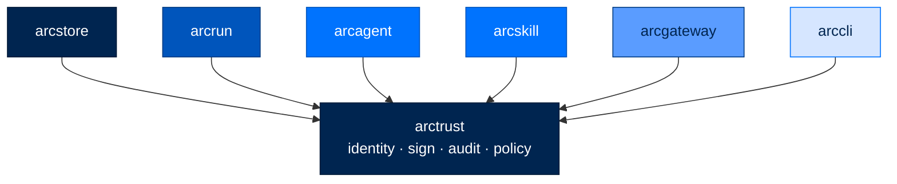

<div align="center">

# 🪪 arctrust

### **The Cryptographic Foundation for Arc**
*Identity · Signing · Audit · Policy — the leaf every other Arc package depends on.*

[](https://opensource.org/licenses/Apache-2.0)
[](#status)
[](#status)
[](#status)
[](#cryptography)

</div>

---

## ✨ What is arctrust?

`arctrust` is the cryptographic floor of the Arc stack. Every other Arc package depends on it — `arctrust` itself depends on nothing but PyNaCl (libsodium) and Pydantic.

It gives you the four primitives every secure agent needs:

- 🪪 **Identity** — Ed25519 keypairs and DIDs (`did:arc:{org}:{type}/{hash}`)
- ✍️ **Signing** — sign and verify arbitrary bytes with libsodium
- 📜 **Audit** — structured events with hash-chained tamper-evident sinks
- ✅ **Policy** — a deny-by-default, fail-closed policy pipeline that decides whether a tool call is allowed

If you're building anything that needs to *prove* what happened, this is where you start.

---

## 🏗️ Where It Fits



`arctrust` is the **leaf node** — it imports nothing from Arc, and every other Arc package imports something from it.

---

## 🚀 Install

```bash
pip install arctrust          # standalone
# or
pip install arcmas            # full Arc stack
```

---

## 🧪 Quick Example

```python
from arctrust import AgentIdentity, emit, AuditEvent, WormSink, generate_keypair
from pathlib import Path

# 1. Generate a fresh agent identity
identity = AgentIdentity.generate(org="acme", agent_type="analyst")
print(identity.did)
# → did:arc:acme:analyst/a3f2c1...

# 2. Sign a message
msg = b"tool_call:read_file:/workspace/report.txt"
signature = identity.sign(msg)
assert identity.verify(msg, signature)

# 3. Emit to the durable, tamper-evident audit log (signed hash chain on disk).
# The chain is signed by the OPERATOR's key, never the agent's own DID key —
# an agent can never forge or silently rewrite its own audit trail (SPEC-053).
from arctrust import InProcessSigner

operator = generate_keypair()
operator_signer = InProcessSigner(operator.private_key)
sink = WormSink(Path("/var/log/arc/audit-chain.jsonl"), operator_signer)
emit(
    AuditEvent(
        actor_did=identity.did,
        action="tool.call",
        target="/workspace/report.txt",
        outcome="allow",
    ),
    sink,
)

# 4. Later — verify the chain survived restart and was not tampered with
assert sink.verify_chain()
```

---

## 🧩 What's Inside

### Identity (`arctrust.identity`)

| Symbol | What It Does |
|---|---|
| `AgentIdentity` | An Ed25519 keypair plus a `did:arc:{org}:{type}/{hash}` DID. Generates, persists, loads, signs, verifies |
| `ChildIdentity` | Ephemeral identity for spawned subagents. Derived deterministically from a parent via HKDF-SHA256 — no fresh randomness required, fully reproducible |
| `derive_child_identity` | Derive a child identity given a parent identity + context label |
| `generate_did` · `parse_did` · `validate_did` | DID string handling |

**Why HKDF-derived child identities matter:** when an agent spawns a subagent, you want the subagent to have its own DID (so its actions are attributable separately) without a key-distribution problem. HKDF lets the parent derive the child's keypair on-demand from a single secret, with a context label that prevents collisions.

### Cryptography (`arctrust.keypair`)

| Symbol | What It Does |
|---|---|
| `KeyPair` | Wraps a libsodium Ed25519 keypair |
| `generate_keypair` | New random keypair |
| `sign(message, secret_key)` | 64-byte Ed25519 signature |
| `verify(message, signature, public_key)` | Returns `bool`. Never raises. Constant-time |

Powered by **PyNaCl → libsodium**. Same primitive you'd find in WireGuard, age, OpenSSH-Ed25519. FIPS-validated builds available for federal deployments.

### Signing (`arctrust.signer`)

The asymmetric signing seam behind every non-repudiable signature Arc emits — WORM audit chains, artifact signatures, arcllm request signing, arcteam audit chains (SPEC-037).

| Symbol | What It Does |
|---|---|
| `Signer` (Protocol) | `public_key`, `algorithm`, `sign(message)` — the one seam every signature resolves through |
| `InProcessSigner` | Holds the private seed in memory. **Ed25519** (personal/enterprise default) or **ECDSA-P256** (FIPS/federal, via PyCA `cryptography`) |
| `VaultSigner` | Signs **by reference** — the seed never enters this process. Hands the message to a `VaultTransit` boundary and gets back a signature |
| `VaultTransit` (Protocol) | The out-of-process boundary: real deployments point this at HashiCorp Vault Transit, a PKCS#11 HSM, or a cloud KMS |
| `FileNotaryTransit` | The **local dev/test reference implementation** of `VaultTransit` — not a production signing backend. Swap in a real Vault/HSM/KMS client for production `vault_transit` custody |
| `build_signer(...)` | Factory — fails closed: `vault_transit` custody with no transit client configured is a hard error, never a silent fall-back to in-process signing |

Tier is stringency metadata, not a different code path: the same `Signer` seam runs at every tier — `custody` (`in_process` / `vault_transit`) and `algorithm` (`ed25519` / `ecdsa-p256`) are config-selected. Federal forces `algorithm=ecdsa-p256` + `custody=vault_transit`; personal defaults to `ed25519` + `in_process`.

### Audit (`arctrust.audit`)

| Symbol | What It Does |
|---|---|
| `AuditEvent` | Structured event: `event_type`, `actor_did`, `action`, `target`, `outcome`, `ts`, `metadata` |
| `AuditSink` (Protocol) | Anything that knows how to write events |
| `WormSink` | The durable system of record: an append-only, asymmetrically-signed SHA-256 hash chain on a `0600` file, signed by an `arctrust.signer.Signer` (Ed25519 or ECDSA-P256; in-process or vault-transit custody). **Tamper-evident** (flip one byte → verify fails), **restart-safe** (tip restored from the file tail), **single-writer** (`flock`), **crash-recoverable** (torn-tail truncate + signed recovery record), and rotates to bounded segments. Replaces the old unchained `JsonlSink` and the in-memory-only `SignedChainSink` |
| `verify_chain(path, public_key)` | Lock-free read-path verifier: streams every segment, checking hash links, signatures (AU-10), `seq` contiguity, and the genesis anchor. Powers `arc store verify` |
| `NullSink` | For tests |
| `emit(event, sink)` | Single emission point. Swallows sink failures (NIST AU-5) — a broken sink can never crash the agent |

**Audit-authority independence (SPEC-053):** the signer handed to `WormSink` is the **operator's** identity, never the agent's own DID key. An agent cannot forge, backdate, or silently rewrite its own audit trail — only an entity holding the operator key (or, at federal, an external witness anchor) can produce a valid chain signature.

### Policy (`arctrust.policy`)

| Symbol | What It Does |
|---|---|
| `PolicyPipeline` | Ordered, fail-closed evaluator. First DENY wins. Sub-1 ms p95 with LRU caching |
| `PolicyLayer` (Protocol) | A single policy stage. Takes `ToolCall` + `PolicyContext`, returns `Decision` (ALLOW / DENY / ABSTAIN) |
| `Decision` | `verdict` (ALLOW/DENY/ABSTAIN), `reason`, `policy_id`, `metadata` |
| `ToolCall` | `tool_name`, `args`, `caller_did`, `classification` |
| `PolicyContext` | Tier, tenant ID, run ID, timestamp, agent metadata |
| `build_pipeline(tier)` | Convenience builder — returns the right `PolicyPipeline` for a tier |

**Layer composition by tier:**

| Tier | Global | Provider | Agent | Team | Sandbox |
|---|---|---|---|---|---|
| Personal | ✅ | — | — | — | — |
| Enterprise | ✅ | ✅ | ✅ | — | — |
| Federal | ✅ | ✅ | ✅ | ✅ | ✅ |

### Artifact Signing (`arctrust.artifact`)

| Symbol | What It Does |
|---|---|
| `content_sha256(content)` | Returns the `sha256:<hex>` digest of `content` |
| `sign_artifact(content, signer_did, private_key)` | Signs `content` with an Ed25519 seed under `signer_did`; returns an `ArtifactSignature` |
| `verify_artifact(content, manifest, trusted_public_key=None)` | Re-verifies `content` against its `ArtifactSignature` at load time. Never raises — any malformed field, digest mismatch, or (when pinned) key mismatch is `False` |
| `ArtifactSignature` | Frozen Pydantic model serialisable to a `.arcsig` sidecar (`to_json`/`from_json`): content digest, signer DID, signer public key, signature, algorithm, timestamp |

Detached content-hash + Ed25519 signing for arbitrary bytes — the primitive behind arcagent's Sign-pillar enforcement on agent-authored capabilities (SPEC-033): sign on write, re-verify at load, independent of any install-time check.

**Honest semantics:** a valid signature proves the bytes are *unmodified since the signer wrote them* and *attributed* to the signer's DID key. It does **not** prove the content is safe — a compromised signer produces a perfectly valid signature over malicious bytes. Safety belongs to the caller's TOFU gate and execution sandbox, never to this primitive.

### Canonical Serialization (`arctrust.canonical`)

| Symbol | What It Does |
|---|---|
| `canonical_json(obj) -> bytes` | Deterministic canonical-JSON bytes a signature binds to: `sort_keys=True`, compact separators, `ensure_ascii=True`. Input must be JSON-serialisable with the stdlib encoder — no silent `default=` coercion |

The one serializer every signing package reuses (arcllm request signing, arcagent checkpoint
signing) instead of hand-rolling per-package JSON serialization — a compact-vs-default
separator or `ensure_ascii` mismatch would silently diverge the bytes and break
cross-package signature verification. A byte-identity test proves every adopter agrees.

### Trust Store (`arctrust.trust_store`)

| Symbol | What It Does |
|---|---|
| `load_operator_pubkey(name)` | Load operator Ed25519 pubkey from `~/.arc/trust/operators/{name}.pub` |
| `load_issuer_pubkey(name)` | Load skill-bundle issuer pubkey from `~/.arc/trust/issuers/{name}.pub` |
| `invalidate_cache()` | Clear the TTL cache (default 60s) |
| `TrustStoreError` | Raised on missing files, wrong permissions, or malformed keys |

**Trust store files must be `0600` permissions.** Loading a file with group- or world-readable bits is a hard error.

---

## 🛡️ Security Properties

| Property | How |
|---|---|
| **Tamper-evident audit** | `WormSink` chains each event with a hash of the previous one (committing its `seq`), signs every record with the *operator's* key (Ed25519 or ECDSA-P256, never the agent's own DID key — SPEC-053), and persists to disk. Flip a single byte, forge a signature, or drop a record anywhere → chain verification fails |
| **No plaintext keys on disk** | Private keys live with `0600` permissions only. Group- or world-readable bits = hard error on load |
| **Constant-time verification** | `verify()` is constant-time (libsodium). No timing side channel |
| **Fail-closed policy** | Pipeline crashes → call denied. Exception in a layer → call denied. Default verdict on no match → DENY |
| **Single audit emission point** | All events go through `emit()`. Sinks fan out from there. No way to bypass |
| **Sink failure isolation** | A broken sink can't crash the agent (NIST AU-5). Failures swallowed silently and logged at WARN |

---

## 📋 Compliance Mapping

| NIST 800-53 | What `arctrust` Provides |
|---|---|
| AU-2, AU-3, AU-12 | `AuditEvent` schema + `emit()` single emission point |
| AU-5 | Sink failure isolation in `emit()` |
| AU-9, AU-10 | `WormSink` durable signed hash chain for tamper-evidence + non-repudiation |
| AU-8 | `ts` field on every `AuditEvent` |
| IA-3 | `AgentIdentity` Ed25519 DID |
| SC-12 | Ed25519 keys via libsodium; HKDF child derivation |
| SC-13 | Ed25519 / ECDSA-P256 (FIPS) asymmetric signing, SHA-256 hash chains |
| SC-28 | `0600` keyfile permissions enforced on load |
| AC-3 | `PolicyPipeline` deny-by-default |
| AU-10 | Non-repudiation via operator-signed (not agent-signed) WORM chains; federal external witness anchor (SPEC-053) |

| OWASP Agentic | What `arctrust` Provides |
|---|---|
| ASI03 (Identity & Privilege Abuse) | Per-agent DIDs, HKDF child identities, no shared keys |
| ASI02 (Tool Misuse) | `PolicyPipeline` with first-DENY-wins |
| ASI06 (Memory/Context Poisoning) | Tamper-evident audit trail catches modifications |
| ASI07 (Insecure Inter-Agent Comms) | Asymmetric (Ed25519 / ECDSA-P256) signing primitive every agent message can use |

---

## 🧪 Status

```bash
uv run --no-sync pytest packages/arctrust/tests
```

- **Tests:** 346+
- **Coverage:** 99%
- **Type check:** `mypy --strict` clean
- **Lint:** `ruff check` clean

---

## 📄 License

Apache 2.0 · Copyright © 2025-2026 BlackArc Systems.
