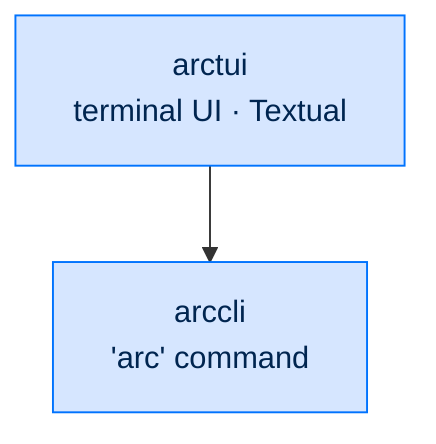

# 🖥 arctui

### **Terminal UI for Arc**
*Future Textual-based TUI client for in-terminal monitoring of running agents.*

---

## ✨ What is arctui?

`arctui` is the eventual terminal UI client for Arc — a Textual-based application that runs in the same Python process and asyncio loop as the agent or dashboard, giving you a rich in-terminal monitoring view without a browser.

> ⚠️ **Status: early scaffolding.** The package installs and exports `__version__` only. No public API yet.

In the meantime, `arc ui tail --viewer-token <t>` gives you a streaming JSONL view of every event from a running `arcui` dashboard, which covers most of the same use cases.

---

## 🏗️ Where It Fits

An entry-layer client. It drives the stack through the `arc` command (`arccmd`); nothing depends on it.

---

## 🔭 Future Scope

- **Live agent panel** — current task, latest response, cost running total
- **Tool call timeline** — most recent tool invocations with parameters and outcomes
- **Audit pane** — searchable, filterable view of audit events
- **Session navigator** — browse past sessions, resume any of them
- **Multi-agent grid** — split-pane view of N agents, one per cell
- **Direct interaction** — steer / cancel / follow-up from inside the terminal

---

## 🧪 Status

- **Status:** scaffolding only — no public API yet
- **License:** Apache 2.0 · Copyright © 2025-2026 BlackArc Systems
