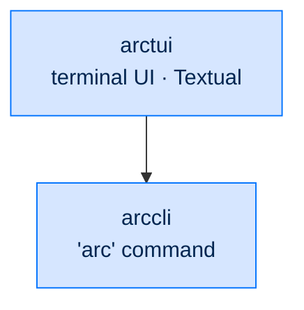

<div align="center">

# 🖥 arctui

### **Terminal UI for Arc**
*Single-process Textual TUI for chatting with and monitoring a running ArcAgent.*

[](https://opensource.org/licenses/Apache-2.0)

</div>

---

## ✨ What is arctui?

`arctui` is a Textual-based terminal client that runs `ArcTUI` in the same process and asyncio event loop as the agent — no subprocess split, no Node/Ink bridge. It gives you a transcript pane, a live activity pane, and an input composer for talking to an `ArcAgent` without a browser.

Launch it with `arc tui` (registered lazily into the `arccli` command registry) or the `arc-tui` script entry point.

If no `arcagent.toml` is found (or `arcagent` isn't installed), the TUI boots in **no-agent mode** — it still runs, but shows a status message instead of live agent output. This is intentional graceful degradation, not a placeholder for the whole package.

---

## 🏗️ Where It Fits

An entry-layer client. It drives the stack through the `arc` command (`arccli`); nothing depends on it.



---

## 🧩 What's Built

| Component | Responsibility |
|---|---|
| `app.py` — `ArcTUI` | Main Textual `App`. Composes `TranscriptView` (left, scrollable) + `ActivityView` (right) + `InputComposer` (bottom). |
| `transcript.py` — `TranscriptView` | Renders the conversation; live token rendering via `start_streaming`/`append_delta`/`finish_streaming` as `arcrun.StreamEvent` token events arrive. |
| `activity.py` — `ActivityView` | Surfaces `ArcAgent` bus events (tool calls, turn boundaries) as they happen. |
| `input_composer.py` — `InputComposer` | User input widget; non-slash input goes to `agent.run(...)` as a Textual `@work` task, slash commands dispatch to a command registry. |
| `command_completer.py` | Slash-command autocomplete. |
| `entry.py` | `arc tui` / `arc-tui` entry point; lazy Textual import so missing the optional dependency never breaks unrelated `arc` subcommands; loads `ArcAgent` from `arcagent.toml` if present, else no-agent mode. |

Event flow: user types → `InputComposer` submits → non-slash goes to `_send_to_agent` (`agent.run(text, session=...)`), tokens stream live into `TranscriptView`; slash commands dispatch to a registry handler.

---

## 🔭 Future Scope

- Tool call timeline with parameters and outcomes
- Searchable, filterable audit pane
- Session navigator — browse and resume past sessions
- Multi-agent grid — split-pane view of N agents
- Direct steer / cancel / follow-up controls from inside the terminal

---

## 🧪 Status

```bash
uv run --no-sync pytest packages/arctui/src/arctui/tests
```

- **Tests:** 66+
- **License:** Apache 2.0 · Copyright © 2025-2026 BlackArc Systems
