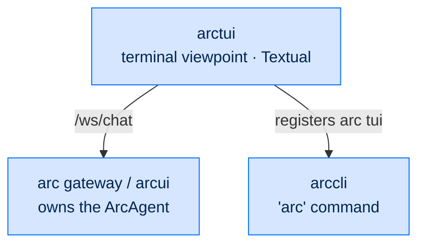

<div align="center">

# 🖥 arctui

### **Terminal UI for Arc**
*Attach-or-serve gateway client — a terminal viewpoint onto a served ArcAgent, never its owner.*

[](https://opensource.org/licenses/Apache-2.0)

</div>

---

## ✨ What is arctui?

`arctui` is a Textual-based terminal client for chatting with a running Arc agent.
It is a **viewpoint** (SPEC-058), not an agent owner: the gateway (`arc ui start` /
`arc team serve`) owns the single `ArcAgent`, and the TUI attaches to it over the
same `/ws/chat/{agent_id}` WebSocket the browser dashboard and every platform
adapter use. It never constructs an `ArcAgent` of its own — that would grab a
second single-writer WORM lock (the collision `arcgateway.fleet` warns about).

Launch it with `arc tui` (registered lazily into the `arccli` command registry) or
the `arc-tui` script entry point.

**Attach-or-serve.** When you run `arc tui`:

- **Attach** — if a gateway is already answering on the target host:port, the TUI
  reuses it (needs a viewer token — `--token`, or the local token `arc ui start`
  persisted).
- **Serve, then attach** — if nothing is listening, the TUI spawns a detached
  `arc ui start --no-browser` (minting its own viewer token), waits for
  `/api/health`, then attaches.

If no agent can be resolved (empty roster, ambiguous name, or the gateway can't be
reached), the TUI boots in **no-agent mode** — it still runs and shows the reason
instead of live agent output. This is intentional graceful degradation.

---

## 🚀 Usage

```bash
arc tui                                  # attach to a local gateway, or spawn one
arc tui --agent employee                 # pick a roster agent by id/name
arc tui --team coding                    # roster from the global fleet ~/.arc/coding
arc tui --root ~/.arc/work               # explicit roster + spawn root (--team-root alias)
arc tui --url http://host:8420 --token <viewer-token>   # attach to a remote gateway
```

**Folder trust.** Launching `arc tui` in a project directory offers to trust that
folder for the served agent — on yes, the directory is appended to the agent's
`[tools.policy].allowed_paths` in its `arcagent.toml` so a coding agent can read and
write the project. The grant is persistent (written to the toml, not in-memory,
since the agent runs in the gateway process). Declined by default on a
non-interactive stdin.

---

## 🏗️ Where It Fits

A surface / terminal-UI layer. It attaches to the gateway that owns the agent;
nothing depends on it.


```mermaid
flowchart TB
    classDef entry fill:#D6E6FF,stroke:#0073FE,color:#002550

    arctui[arctui<br/>terminal viewpoint · Textual]:::entry -->|/ws/chat| gateway[arc gateway / arcui<br/>owns the ArcAgent]:::entry
    arctui -->|registers arc tui| arccli[arccli<br/>'arc' command]:::entry
```

`arc tui` soft-registers into `arccli` (arccli soft-imports arctui; arctui
hard-depends on arccmd — this avoids a circular hard dependency).

---

## 🧩 What's Built

| Component | Responsibility |
|---|---|
| `entry.py` | `arc tui` / `arc-tui` entry point. Resolves the roster agent, offers folder-trust, resolves the gateway endpoint, opens a `GatewayChatClient`, and runs the TUI against it. Lazy Textual import so a missing optional dependency never breaks unrelated `arc` subcommands. |
| `serve.py` — `ensure_gateway` / `Endpoint` | Attach-or-serve resolver: probe `/api/health`, reuse a running gateway or spawn a detached `arc ui start --no-browser`, and return one `Endpoint` to attach to. Owns viewer-token mint/persist/read. |
| `gateway_client.py` — `GatewayChatClient` | WebSocket `ChatTransport` onto `/ws/chat/{agent_id}`: token handshake, one user turn per `send_turn`, block-at-turn agent reply frame. |
| `transport.py` — `ChatTransport` / `TurnEvent` | The seam the app renders against (`message` / `error` / `done`). Keeps the UI decoupled from the concrete client so a future in-process or NATS transport drops in unchanged. |
| `roster.py` — `resolve_agent` / `list_agents` | Enumerate + select agents from the arc roster (`arcgateway.team_roster`), the same discovery arcui uses — not a CWD-only single load. |
| `trust.py` | Folder-trust: append the launch directory to the agent's `allowed_paths` on yes. |
| `app.py` — `ArcTUI` | Main Textual `App`. Composes `TranscriptView` (left) + `ActivityView` (right) + `InputComposer` (bottom); drives turns through the transport and dispatches slash commands. |
| `transcript.py` — `TranscriptView` | Renders the conversation; live delta rendering via `start_streaming`/`append_delta`/`finish_streaming`. Markdown-lite (bold/italic/code) — full rendering lives in the web dashboard. |
| `activity.py` — `ActivityView` | Tool-call activity panel (bounded row buffer). |
| `input_composer.py` — `InputComposer` | Multi-line input; slash-aware autocomplete + in-session history. Non-slash goes to the agent; slash dispatches to a command registry. |
| `command_completer.py` | Slash-command autocomplete from the arccli registry. |
| `connect.py` / `connect_screen.py` | `/connect` and `/connections` (SPEC-064): connector setup collected in masked modals, never routed to the arccli handler (its `getpass` reads the terminal Textual owns — D-586). All install/probe/rollback lives behind `arcagent.connections.Connections`. |
| `prompts.py` | Approval / clarify / secret-input modals. |
| `theme.py` | Palette tokens + TCSS; overridable via `[tui.theme]` in agent config. |

**Turn flow:** user types → `InputComposer` submits → non-slash goes to
`_send_to_agent` (a Textual `@work` task) → `transport.send_turn(text)` yields
`TurnEvent`s → reply text streams into `TranscriptView`; slash commands dispatch to
a registry handler (or a built-in for `/help`, `/clear`, `/quit`, `/connect`,
`/connections`).

---

## 🔭 Future Scope

- Live tool-call timeline fed from the gateway (activity pane wiring in attach mode)
- Searchable, filterable audit pane
- Session navigator — browse and resume past sessions
- Multi-agent grid — split-pane view of N agents
- Direct steer / cancel / follow-up controls from inside the terminal

---

## 🧪 Status

```bash
uv run --no-sync pytest packages/arctui/src/arctui/tests
```

- **Tests:** colocated `tests/{unit,smoke}/`
- **License:** Apache 2.0 · Copyright © 2025-2026 BlackArc Systems
</content>
</invoke>
