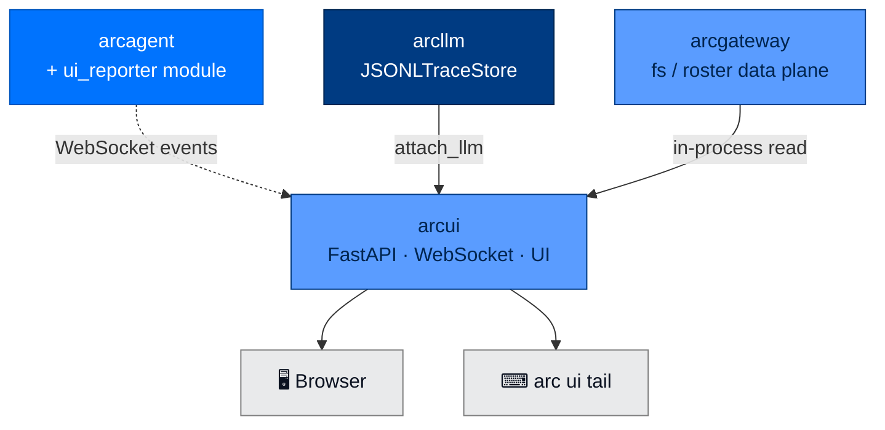

<div align="center">

# 📊 arcui

### **Real-Time Multi-Agent Dashboard**
*Live WebSocket telemetry. Three-token auth. Filter by layer, agent, or team. Watch your fleet think in real time.*

[](https://opensource.org/licenses/Apache-2.0)
[](#status)
[](#status)
[](#)

</div>

---

## ✨ What is arcui?

`arcui` is the dashboard. Run it once. Point your agents at it. Watch them work.

It's a FastAPI server with WebSocket transport that receives live telemetry from running agents and renders a real-time UI for monitoring LLM calls, tool invocations, costs, and audit events. You can filter by layer (LLM / run / agent / team), by agent DID, or by team.

> 📡 **Live, per-event streaming. No polling. Three-token auth. Warm-start from JSONL traces.**

---

## 🏗️ Where It Fits



Depends on `arcllm` (for `JSONLTraceStore`), `arcgateway` (the read-only fs / roster data plane), and `arcstore`. `arcagent` and `arccli` depend on `arcui` for the `ui_reporter` module and `arc ui` commands.

---

## 🚀 Install

```bash
pip install arcmas              # arcui is included in the meta package
```

---

## 🎬 Two-Terminal Quickstart

```bash
# Terminal 1 — start the dashboard
arc ui start --show-tokens
# Output:
#   viewer:    abc123...
#   operator:  def456...
#   agent:     ghi789...
#   listening on http://127.0.0.1:8420

# Terminal 2 — run an agent that streams to the dashboard
arc agent serve my-agent --ui
```

Open http://127.0.0.1:8420 with the **viewer** token. Or stream to terminal:

```bash
# Terminal 3 — JSONL stream of every event
arc ui tail --viewer-token <token> --layer llm
```

---

## 🧪 Quick Example (Python)

```python
from arcui import create_app
import uvicorn

app = create_app()
# Tokens print to stdout on first run; persisted to ~/.arcagent/ui-token
uvicorn.run(app, host="127.0.0.1", port=8420)
```

Or attach an arcllm model directly:

```python
from arcui import create_app, attach_llm
from arcllm import load_model

app = create_app()
model = load_model("anthropic", telemetry=True, audit=True)
attach_llm(app, model)
```

---

## 🔐 Three-Token Auth

`arcui` uses three role-separated tokens. **All three are auto-generated at startup if you don't supply them.**

| Token | Lets You |
|---|---|
| **viewer** | Read events, view the dashboard, run `arc ui tail` |
| **operator** | Approve pairings, kill sessions, push admin commands |
| **agent** | Push events into the dashboard (used by `ui_reporter` module) |

The agent token is auto-persisted to `~/.arcagent/ui-token` so any agent on the host can stream to the dashboard without re-discovering it.

```bash
# Auto-generate tokens
arc ui start --show-tokens

# Supply your own
arc ui start \
  --viewer-token mytoken \
  --operator-token optoken \
  --agent-token agtoken
```

> ⚠️ `arc ui tail` requires `--viewer-token` explicitly. It does **not** auto-read `~/.arcagent/ui-token` — that file holds the *agent* token, not the viewer token.

---

## 📟 CLI Commands

```bash
# Start
arc ui start                                  # default 127.0.0.1:8420
arc ui start --port 9000
arc ui start --host 0.0.0.0                   # bind all interfaces (careful!)
arc ui start --show-tokens                    # print full tokens
arc ui start --max-agents 500                 # default 100
arc ui start --traces-dir /var/arc/traces     # warm-start from JSONL traces

# Stream events
arc ui tail --viewer-token <t>                # all events
arc ui tail --viewer-token <t> --layer llm    # filter to LLM layer
arc ui tail --viewer-token <t> --layer agent  # filter to agent layer
arc ui tail --viewer-token <t> --layer run    # filter to arcrun loop layer
arc ui tail --viewer-token <t> --layer team   # filter to team layer
arc ui tail --viewer-token <t> --agent did:arc:acme:.../   # filter by agent
arc ui tail --viewer-token <t> --group research-team       # filter by team
```

---

## 🧱 Public API

```python
from arcui import (
    create_app,            # FastAPI factory; takes AuthConfig, max_agents, JSONLTraceStore
    serve,                 # convenience: create_app + uvicorn.run
    attach_llm,            # connect an arcllm model so traces stream live
)

# Used by arcagent's ui_reporter module:
from arcagent.modules.ui_reporter import UIBridgeSink
```

### How agents stream into the dashboard

`UIBridgeSink` is an arctrust audit sink. When the `ui_reporter` module is enabled in `arcagent.toml`, every audit event the agent emits also gets pushed to the dashboard over WebSocket:

```toml
[modules.ui_reporter]
enabled = true
```

Then run with `arc agent serve my-agent --ui`. The agent automatically discovers the dashboard URL + agent token from `~/.arcagent/ui-token`.

---

## 🪟 What You See

The dashboard surfaces:

- **Live event stream** — every LLM call, tool call, turn boundary
- **Per-agent state** — current task, last response, tool/skill counts, DID
- **Costs** — running USD per agent, per session, per provider
- **Audit trail** — searchable, filterable, exportable
- **Team view** — multiple agents grouped by team membership
- **Layer toggles** — show only LLM events, only tool events, only audit events, etc.

`arc ui tail` gives you the same data as JSONL on stdout — pipe it into `jq`, `grep`, or any structured-log tool.

### Pages (path-routed)

The dashboard is a React single-page app with path-based routing. Bookmark a route and the deep-link reopens to it. The navigation mirrors the package boundary — LLM-call data lives under **ArcLLM**, agentic-loop data under **ArcRun**.

| Page | Path | Source |
|------|------|--------|
| Agents | `/agents` | `/api/team/roster` — total + live count, card grid |
| Agent Detail | `/agents/:id/:tab` | 9 tabs: Overview · Identity · Runs · LLM · Skills · Tools · Policy · Memory · Files |
| ArcLLM | `/arcllm` | LLM telemetry — overview charts + live Calls table with raw/structured per-call drawer (`/api/stats`, `/api/traces`) |
| ArcRun | `/arcrun` | Agentic-loop runs — fleet sessions table + run-replay drawer + live run activity |
| Messages | `/messages` | Agent chat (`/ws/chat/{id}`) + team channels (`/api/team/channels`) |
| Knowledge | `/knowledge` | `/api/knowledge/{id}` — context budget, memory, workspace tree, graph |
| Tasks | `/tasks` | `/api/team/tasks` — across all agents, filter by status |
| Tools & Skills | `/tools-skills` | `/api/team/tools-skills` — tools matrix + skills directory |
| Security | `/security` | `/api/team/audit` + control actions + policy denials + connection panel |
| Policy | `/policy` | `/api/team/policy/{bullets,stats}` — fleet-wide ACE bullets |
| Settings | `/settings` | arcllm config (PATCH `/api/arcllm-config`), operator-gated |

### WS Subscribe Protocol (SPEC-022)

In addition to the existing event_batch stream, `/ws` accepts:

```json
// Browser → server
{"type": "subscribe:agent",   "agent_id": "alpha"}
{"type": "unsubscribe:agent", "agent_id": "alpha"}

// Server → browser
{"type": "file_change", "agent_id": "alpha",
 "event_type": "policy:bullets_updated",
 "path": "workspace/policy.md",
 "payload": {"bullets": [...]}}
```

Page-specific event mapping:

| Tab / Page | Subscribed events |
|------------|-------------------|
| Overview | `config:updated`, `pulse:updated`, `tasks:updated`, `schedules:updated` |
| Sessions | `session:changed` |
| Memory | `memory:updated`, `skills:updated` |
| Policy | `policy:bullets_updated` |
| Files | all of the above |
| Agents fleet | `agent:online`, `agent:offline`, `roster:changed` |

Reconnect handler re-fires `subscribe:agent` for every tracked agent automatically.

### Frontend (`web/`)

The frontend is a **React 19 + shadcn/ui + Tailwind v4** SPA (Sage Green theme) under `packages/arcui/web/`. It's built with Vite straight into `src/arcui/static/`, which the Starlette server serves unchanged (`Route("/", index)` + `Mount("/assets")`). The built output is committed, so `pip install` / `arc ui start` need no Node toolchain.

Air-gap-friendly: **no CDN dependency**. Fonts (Plus Jakarta Sans, IBM Plex Mono) are self-hosted via `@fontsource` and bundled by Vite. `sw.js` is a one-time kill-switch service worker that unregisters any previously-installed caching SW (Vite content-hashing handles cache-busting).

```bash
cd packages/arcui/web
npm install
npm run build      # → ../src/arcui/static/  (commit the output)

# Dev loop: HMR against a running backend
arc ui start --no-browser --show-tokens   # terminal 1 (note the viewer token)
npm run dev                                # terminal 2 — proxies /api + /ws to :8420
```

Key modules: `lib/api.ts` (bearer client), `lib/ws.ts` + `lib/arc-socket.ts` (RobustWebSocket + subscribe protocol), `store/live.ts` (zustand live store, `llm`/`run` layer routing), `hooks/use-chat.ts` (chat session with seq-gap reconnect), and reusable components `DataTable` / `FileTree` / `TraceDrawer` / `RunReplayDrawer` / `PolicyBulletCard`.

---

## 🛡️ Security Architecture

### Token Separation

Three tokens with three different scopes prevents the common "anyone with the URL can do anything" failure mode. A read-only viewer can't approve pairings. An agent token can push events but can't read other agents' streams.

### Token Persistence

The agent token (and only the agent token) lives at `~/.arcagent/ui-token` with `0600` permissions, so any agent process on the host can find the dashboard without env vars or external service discovery.

### Default Bind Address

`arc ui start` defaults to `127.0.0.1` — **not** `0.0.0.0`. The dashboard is local-by-default. Binding all interfaces requires explicit `--host 0.0.0.0`, and you should put it behind mTLS or a reverse proxy when you do.

### Warm-Start Replay

`arc ui start --traces-dir <path>` warm-starts the dashboard by replaying historical JSONL traces. This is how you get a meaningful view after a restart, without needing live agents to backfill state. The replay is read-only — it cannot inject events that look "live."

---

## 📋 Compliance Mapping

| NIST 800-53 | What `arcui` Provides |
|---|---|
| AU-2 | Live event surface for human review of all agent operations |
| AU-9 | Read-only display of audit events; cannot modify the underlying log |
| AU-11 | Long-term retention via JSONL trace dir; warm-start replay |
| SI-4 | Continuous monitoring with sub-second event latency |
| SC-13 | Three-token role-separated auth |

| OWASP Agentic | Mitigation |
|---|---|
| ASI09 (Trust Exploitation) | Every agent action surfaced with attribution; humans can spot impersonation in real time |
| ASI10 (Rogue Agents) | Behavioral monitoring at the human-readable layer; anomalies become immediately visible |

---

## 🧪 Status

```bash
uv run --no-sync pytest packages/arcui/tests
```

- **Tests:** 300
- **Type check:** `mypy --strict` clean
- **Lint:** `ruff check` clean

---

## 📄 License

Apache 2.0 · Copyright © 2025-2026 BlackArc Systems.
