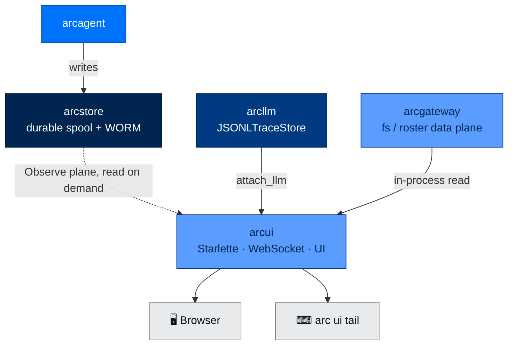

<div align="center">

# 📊 arcui

### **Real-Time Multi-Agent Dashboard**
*Read-on-demand from the shared arcstore record. Two-token auth. Filter by layer, agent, or team. Watch your fleet think in near-real-time.*

[](https://opensource.org/licenses/Apache-2.0)
[](#status)
[](#status)
[](#)

</div>

---

## ✨ What is arcui?

`arcui` is the dashboard. Run it once. Point it at your team directory. Watch your fleet work.

It's a Starlette server, backed by `arcstore`'s durable spool + WORM record (the **Observe
plane**), that renders a real-time UI for LLM calls, tool invocations, costs, and audit
events read back on demand — agents don't need an opt-in reporter module to show up. You can
filter by layer (LLM / run / agent / team), by agent DID, or by team. A WebSocket also pushes
live team-chat messages (`/ws/chat/{agent_id}`).

> 📡 **Reads on demand from the shared arcstore record. Two-token auth (viewer/operator).**

---

## 🏗️ Where It Fits



Depends on `arcllm` (for `JSONLTraceStore`), `arcgateway` (the read-only fs / roster data
plane), and `arcstore` (the Observe-plane mirror it reads from). Nothing needs to import
`arcui` to show up in it — `arcagent` writes through `arcstore` like everything else; `arccli`
depends on `arcui` only for the `arc ui` commands.

---

## 🚀 Install

```bash
pip install arcmas              # arcui is included in the meta package
```

---

## 🎬 Two-Terminal Quickstart

```bash
# Terminal 1 — run an agent (writes activity through arcstore as it goes)
arc agent serve my-agent

# Terminal 2 — start the dashboard, pointed at the team directory the agent lives in
arc ui start --team-root ./team --show-tokens
# Output:
#   Viewer token:   abc123...
#   Operator token: def456...
#   ArcUI dashboard: http://127.0.0.1:8420
```

Open http://127.0.0.1:8420 with the **viewer** token — on a loopback bind the browser opens
pre-authenticated, no copy-paste needed. Or stream to terminal:

```bash
# Terminal 3 — JSONL stream of every event
arc ui tail --viewer-token <token> --layer llm
```

---

## 🧪 Quick Example (Python)

```python
from arcui import create_app
import uvicorn

app = create_app()
# Viewer/operator tokens print to stdout on first run (masked unless --show-tokens);
# they live only in the running process, no on-disk token file.
uvicorn.run(app, host="127.0.0.1", port=8420)
```

Or attach an arcllm model directly:

```python
from arcui import create_app, attach_llm
from arcllm import load_model

app = create_app()
model = load_model("anthropic", telemetry=True, audit=True)
attach_llm(app, model)
```

---

## 🔐 Two-Token Auth

`arcui` uses two role-separated tokens. **Both are auto-generated at startup if you don't supply them**, and printed masked (`--show-tokens` prints them in full). Tokens live only in the running process — there is no on-disk token file and no separate "agent" token or role.

| Token | Lets You |
|---|---|
| **viewer** | Read events, view the dashboard, run `arc ui tail` |
| **operator** | Mutate runtime config (PATCH `/api/arcllm-config`, `/api/config`), see unredacted LLM config |

```bash
# Auto-generate tokens
arc ui start --show-tokens

# Supply your own
arc ui start \
  --viewer-token mytoken \
  --operator-token optoken
```

> ⚠️ `arc ui tail` requires `--viewer-token` explicitly.

Agents don't push events into the dashboard over a token-authenticated channel at all (SPEC-026 FR-5): `arcui` is a pure **reader** of the durable record. It runs its own `StoreIngest` over the shared `arcstore` spool + WORM files (everything `arcllm`/`arcrun`/`arcagent` already wrote, whether or not `arcui` was running) into its own SQLite mirror, then serves read-on-demand REST from that mirror. There is no live push wire, so there's nothing for a compromised or crashed agent to leave dangling.

---

## 📟 CLI Commands

```bash
# Start
arc ui start                                  # default 127.0.0.1:8420
arc ui start --port 9000
arc ui start --host 0.0.0.0                   # bind all interfaces (careful!)
arc ui start --show-tokens                    # print full tokens
arc ui start --max-agents 500                 # default 100
arc ui start --team-root ./team               # agent-discovery root (SPEC-022 routes)
arc ui start --gateway-config ./gateway.toml  # enable Slack/Telegram; default enables the web platform
arc ui start --no-browser                     # headless / CI
arc ui start --no-chat                        # disable the in-process web chat platform

# Stream events
arc ui tail --viewer-token <t>                # all events
arc ui tail --viewer-token <t> --layer llm    # filter to LLM layer
arc ui tail --viewer-token <t> --layer agent  # filter to agent layer
arc ui tail --viewer-token <t> --layer run    # filter to arcrun loop layer
arc ui tail --viewer-token <t> --layer team   # filter to team layer
arc ui tail --viewer-token <t> --agent did:arc:acme:.../   # filter by agent
arc ui tail --viewer-token <t> --group research-team       # filter by team
```

---

## 🧱 Public API

```python
from arcui import (
    create_app,            # Starlette factory; takes AuthConfig, max_agents, team_root, gateway_config, data_dir, ...
    serve,                 # convenience: create_app + uvicorn.run
    attach_llm,            # connect an arcllm model so traces stream live
)
```

### How agent data reaches the dashboard

There is no live push wire from the agent process (SPEC-026 FR-5 tore it out — see
**Two-Token Auth** above). `arcui` runs its own `StoreIngest` over the shared `arcstore`
spool + WORM files and serves everything read-on-demand from its own SQLite mirror, so any
agent that already wrote to the shared store shows up whether or not `arcui` was running when
it did. `arc ui start --team-root <dir>` just points `arcui` at the right `arcstore` data
dir / team directory to read from — nothing is registered or authenticated from the agent
side, and there is no corresponding flag on `arc agent serve`.

---

## 🪟 What You See

The dashboard surfaces:

- **Live event stream** — every LLM call, tool call, turn boundary
- **Per-agent state** — current task, last response, tool/skill counts, DID
- **Costs** — running USD per agent, per session, per provider
- **Audit trail** — searchable, filterable, exportable
- **Team view** — multiple agents grouped by team membership
- **Layer toggles** — show only LLM events, only tool events, only audit events, etc.

`arc ui tail` gives you the same data as JSONL on stdout — pipe it into `jq`, `grep`, or any structured-log tool.

### Pages (path-routed)

The dashboard is a React single-page app with path-based routing. Bookmark a route and the deep-link reopens to it. The navigation mirrors the package boundary — LLM-call data lives under **ArcLLM**, agentic-loop data under **ArcRun**.

| Page | Path | Source |
|------|------|--------|
| Agents | `/agents` | `/api/team/roster` — total + live count, card grid |
| Agent Detail | `/agents/:id/:tab` | 9 tabs: Overview · Identity · Runs · LLM · Skills · Tools · Policy · Memory · Files |
| ArcLLM | `/arcllm` | LLM telemetry — overview charts + live Calls table with raw/structured per-call drawer (`/api/stats`, `/api/traces`) |
| ArcRun | `/arcrun` | Agentic-loop runs — fleet sessions table + run-replay drawer + live run activity |
| Messages | `/messages` | Agent chat (`/ws/chat/{id}`) + team channels (`/api/team/channels`) |
| Knowledge | `/knowledge` | `/api/knowledge/{id}` — context budget, memory, workspace tree, graph |
| Tasks | `/tasks` | `/api/team/tasks` — across all agents, filter by status |
| Tools & Skills | `/tools-skills` | `/api/team/tools-skills` — tools matrix + skills directory |
| Security | `/security` | `/api/team/audit` + policy denials + connection panel |
| Policy | `/policy` | `/api/team/policy/{bullets,stats}` — fleet-wide ACE bullets |
| Settings | `/settings` | arcllm config (PATCH `/api/arcllm-config`), operator-gated |

### WebSockets

There is **no** `/ws` event-push / `subscribe:agent` feed — SPEC-026 FR-5 removed the live push
pipeline (EventBuffer, SubscriptionManager, the per-agent `file_change` bridge), and the REST
views read the `arcstore` mirror on demand instead. Two WebSockets remain:

| Socket | Direction | Purpose |
|--------|-----------|---------|
| `/ws/chat/{agent_id}` | bidirectional | interactive chat with a running agent |
| `/ws/team` | read-only stream + one-way post | drains the arcteam bus to the browser (frames carry handles, mark `@mentions`); a `{"type": "post", "channel": ..., "text": ...}` frame is forwarded and signed as the human entity. `viewer`/`operator` tokens only. |

### Frontend (`web/`)

The frontend is a **React 19 + shadcn/ui + Tailwind v4** SPA (Sage Green theme) under `packages/arcui/web/`. It's built with Vite straight into `src/arcui/static/`, which the Starlette server serves unchanged (`Route("/", index)` + `Mount("/assets")`). The built output is committed, so `pip install` / `arc ui start` need no Node toolchain.

Air-gap-friendly: **no CDN dependency**. Fonts (Plus Jakarta Sans, IBM Plex Mono) are self-hosted via `@fontsource` and bundled by Vite. `sw.js` is a one-time kill-switch service worker that unregisters any previously-installed caching SW (Vite content-hashing handles cache-busting).

```bash
cd packages/arcui/web
npm install
npm run build      # → ../src/arcui/static/  (commit the output)

# Dev loop: HMR against a running backend
arc ui start --no-browser --show-tokens   # terminal 1 (note the viewer token)
npm run dev                                # terminal 2 — proxies /api + /ws to :8420
```

Key modules: `lib/api.ts` (bearer client), `hooks/use-chat.ts` and `hooks/use-team-stream.ts` (the `/ws/chat` + `/ws/team` WebSocket clients), and reusable components `data-table.tsx` / `file-tree.tsx` / `trace-drawer.tsx` / `run-replay-drawer.tsx` / `policy-bullet.tsx`.

---

## 🛡️ Security Architecture

### Token Separation

Two tokens with two different scopes prevents the common "anyone with the URL can do anything" failure mode. A read-only viewer can't mutate the runtime LLM/app config or see unredacted config secrets.

### No Token Persistence

Both tokens are generated fresh in the running process on every `arc ui start` (or supplied explicitly via `--viewer-token`/`--operator-token`) and printed masked unless `--show-tokens`. There is no on-disk token file and no separate agent-facing token or role — see **Two-Token Auth** above for why agents don't need one.

### Default Bind Address

`arc ui start` defaults to `127.0.0.1` — **not** `0.0.0.0`. The dashboard is local-by-default. Binding all interfaces requires explicit `--host 0.0.0.0`, and you should put it behind mTLS or a reverse proxy when you do.

### Warm Start Is Automatic

There's no explicit "replay" flag: `arcui` runs its own `StoreIngest` over the shared `arcstore` spool + WORM files into its own SQLite mirror on every read, so a freshly-started dashboard already has the full durable history — including everything written while `arcui` wasn't running — without any live agents needing to backfill state.

---

## 📋 Compliance Mapping

| NIST 800-53 | What `arcui` Provides |
|---|---|
| AU-2 | Live event surface for human review of all agent operations |
| AU-9 | Read-only display of audit events; cannot modify the underlying log |
| AU-11 | Long-term retention via the shared `arcstore` durable record; automatic warm start on restart |
| SI-4 | Near-real-time monitoring, read-on-demand from the `arcstore` mirror |
| SC-13 | Two-token role-separated auth |

| OWASP Agentic | Mitigation |
|---|---|
| ASI09 (Trust Exploitation) | Every agent action surfaced with attribution; humans can spot impersonation in real time |
| ASI10 (Rogue Agents) | Behavioral monitoring at the human-readable layer; anomalies become immediately visible |

---

## 🧪 Status

```bash
uv run --no-sync pytest packages/arcui/tests
```

- **Tests:** 386+
- **Type check:** `mypy --strict` clean
- **Lint:** `ruff check` clean

---

## 📄 License

Apache 2.0 · Copyright © 2025-2026 BlackArc Systems.
